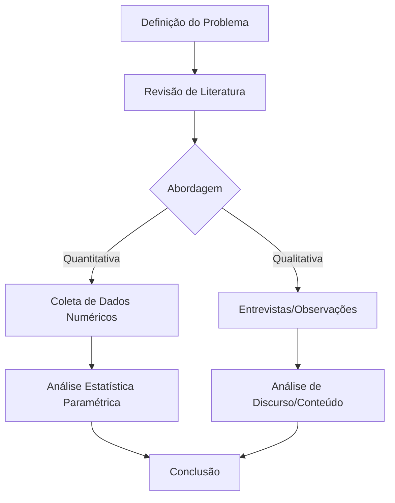

# Aula 07 - Metodologia, Materiais e Reprodutibilidade Científica

**Carga Horária:** 2h - Aula Diária

> **Aviso:** Os materiais complementares e templates estão protegidos. Utilize a senha `escritaiff2026` para acessá-los.

## 1. Slide Referente da Aula (Beamer)

```latex
\documentclass[aspectratio=169]{beamer}
\usetheme{Madrid}
\usepackage[utf8]{inputenc}
\usepackage[T1]{fontenc}
\usepackage[brazil]{babel}

\title{Escrita Acadêmica e LaTeX}
\subtitle{Aula 07: Metodologia e Reprodutibilidade}
\author{Prof. Dr. Pedro}
\institute{Instituto Federal Fluminense (IFF)}
\date{\today}

\begin{document}

\begin{frame}
    \titlepage
\end{frame}

\begin{frame}{Objetivos da Metodologia}
    \begin{itemize}
        \item Descrever \textbf{como} o estudo foi conduzido.
        \item Garantir a \textbf{reprodutibilidade} científica.
        \item Detalhar materiais, equipamentos, amostra e procedimentos.
        \item Justificar as escolhas metodológicas (qualitativa, quantitativa, mista).
    \end{itemize}
\end{frame}

\begin{frame}{Estrutura da Seção (ABNT NBR 14724)}
    \begin{itemize}
        \item Tipo de Pesquisa (Exploratória, Descritiva, Explicativa)
        \item Universo e Amostra
        \item Instrumentos de Coleta de Dados
        \item Procedimentos de Coleta
        \item Análise de Dados
    \end{itemize}
\end{frame}

\end{document}
```

## 2. Detalhamento Minucioso das Normas ABNT (NBR 14724)
A **ABNT NBR 14724** estabelece os princípios gerais para a elaboração de trabalhos acadêmicos (teses, dissertações, TCCs). A seção de **Metodologia** (ou Material e Métodos) é considerada um elemento textual fundamental (desenvolvimento). 
A norma exige clareza, precisão e uso de linguagem técnica impessoal (voz passiva) para que outro pesquisador consiga reproduzir o experimento ou estudo de forma independente, além de padronização nas subdivisões (seções e subseções primárias, secundárias e terciárias) conforme a **NBR 6024**.

## 3. Estudo de Caso (Use Case) Real
**Contexto:** Pesquisa sobre o desempenho térmico de tijolos ecológicos em construções sustentáveis.
- **Forma Incorreta (Baixa Reprodutibilidade):** "Os tijolos foram testados e aquecidos em um forno em alta temperatura para ver se quebravam."
- **Forma Correta e Científica:** "Foram ensaiados 50 corpos de prova de tijolo ecológico (solo-cimento), traço 1:10 em massa, curados por 28 dias em câmara úmida. O aquecimento ocorreu em mufla da marca XYZ, modelo ABC, com rampa de aquecimento controlada de 5°C/min até atingir 1000°C, mantendo-se o patamar isotérmico por 2 horas, conforme os preceitos da NBR 15270."

## 4. Diagramas e Ilustrações



## 5. Exercício Prático
1. Redija o parágrafo de "Coleta de Dados" do seu atual projeto de pesquisa aplicando os princípios de reprodutibilidade vistos nesta aula.
2. Crie uma subseção de "Materiais e Equipamentos" no seu documento LaTeX usando o comando `\subsection{Materiais e Equipamentos}` e liste os itens usando o ambiente `itemize`.

## 6. Referências Bibliográficas
- ASSOCIAÇÃO BRASILEIRA DE NORMAS TÉCNICAS. **NBR 14724**: Informação e documentação: trabalhos acadêmicos: apresentação. Rio de Janeiro: ABNT, 2011.
- CRESWELL, J. W. **Projeto de pesquisa**: métodos qualitativo, quantitativo e misto. 3. ed. Porto Alegre: Artmed, 2010.


## Slide Referente da Aula (PPTX — Modelo Institucional IFF)

Para apresentações em auditórios do IFF ou defesas que utilizam o **Microsoft PowerPoint (.pptx)** (compatível com LibreOffice Impress e Google Slides), disponibilizamos o modelo institucional Widescreen (16:9) pronto para uso e estruturado nas normas canônicas da ABNT/IBGE abordadas nesta aula:

### 1. Especificação Visual e Identidade IFF (Widescreen 16:9)
- **Paleta Institucional:**
  - Verde Oficial IFF: `#2D6238` (`RGB: 45, 98, 56`) — Primária para Títulos e Capa.
  - Vermelho Destaque IFF: `#B3282D` (`RGB: 179, 40, 45`) — Secundária para Alertas e Código.
  - Cinza Chumbo: `#333333` (`RGB: 51, 51, 51`) — Corpo de Texto.
- **Rodapé Institucional Padronizado:** `Prof. Dr. Pedro Henrique Silva | IFF Campus Bom Jesus do Itabapoana | Curso de Escrita Acadêmica e LaTeX (80h) | Aula 07`.

### 2. Download do Arquivo PPTX Institucional
O arquivo `.pptx` institucional desta aula encontra-se gerado no repositório com todos os 4 slides (Capa, Roteiro, Fundamentação Teórica e Exemplo Prático/Referências):

> [!TIP] **Download da Apresentação**
> **[📥 Baixar Apresentação Institucional em PPTX — Aula 07: Metodologia, Materiais e Reprodutibilidade](/assets/biblioteca/latex-escrita/slides-pptx/aula-07-iff-institucional.pptx)**

### 3. Conversão Direta via Terminal (Pandoc)
Caso prefira compilar seus próprios slides localmente a partir deste texto Markdown utilizando o template mestre institucional:
```bash
pandoc aula-07.md -o aula-07-iff-institucional.pptx --reference-doc=template-iff-widescreen.pptx --slide-level=2
```
