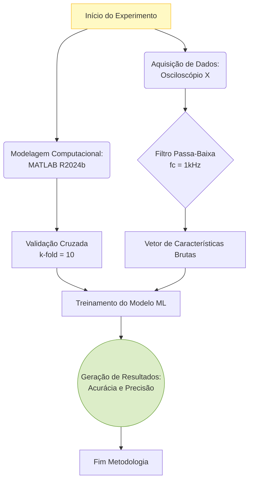

| Material Didático | Link Institucional (Acesso Aberto / PDF) |
| :--- | :--- |
| 📄 **Slides LaTeX — Modelo Branco (.pdf)** | [Acessar Slide Branco](/assets/biblioteca/latex-escrita/slides-latex/aula-07-branco.pdf) |
| 📄 **Slides LaTeX — Modelo Preto (.pdf)** | [Acessar Slide Preto](/assets/biblioteca/latex-escrita/slides-latex/aula-07-preto.pdf) |
| 📝 **Notas de Aula Institucionais (.pdf)** | [Acessar Notas Institucionais](/assets/biblioteca/latex-escrita/notes-latex/aula-07.pdf) |

## 📋 Sumário da Aula
- 1. Introdução e Fundamentação Teórica
- 2. Normalização ABNT e Rigor Metodológico
- 3. Prática e Engenharia no Ecossistema ReLaTeX
- 4. Estudo de Caso Real e Resolução de Problemas
- 5. Síntese e Conclusão

---

## 1. O Papel Central da Metodologia na Pesquisa Científica

A seção de Metodologia, Materiais e Métodos ou Procedimentos Metodológicos é, sob muitas perspectivas, o capítulo mais crítico de uma dissertação ou tese científica. O rigor metodológico é o que separa a ciência de opiniões informadas ou anedóticas.

Conforme as diretrizes da **ABNT NBR 14724:2011**, que rege a estrutura de trabalhos acadêmicos no Brasil, a metodologia é um elemento textual obrigatório. Sua principal função é responder à pergunta: *"Como a pesquisa foi conduzida, passo a passo, a ponto de permitir que outro pesquisador replique o experimento e obtenha resultados equivalentes?"*.

A crise de reprodutibilidade científica mundial tem feito revistas de alto impacto (Qualis A1/A2, periódicos Nature, Science, IEEE Transactions) rejeitarem sumariamente manuscritos que não detalham suficientemente seus aparatos, softwares, versões e métodos de aquisição de dados.

## 2. Tipologia da Pesquisa

Antes de descrever os equipamentos e passos procedimentais, a seção metodológica de uma tese costuma tipificar a pesquisa quanto a diferentes esferas:

### 2.1 Quanto à Natureza
*   **Pesquisa Básica:** Gera conhecimentos novos e avanços teóricos sem aplicação prática imediata ou fim lucrativo.
*   **Pesquisa Aplicada:** Visa gerar conhecimentos para aplicação prática e resolução de problemas específicos (muito comum em engenharias).

### 2.2 Quanto aos Objetivos (Classificação de Gil, 2002)
*   **Exploratória:** Proporciona maior familiaridade com o problema. Geralmente envolve levantamento bibliográfico profundo ou estudos de caso.
*   **Descritiva:** Descreve características de determinada população ou fenômeno, ou o estabelecimento de relações entre variáveis (ex: estudos estatísticos de ocorrência).
*   **Explicativa:** Identifica os fatores que determinam ou contribuem para a ocorrência dos fenômenos (a forma mais complexa, focada no "porquê").

### 2.3 Quanto à Abordagem do Problema
*   **Quantitativa:** Traduz em números as opiniões, informações e dados para classificá-los e analisá-los utilizando técnicas estatísticas.
*   **Qualitativa:** A análise dos dados é feita de forma indutiva (interpretação).
*   **Mista:** Combina análises quantitativas de variáveis instrumentais com análises fenomenológicas ou qualitativas (ex: medição do tempo de resposta de um software aliada à percepção de uso de especialistas humanos).

## 3. Descrição de Materiais, Equipamentos e Delineamento Experimental

### 3.1 Nomenclatura, Fabricantes e Modelos

Na redação acadêmica padrão (e isso é severamente cobrado pela NBR 14724 em trabalhos de bancada, laboratório ou simulação computacional), sempre que um material ou equipamento específico for utilizado, deve-se declarar o modelo, o fabricante e a localidade de origem (Cidade, Estado, País) entre parênteses na primeira menção.

*Incorreto:* Os testes foram feitos usando um multímetro e um osciloscópio.
*Correto (Padrão ouro):* A aquisição de tensão foi realizada empregando-se um osciloscópio digital (Modelo DPO2024B, Tektronix, Beaverton, OR, EUA) configurado com taxa de amostragem de 1 GS/s.

### 3.2 Delineamento Experimental (Design of Experiments - DoE)

Se a pesquisa envolve múltiplas variáveis independentes e dependentes, a metodologia deve explicar a matriz experimental. Técnicas de planejamento fatorial (ex: 2^k, superfície de resposta) devem ser justificadas. A amostragem (quantos ensaios, número de réplicas, aleatorização) precisa estar clara para atestar a validade estatística (valor-p, intervalo de confiança).

## 4. O Desafio da Reprodutibilidade e Open Science

A "Ciência Aberta" (Open Science) demanda que os dados brutos (datasets) e códigos (scripts de R, Python, MATLAB) utilizados na análise sejam disponibilizados. 

Em teses de engenharia, a reprodutibilidade atinge seu nível máximo quando o autor hospeda o código de sua metodologia no GitHub, Zenodo ou Mendeley Data, e insere o link / DOI no texto do capítulo de Metodologia, garantindo que o algoritmo de treinamento de redes neurais, ou as equações de diferenças finitas descritas em LaTeX, possam ser executadas pelos avaliadores da banca.

## 5. Diagrama do Delineamento Experimental (Mermaid)

## 6. Estudo de Caso

**O Cenário:** O aluno de mestrado Carlos está desenvolvendo uma rede de sensores sem fio para monitoramento do solo na agricultura de precisão. Ele construiu os nós sensores usando microcontroladores baratos e enviou os dados para um servidor local via protocolo MQTT. 

**Redação Fraca:** "No desenvolvimento, usamos sensores de umidade. Eles foram ligados ao Arduino e os dados enviados para a nuvem. Depois, fizemos a análise dos dados pelo computador para ver se a planta precisava de água." (Nota: Sem rigor, impossível replicar. Qual sensor? Qual Arduino? Qual nuvem? Como a análise foi feita?).

**Redação Científica e Reprodutível (Aplicando NBR 14724 e rigor):** "O delineamento da rede de sensores fundamentou-se na plataforma de prototipagem eletrônica ESP32 (Espressif Systems, Xangai, China). A variável independente, umidade volumétrica do solo, foi mensurada utilizando-se cinco sensores capacitivos não-corrosivos modelo v1.2 (DFRobot, Pequim, China), calibrados individualmente em laboratório. O firmware foi desenvolvido na IDE Arduino versão 2.1, operando com taxa de amostragem de 1 Hz. O tráfego de telemetria foi conduzido via protocolo MQTT, hospedado em um container Docker rodando um broker Mosquitto versão 2.0 (Eclipse Foundation, Canadá), instalado em um servidor Linux Ubuntu 22.04 LTS..." 

A redação científica transforma um trabalho de 'feira de ciências' em uma dissertação robusta. O avaliador sabe exatamente as versões do software e as origens do hardware para testar as afirmações de Carlos.

## 7. Exercício Prático

**Objetivo:** Exercitar a precisão na descrição metodológica e caracterização de materiais.

1.  Escreva um parágrafo (10 a 15 linhas) simulando o início do seu capítulo de Metodologia.
2.  Classifique sua pesquisa hipotética quanto à natureza, objetivo e abordagem.
3.  Descreva, pelo menos, três hardwares ou softwares críticos para a sua pesquisa. Utilize a nomenclatura padronizada com Empresa fabricante, Cidade e País entre parênteses.
4.  Crie um fluxograma de 5 blocos (pode ser manual) descrevendo os passos do seu procedimento principal. Como você passaria isso para LaTeX/TikZ ou Mermaid?

## 8. Referências Bibliográficas (ABNT NBR 6023:2018)

ASSOCIAÇÃO BRASILEIRA DE NORMAS TÉCNICAS. **NBR 14724**: Informação e documentação: trabalhos acadêmicos: apresentação. Rio de Janeiro: ABNT, 2011.

ASSOCIAÇÃO BRASILEIRA DE NORMAS TÉCNICAS. **NBR 6023**: Informação e documentação: referências: elaboração. Rio de Janeiro: ABNT, 2018.

GIL, A. C. **Como elaborar projetos de pesquisa**. 4. ed. São Paulo: Atlas, 2002.

MARCONI, M. de A.; LAKATOS, E. M. **Fundamentos de metodologia científica**. 8. ed. São Paulo: Atlas, 2017.

## 🛠️ Recursos Adicionais e Material Suplementar

- **[🏛️ Guia Oficial de Modelos, Classes e Pacotes ReLaTeX](/pt-br/resource/latex/modelos-de-documento)** — Exemplos canônicos de código, classes (`ifftese.cls`, `slidesiffmodelo.cls`) e documentação interna.
- **[📅 Planejamento Letivo e Cronograma de Atividades](/pt-br/resource/latex/planejamento-e-cronograma)** — Matriz analítica de 80h (Terças, 14h30-17h30) e avaliação em 2 bimestres.
- **[📜 Código de Conduta e Diretrizes Acadêmicas](/pt-br/resource/latex/codigo-de-conduta-e-diretrizes)** — Regimento ético, normas CEP/CONEP e uso transparente de IA.
- **[CTAN (Comprehensive TeX Archive Network)](https://ctan.org/)** — Portal oficial mundial de pacotes LaTeX2e.
- **[ABNT Catálogo de Normas](https://www.abnt.org.br/)** — Acesso e consulta às normas técnicas vigentes.
- **[Overleaf Documentation](https://www.overleaf.com/learn)** — Base de conhecimento e guias práticos sobre compilação TeX.

