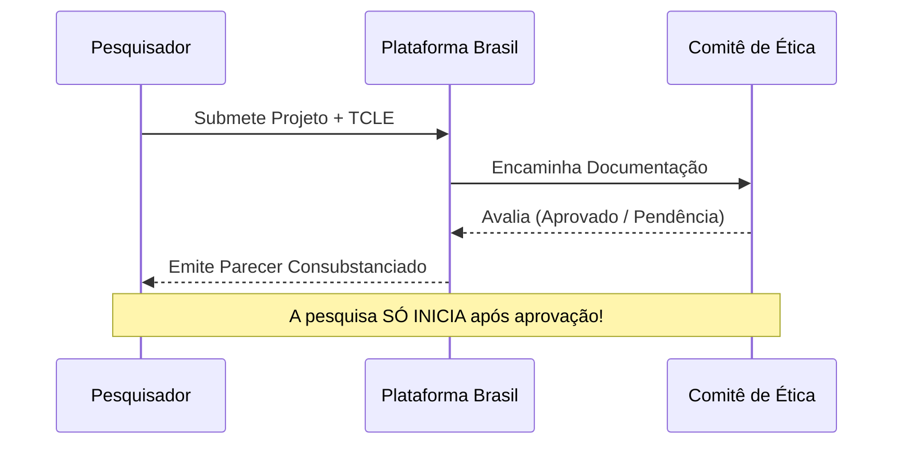

# Aula 08 - Ética na Pesquisa e Uso de IA

**Carga Horária:** 2h - Aula Diária

> **Aviso:** Os materiais complementares e templates estão protegidos. Utilize a senha `escritaiff2026` para acessá-los.

## 1. Slide Referente da Aula (Beamer)

```latex
\documentclass[aspectratio=169]{beamer}
\usetheme{Madrid}
\usepackage[utf8]{inputenc}
\usepackage[T1]{fontenc}
\usepackage[brazil]{babel}

\title{Escrita Acadêmica e LaTeX}
\subtitle{Aula 08: Ética na Pesquisa e Uso de IA}
\author{Prof. Dr. Pedro}
\institute{Instituto Federal Fluminense (IFF)}
\date{\today}

\begin{document}

\begin{frame}
    \titlepage
\end{frame}

\begin{frame}{Ética na Pesquisa com Seres Humanos}
    \begin{itemize}
        \item Resoluções CNS 466/2012 e 510/2016.
        \item O papel do Comitê de Ética em Pesquisa (CEP) e da CONEP.
        \item Plataforma Brasil: submissão de projetos.
        \item Termo de Consentimento Livre e Esclarecido (TCLE).
    \end{itemize}
\end{frame}

\begin{frame}{Uso Ético de Inteligência Artificial}
    \begin{itemize}
        \item Plágio algorítmico vs. Ferramenta de apoio.
        \item IA não é autora (incapacidade de assumir responsabilidade legal/moral).
        \item Transparência metodológica: citar o uso da IA na metodologia.
        \item Verificação rigorosa de dados (alucinações).
    \end{itemize}
\end{frame}

\end{document}
```

## 2. Detalhamento Minucioso das Normas e Resoluções
Para pesquisas envolvendo seres humanos (como entrevistas e questionários), a **Resolução CNS 466/2012** e a **Resolução 510/2016** (Ciências Humanas e Sociais) determinam que os projetos devem ser submetidos e aprovados por um **Comitê de Ética em Pesquisa (CEP)** via **Plataforma Brasil** *antes* do início da coleta de dados.
No manuscrito acadêmico (segundo a ABNT NBR 14724 e normas de revistas), o número do parecer de aprovação do CEP deve ser obrigatoriamente citado na seção de Metodologia. Em relação à Inteligência Artificial (IA), novas diretrizes de periódicos exigem declaração explícita de uso (ex: correção gramatical, tradução), vetando o uso de IAs generativas como "coautoras".

## 3. Estudo de Caso (Use Case) Real
**Contexto:** Uso do ChatGPT em um TCC.
- **Situação Problemática:** O aluno gerou a fundamentação teórica inteira usando IA, copiou, colou, e não revisou referências (que eram inventadas/alucinadas pelo modelo), submetendo como trabalho autoral.
- **Uso Ético e Correto:** O aluno escreveu os rascunhos com base em artigos fichados. Em seguida, utilizou uma IA para melhorar a coesão, traduzir o abstract e gerar scripts Python para análise de dados. Na metodologia, adicionou: "Para revisão gramatical e estrutural do texto, utilizou-se o modelo GPT-4 (OpenAI, 2023), sendo toda a responsabilidade intelectual exclusiva do autor humano."

## 4. Diagramas e Ilustrações



## 5. Exercício Prático
1. Elabore um modelo básico de Termo de Consentimento Livre e Esclarecido (TCLE) para sua pesquisa.
2. Escreva um parágrafo de declaração de uso de IA para ser inserido na introdução ou metodologia de um artigo.

## 6. Referências Bibliográficas
- BRASIL. Ministério da Saúde. Conselho Nacional de Saúde. **Resolução nº 466, de 12 de dezembro de 2012**. Diretrizes e normas regulamentadoras de pesquisas envolvendo seres humanos. Diário Oficial da União, Brasília, DF, 13 jun. 2013.
- COPE (Committee on Publication Ethics). **Authorship and AI tools**. 2023. Disponível em: publicationethics.org.


## Slide Referente da Aula (PPTX — Modelo Institucional IFF)

Para apresentações em auditórios do IFF ou defesas que utilizam o **Microsoft PowerPoint (.pptx)** (compatível com LibreOffice Impress e Google Slides), disponibilizamos o modelo institucional Widescreen (16:9) pronto para uso e estruturado nas normas canônicas da ABNT/IBGE abordadas nesta aula:

### 1. Especificação Visual e Identidade IFF (Widescreen 16:9)
- **Paleta Institucional:**
  - Verde Oficial IFF: `#2D6238` (`RGB: 45, 98, 56`) — Primária para Títulos e Capa.
  - Vermelho Destaque IFF: `#B3282D` (`RGB: 179, 40, 45`) — Secundária para Alertas e Código.
  - Cinza Chumbo: `#333333` (`RGB: 51, 51, 51`) — Corpo de Texto.
- **Rodapé Institucional Padronizado:** `Prof. Dr. Pedro Henrique Rocha de Andrade | IFF Campus Bom Jesus do Itabapoana | Curso de Escrita Acadêmica e LaTeX (80h) | Aula 08`.

### 2. Download do Arquivo PPTX Institucional
O arquivo `.pptx` institucional desta aula encontra-se gerado no repositório com todos os 4 slides (Capa, Roteiro, Fundamentação Teórica e Exemplo Prático/Referências):

> [!TIP] **Download da Apresentação**
> **[📥 Baixar Apresentação Institucional em PPTX — Aula 08: Ética na Pesquisa (CEP/CONEP) e Uso Ético de IA](/assets/biblioteca/latex-escrita/slides-pptx/aula-08-iff-institucional.pptx)**

### 3. Conversão Direta via Terminal (Pandoc)
Caso prefira compilar seus próprios slides localmente a partir deste texto Markdown utilizando o template mestre institucional:
```bash
pandoc aula-08.md -o aula-08-iff-institucional.pptx --reference-doc=template-iff-widescreen.pptx --slide-level=2
```
