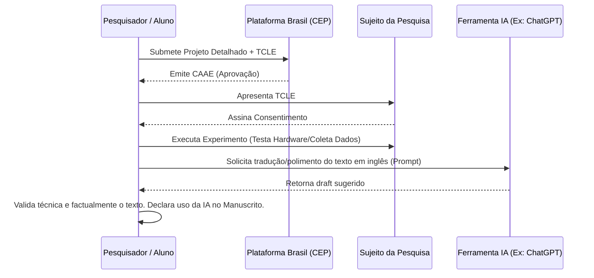

| Material Didático | Link Institucional (Acesso Aberto / PDF) |
| :--- | :--- |
| 📄 **Slides LaTeX — Modelo Branco (.pdf)** | [Acessar Slide Branco](/assets/biblioteca/latex-escrita/slides-latex/aula-08-branco.pdf) |
| 📄 **Slides LaTeX — Modelo Preto (.pdf)** | [Acessar Slide Preto](/assets/biblioteca/latex-escrita/slides-latex/aula-08-preto.pdf) |
| 📄 **Notas de Aula Institucionais (.pdf)** | [Acessar Notas Institucionais](/assets/biblioteca/latex-escrita/notes-latex/aula-08.pdf) |

## 📋 Sumário da Aula
- 1. Introdução e Fundamentação Teórica
- 2. Normalização ABNT e Rigor Metodológico
- 3. Prática e Engenharia no Ecossistema ReLaTeX
- 4. Estudo de Caso Real e Resolução de Problemas
- 5. Síntese e Conclusão

---

## 1. O Sistema CEP/CONEP e a Ética com Seres Humanos

Qualquer projeto de pesquisa, TCC, dissertação ou tese em território nacional que envolva seres humanos de forma direta ou indireta está submetido às diretrizes do Sistema CEP/CONEP (Comitê de Ética em Pesquisa / Comissão Nacional de Ética em Pesquisa), regulamentado pelo Conselho Nacional de Saúde (Resoluções CNS n. 466/2012 e n. 510/2016).

### 1.1 O Que Configura "Envolvimento de Seres Humanos"?

Engenheiros e pesquisadores da área de exatas frequentemente (e equivocadamente) acreditam estar isentos da submissão de projetos ao CEP. No entanto, o envolvimento humano não se restringe a ensaios clínicos (dar um medicamento ao paciente). Constitui pesquisa envolvendo seres humanos trabalhos como:

*   Aplicação de questionários, surveys ou entrevistas estruturadas via Google Forms para validar usabilidade de um software.
*   Coleta de dados fisiológicos (sinais de EEG, ECG, frequência cardíaca) através de hardwares desenvolvidos no mestrado.
*   Uso de bases de dados secundárias contendo informações sigilosas ou identificáveis (dados médicos, dados financeiros de usuários).
*   Testes de interação Humano-Computador, onde um painel de usuários testa uma interface (UI/UX).

### 1.2 A Plataforma Brasil e o Processo de Submissão

A **Plataforma Brasil** é a base nacional e unificada de registros de pesquisas com seres humanos. O trâmite legal antes de iniciar a coleta de dados é absoluto:

1.  O projeto deve estar redigido detalhadamente (Metodologia, Riscos, Benefícios).
2.  Preenche-se o formulário na Plataforma Brasil e anexa-se os documentos obrigatórios, incluindo a Folha de Rosto institucional assinada.
3.  O fundamental é o **TCLE (Termo de Consentimento Livre e Esclarecido)**. Esse documento será lido e assinado pelo participante (ou por meios eletrônicos validados). Ele deve explicar a pesquisa em linguagem não técnica, deixar claro que o sujeito pode desistir a qualquer momento sem punição, e garantir confidencialidade, anonimato e destinação dos dados.
4.  A aprovação deve ser obtida **antes** do início de qualquer experimento humano. Pesquisas que coletam dados e depois tentam aprovação ética são negadas, correndo risco legal grave (falsidade, violação de direitos humanos).
5.  No texto da Tese/Artigo, é compulsório indicar explicitamente o número do **Certificado de Apresentação de Apreciação Ética (CAAE)** da aprovação.

## 2. A Inserção de Modelos de Linguagem (LLMs e IA Generativa) na Ciência

Com o surgimento e onipresença de Large Language Models (LLMs) como ChatGPT, Claude, Gemini, e DeepSeek, a academia enfrenta um novo desafio ético: a autoria, integridade e o plágio sintético.

Veículos editoriais de imenso prestígio (Nature, Science, IEEE, Elsevier) publicaram, a partir de 2023, diretrizes severas para o uso destas ferramentas. A comunidade científica aceita a IA como uma ferramenta de auxílio produtivo, mas **repudia a IA como autora intelectual**.

### 2.1 Diretrizes de Uso Transparente

Para evitar processos de sindicância e perda de títulos, a conduta acadêmica atual demanda transparência radical no uso de Inteligência Artificial:

1.  **Ferramentas de IA Não São Autoras:** Um software não pode assumir responsabilidade legal e ética (accountability) por possíveis fraudes ou erros no texto. Assim, IAs não podem figurar como coautoras de artigos ou teses.
2.  **Transparência Metodológica (Disclosure):** Caso uma IA seja usada na revisão do texto, formatação de código LaTeX, geração de ideias estruturais, ou tradução (proofreading), isso deve ser explicitamente declarado (geralmente nos Agradecimentos, ou em uma seção de "Declaração de uso de IA").
3.  **Proibição para Geração de Dados Fictícios:** O uso de IAs para fabricar dados de simulação, plotar gráficos falsos ou gerar "estudos de caso hipotéticos" e apresentá-los como reais constitui infração gravíssima (fabricação de dados científicos).
4.  **Alucinações e Validação Humana:** O aluno/pesquisador é 100% responsável pela precisão. Citações bibliográficas geradas por LLMs frequentemente são alucinações (artigos que não existem, autores misturados, DOIs quebrados). A checagem humana (Human-in-the-loop) é a fronteira final.

## 3. Diagrama do Fluxo Ético de Pesquisa (Mermaid)

## 4. Estudo de Caso

**O Cenário:** Mariana, engenheira mecânica, construiu uma prótese biônica de mão no doutorado. O movimento depende da leitura de sensores EMG colocados no braço de amputados. Ela quer testar a prótese em 10 pacientes do hospital universitário local. O prazo da tese está apertado.

**Desastre Ético:** Mariana imprime a prótese, leva ao hospital, pede aos pacientes que testem e mede o grau de abertura da garra. Ela usa o ChatGPT para redigir o capítulo inteiro de Resultados e inventa duas citações para dar volume. Na defesa, a banca descobre que ela não submeteu o projeto à Plataforma Brasil e as citações não batem (o ChatGPT alucinou as publicações). Resultado: tese reprovada, possibilidade de cancelamento de matrícula e responder legalmente por intervenção médica sem CEP.

**Abordagem Ética e Correta:** Antes de encostar a prótese no primeiro paciente, Mariana redige um TCLE descrevendo os riscos (ex: alergia ao plástico, fadiga muscular). Submete via Plataforma Brasil, aguarda 45 dias, recebe o Parecer Consubstanciado de Aprovação. Testa os pacientes documentando tudo. Escreve a tese por conta própria. Usa o Gemini apenas para refinar a gramática do resumo final e declara, em uma seção "Declaração de Uso de IA", que: *"Durante a preparação deste trabalho, a autora utilizou o modelo Gemini Pro (Google) unicamente a fim de melhorar a fluidez da linguagem técnica da língua inglesa. A autora revisou e assume total responsabilidade por todo o conteúdo final."* A banca elogia o rigor e a transparência.

## 5. Exercício Prático

1.  Analise seu projeto atual (seja TCC, PIBITI ou apenas uma ideia inicial). Ele requer submissão à Plataforma Brasil? Descreva os motivos do "Sim" ou do "Não".
2.  Suponha que exija aprovação. Escreva 3 parágrafos simulando o texto principal de um TCLE, focado em explicar: os objetivos, os riscos (ainda que mínimos) e a garantia de sigilo ao leigo.
3.  Redija uma declaração curta, no padrão Qualis A, que seria inserida no final do seu artigo atestando as formas como você utilizou (ou optou por não utilizar) Inteligência Artificial no seu fluxo de trabalho acadêmico.

## 6. Referências Bibliográficas (ABNT NBR 6023:2018)

BRASIL. Ministério da Saúde. Conselho Nacional de Saúde. **Resolução nº 466, de 12 de dezembro de 2012**. Aprova diretrizes e normas regulamentadoras de pesquisas envolvendo seres humanos. Brasília, DF: Ministério da Saúde, 2012.

BRASIL. Ministério da Saúde. Conselho Nacional de Saúde. **Resolução nº 510, de 07 de abril de 2016**. Regulamenta a pesquisa nas ciências humanas e sociais. Brasília, DF: Ministério da Saúde, 2016.

ELSEVIER. **The use of AI and AI-assisted technologies in writing for Elsevier**. 2023. Disponível em: https://www.elsevier.com/about/policies-and-standards/the-use-of-ai-and-ai-assisted-technologies-in-writing-for-elsevier. Acesso em: 04 ago. 2026.

NATURE. **Artificial intelligence (AI) in research and publication**. 2023. Disponível em: https://www.nature.com/nature-portfolio/editorial-policies/ai. Acesso em: 04 ago. 2026.

## 🛠️ Recursos Adicionais e Material Suplementar

- **[🏛️ Guia Oficial de Modelos, Classes e Pacotes ReLaTeX](/pt-br/resource/latex/modelos-de-documento)** — Exemplos canônicos de código, classes (`ifftese.cls`, `slidesiffmodelo.cls`) e documentação interna.
- **[📅 Planejamento Letivo e Cronograma de Atividades](/pt-br/resource/latex/planejamento-e-cronograma)** — Matriz analítica de 80h (Terças, 14h30-17h30) e avaliação em 2 bimestres.
- **[📜 Código de Conduta e Diretrizes Acadêmicas](/pt-br/resource/latex/codigo-de-conduta-e-diretrizes)** — Regimento ético, normas CEP/CONEP e uso transparente de IA.
- **[CTAN (Comprehensive TeX Archive Network)](https://ctan.org/)** — Portal oficial mundial de pacotes LaTeX2e.
- **[ABNT Catálogo de Normas](https://www.abnt.org.br/)** — Acesso e consulta às normas técnicas vigentes.
- **[Overleaf Documentation](https://www.overleaf.com/learn)** — Base de conhecimento e guias práticos sobre compilação TeX.

