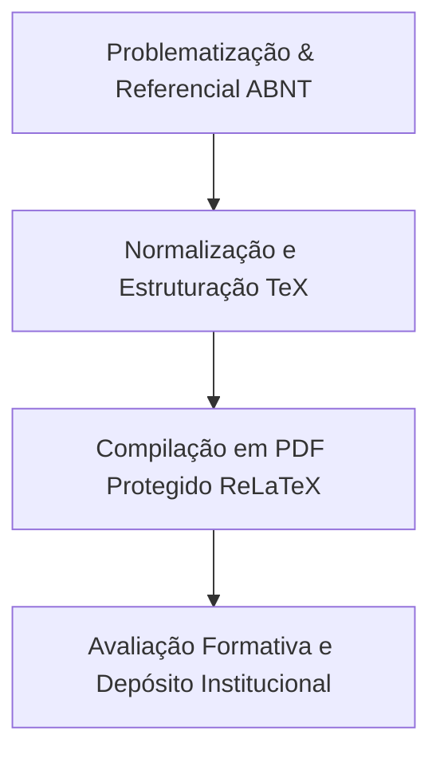

> [!note] 📦 Material Didático e Recursos da Aula
> - 📄 **[Slides LaTeX — Modelo Branco (PDF)](/assets/biblioteca/latex-escrita/slides-latex/aula-09-branco.pdf)** — *Apresentação visual oficial.*
> - 📄 **[Slides LaTeX — Modelo Preto (PDF)](/assets/biblioteca/latex-escrita/slides-latex/aula-09-preto.pdf)** — *Apresentação visual em tema escuro.*
> - 📝 **[Notas de Aula Institucionais (PDF)](/assets/biblioteca/latex-escrita/notes-latex/aula-09.pdf)** — *Apostila técnica completa em LaTeX.*
> 
> ### 🛠️ Recursos Adicionais e Links Externos
> - **[🏛️ Guia Oficial de Modelos e Classes ReLaTeX](/pt-br/resource/latex/modelos-de-documento)** — *Documentação técnica `ifftese.cls` e pacotes.*
> - **[📅 Planejamento Letivo e Cronograma](/pt-br/resource/latex/planejamento-e-cronograma)** — *Planejamento analítico das 20 aulas.*
> - **[📜 Código de Conduta e Diretrizes](/pt-br/resource/latex/codigo-de-conduta-e-diretrizes)** — *Normas éticas e regimento de IA.*
> - **[CTAN (Comprehensive TeX Archive Network)](https://ctan.org/)** — *Repositório mundial de pacotes TeX.*
> - **[ABNT — Catálogo de Normas Técnicas](https://www.abnt.org.br/)** — *Portal oficial ABNT NBR 14724, 10520 e 6023.*
> - **[Overleaf Documentation](https://www.overleaf.com/learn)** — *Guias interativos da linguagem LaTeX.*

## 📋 Sumário da Aula
- 1. Fundamentação Teórica e Normativa
- 2. Aplicação Prática no Ecossistema ReLaTeX
- 3. Estudo de Caso e Resolução de Problemas
- 4. Síntese e Diretrizes de Laboratório

### 📊 Fluxograma do Processo Metodológico (Mermaid)

## 📚 Referências Bibliográficas

- ASSOCIAÇÃO BRASILEIRA DE NORMAS TÉCNICAS. **ABNT NBR 14724**: Informação e documentação — Trabalhos acadêmicos — Apresentação. Rio de Janeiro: ABNT, 2011.
- ASSOCIAÇÃO BRASILEIRA DE NORMAS TÉCNICAS. **ABNT NBR 10520**: Informação e documentação — Citações em documentos — Apresentação. Rio de Janeiro: ABNT, 2023.
- ASSOCIAÇÃO BRASILEIRA DE NORMAS TÉCNICAS. **ABNT NBR 6023**: Informação e documentação — Referências — Elaboração. Rio de Janeiro: ABNT, 2018.
