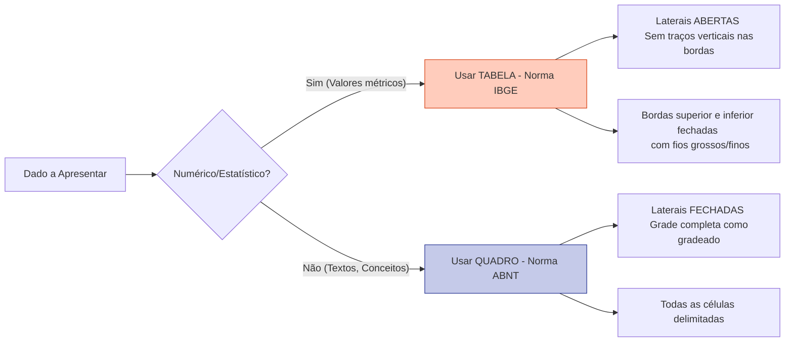

| Material Didático | Link Institucional (Acesso Aberto / PDF) |
| :--- | :--- |
| 📄 **Slides LaTeX — Modelo Branco (.pdf)** | [Acessar Slide Branco](/assets/biblioteca/latex-escrita/slides-latex/aula-09-branco.pdf) |
| 📄 **Slides LaTeX — Modelo Preto (.pdf)** | [Acessar Slide Preto](/assets/biblioteca/latex-escrita/slides-latex/aula-09-preto.pdf) |
| 📝 **Notas de Aula Institucionais (.pdf)** | [Acessar Notas Institucionais](/assets/biblioteca/latex-escrita/notes-latex/aula-09.pdf) |

## 📋 Sumário da Aula
- 1. Introdução e Fundamentação Teórica
- 2. Normalização ABNT e Rigor Metodológico
- 3. Prática e Engenharia no Ecossistema ReLaTeX
- 4. Estudo de Caso Real e Resolução de Problemas
- 5. Síntese e Conclusão

---

## 1. O Capítulo de Resultados

O capítulo de "Resultados" (frequentemente agrupado como "Resultados e Discussão", embora a divisão seja a preferida em pesquisas experimentais exatas) é o destino final e razão de existir de toda a argumentação da pesquisa.

Para que os resultados possuam clareza e credibilidade, os dados devem ser apresentados em um formato visual estruturado e padronizado. Na escrita acadêmica brasileira (e exigido pelo `ifftese` no LaTeX), há uma forte distinção formal entre a exibição de dados estatísticos/numéricos e a exibição de conteúdos qualitativos e textuais. Esta separação é baseada conjuntamente na NBR 14724 da ABNT e nas normas de apresentação tabular do IBGE.

## 2. A Confusão Histórica: Tabelas vs. Quadros

Muitos alunos iniciantes cometem um erro crasso e frequente nas dissertações: chamam qualquer arranjo de linhas e colunas de "Tabela". Para a norma técnica no Brasil, existem duas classes fundamentais e distintas, com formatações visuais rigorosamente diferentes: as Tabelas (Norma IBGE) e os Quadros (ABNT).

### 2.1 Tabela (Segundo as Normas de Apresentação Tabular do IBGE, 1993)

**Propósito:** Exibir dados numéricos, estatísticos e matemáticos sujeitos a análise quantitativa. O foco absoluto da tabela é evidenciar as variáveis métricas em suas colunas, facilitando a leitura de séries numéricas contínuas e permitindo comparações rápidas de ordens de grandeza.

**Regras de Formatação Estritas (IBGE 1993):**
1.  **Sem Bordas Laterais:** A característica visual mais marcante da Tabela do IBGE é que ela **não possui traços verticais delimitando suas bordas direita e esquerda externas**.
2.  **Sem Grades Internas Completas:** Evita-se fechar células como num tabuleiro da velha. Há traços horizontais demarcando o cabeçalho superior e traços horizontais finalizando a parte inferior da tabela. Traços verticais internos são desencorajados, usados apenas em tabelas imensamente complexas (mas ainda sem borda externa).
3.  **Posição do Título:** O título localiza-se na parte superior, antecedido da palavra Tabela e de seu número de ordem em arábicos (ex: Tabela 1 - Desempenho do Algoritmo Genético).
4.  **Fonte da Informação:** É obrigatório citar a fonte dos dados no rodapé da tabela, mesmo que a fonte seja o próprio autor da pesquisa (ex: Fonte: Elaborado pelo autor (2026)). A fonte deve vir na parte inferior.
5.  **Corpo e Cabeçalho:** O cabeçalho deve ser simples, explicando as variáveis (ex: Tempo (ms), Tensão (V), Erro (%)).

### 2.2 Quadro (ABNT NBR 14724)

**Propósito:** Exibir e sintetizar dados predominantemente qualitativos, textuais, conceitos, classificações, equações alfanuméricas, organogramas comparativos ou strings lógicas de revisão sistemática.

**Regras de Formatação Estritas (ABNT):**
1.  **Bordas Completamente Fechadas:** O Quadro é uma "caixa" perfeitamente fechada. Todas as suas bordas externas e as grandes internas (verticais e horizontais) devem estar desenhadas, delimitando perfeitamente as células de texto.
2.  **Identificação:** Assim como a tabela, possui título na parte superior e numeração sequencial (ex: Quadro 1 - Critérios de Inclusão da Revisão Bibliográfica).
3.  **Fonte da Informação:** A fonte deve ser citada no rodapé da figura (ex: Fonte: Adaptado de Silva (2022)).

## 3. Implementação Prática no LaTeX

A classe `ifftese` e pacotes como o `booktabs` (para tabelas de alta qualidade) tratam dessas diferenças estruturais de forma nativa e profissional.

*   Para criar **Tabelas** visualmente belas, sem bordas laterais e com espaçamento elegante, utiliza-se quase sempre o pacote `booktabs` com os comandos `\toprule`, `\midrule` e `\bottomrule`, evitando os traços verticais `|` no ambiente `tabular`.
*   Para criar **Quadros**, o LaTeX precisa fechar todas as grades. Geralmente usa-se a própria estrutura nativa do `tabular` (ex: `\begin{tabular}{|c|c|c|}`) junto com um ambiente flutuante específico como `\begin{quadro}` (criado no preâmbulo por meio de pacotes de customização ou pela classe da universidade).

## 4. Diagrama Comparativo (Mermaid)

## 5. Estudo de Caso

**O Cenário:** O mestrando João avaliou 3 linguagens de programação diferentes (C, Python e Java) para criptografia embarcada num chip IoT. Ele quer mostrar as vantagens teóricas de cada uma, e também mostrar os resultados medidos de uso de CPU e tempo gasto para criptografar.

**Solução Híbrida e Correta:**

1.  Para exibir os parâmetros conceituais e características operacionais de cada linguagem, João cria o **Quadro 1 - Comparativo qualitativo das linguagens estudadas**. O quadro terá linhas verticais e horizontais fechadas. Nas colunas: "Linguagem", "Tipagem", "Paradigma", "Vantagem no IoT". O conteúdo das células será textual (ex: "Fortemente tipada", "Orientação a objetos").
2.  Para exibir os resultados finais experimentais recolhidos de seus sensores na bancada, ele cria a **Tabela 1 - Desempenho computacional dos algoritmos criptográficos em IoT**. A tabela não terá bordas laterais. As colunas serão: "Linguagem", "Tempo de Execução (ms)", "Uso de CPU (%)", "Consumo Estimado (mW)". O interior será preenchido com números de ponto flutuante, médias e desvio-padrão obtidos do experimento.

## 6. Exercício Prático

1.  Considere os seguintes dados: O Brasil foi pentacampeão do mundo nos anos de 1958, 1962, 1970, 1994 e 2002. A Itália foi tetracampeã em 1934, 1938, 1982, 2006. A Alemanha tetracampeã em 1954, 1974, 1990, 2014. Você classificaria essa informação visualmente num Quadro ou numa Tabela? Por quê?
2.  No ambiente LaTeX `tabular`, como você declararia as colunas para uma **Tabela** (IBGE) de 3 colunas centralizadas, respeitando a ausência de bordas externas verticais?
3.  E como faria a declaração do mesmo ambiente `tabular` para o **Quadro** (ABNT) com as mesmas 3 colunas centralizadas, de forma que houvesse traços verticais delimitando todas as colunas e bordas externas?

## 7. Referências Bibliográficas

ASSOCIAÇÃO BRASILEIRA DE NORMAS TÉCNICAS. **NBR 14724**: Informação e documentação: trabalhos acadêmicos: apresentação. Rio de Janeiro: ABNT, 2011.

INSTITUTO BRASILEIRO DE GEOGRAFIA E ESTATÍSTICA (IBGE). **Normas de apresentação tabular**. 3. ed. Rio de Janeiro: IBGE, 1993.

KOPKA, H.; DALY, P. W. **Guide to LaTeX**. 4. ed. Boston: Addison-Wesley, 2004.

## 🛠️ Recursos Adicionais e Material Suplementar

- **[🏛️ Guia Oficial de Modelos, Classes e Pacotes ReLaTeX](/pt-br/resource/latex/modelos-de-documento)** — Exemplos canônicos de código, classes (`ifftese.cls`, `slidesiffmodelo.cls`) e documentação interna.
- **[📅 Planejamento Letivo e Cronograma de Atividades](/pt-br/resource/latex/planejamento-e-cronograma)** — Matriz analítica de 80h (Terças, 14h30-17h30) e avaliação em 2 bimestres.
- **[📜 Código de Conduta e Diretrizes Acadêmicas](/pt-br/resource/latex/codigo-de-conduta-e-diretrizes)** — Regimento ético, normas CEP/CONEP e uso transparente de IA.
- **[CTAN (Comprehensive TeX Archive Network)](https://ctan.org/)** — Portal oficial mundial de pacotes LaTeX2e.
- **[ABNT Catálogo de Normas](https://www.abnt.org.br/)** — Acesso e consulta às normas técnicas vigentes.
- **[Overleaf Documentation](https://www.overleaf.com/learn)** — Base de conhecimento e guias práticos sobre compilação TeX.

