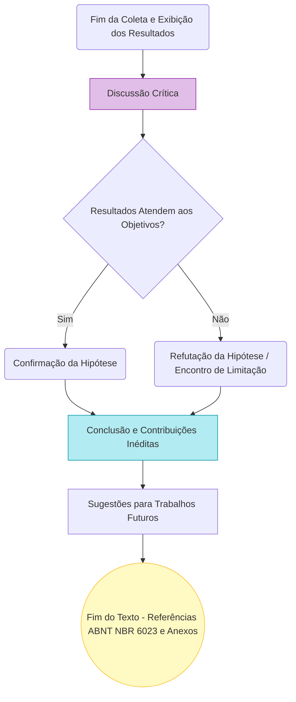

# Aula 10: Discussão, Conclusão, Sistema Autor-Data ABNT NBR 10520:2023 e Referências NBR 6023:2018/2020

**Carga Horária Equivalente:** 4 tempos de 50 minutos (3h20m / 4 horas-aula diárias)
**Professor Responsável:** Prof. Dr. Pedro Henrique Rocha de Andrade

---

> [!WARNING] AVISO INSTITUCIONAL
> Os materiais associados a esta disciplina, incluindo links de acesso, bibliografia suplementar e recursos audiovisuais, são protegidos por senha. Em caso de solicitação, utilize a credencial: `escritaiff2026`.

| Material Didático | Link Institucional (Acesso Restrito / Senha Protegida) |
| :--- | :--- |
| 📄 **Slides LaTeX (.pdf)** | [Acessar Slide LaTeX](/assets/biblioteca/latex-escrita/slides-latex/aula-10.pdf) |
| 📊 **Slides PPTX (.pdf)** | [Acessar Slide PPTX](/assets/biblioteca/latex-escrita/slides-pptx/aula-10.pdf) |

---

## 1. O Papel da Discussão e da Conclusão

Após a apresentação fria e objetiva dos dados no capítulo de Resultados, a escrita acadêmica exige que o pesquisador eleve o nível da tese e promova o embate intelectual, interpretando criticamente seus achados na **Discussão** e fechando as amarras lógicas na **Conclusão**.

### 1.1 A Arte da Discussão de Resultados

A Discussão responde ao "E daí?". Não basta mostrar que o Algoritmo A foi 15% mais rápido que o Algoritmo B. A Discussão deve:
*   **Confrontar a Literatura:** Comparar seus achados com as publicações analisadas na Revisão Sistemática (Capítulo 2). Seus resultados apoiam ou contradizem o estudo anterior de Silva e Santos (2025)?
*   **Explicar Exceções:** Justificar anomalias, dados fora do padrão (outliers) e desvios de expectativa. Se a bateria esgotou mais rápido que o calculado, por que isso ocorreu (efeito térmico, falha no componente)?
*   **Evidenciar o Ineditismo e a Contribuição (Novelty):** É o momento de provar que a lacuna que originou o trabalho foi efetivamente resolvida.

### 1.2 Estruturação da Conclusão (Considerações Finais)

A Conclusão (ou Considerações Finais) não deve conter citações a outros autores (salvo em casos extremíssimos) e não deve apresentar novos resultados ou gráficos. Ela deve responder taxativamente e de forma sequencial aos **Objetivos Específicos** propostos na Introdução (Capítulo 1).

A estrutura consagrada:
1.  **Retomada sucinta do problema principal.**
2.  **Síntese das maiores conquistas obtidas.**
3.  **Limitações do Estudo:** Todo estudo sério tem limitações (o equipamento permitiu medir apenas até x Hertz, a amostra de pacientes foi pequena, o modelo validou apenas em simulação). Esconder limitações é o caminho mais rápido para ser criticado em uma defesa.
4.  **Trabalhos Futuros:** Proposições claras para próximos alunos ou continuidade da pesquisa (Mestrado -> Doutorado).

## 2. O Novo Padrão de Citações: ABNT NBR 10520:2023

A norma que rege a menção de trabalhos no corpo do texto passou por uma revolução drástica no ano de 2023, modernizando a formatação histórica da ABNT. Todo manuscrito científico precisa aplicar e entender a distinção do sistema "Autor-Data".

### 2.1 Citação Indireta (Paráfrase)

É a mais utilizada em Engenharias e Exatas. O autor reescreve a ideia da obra consultada com suas próprias palavras. O fundamental é informar a autoria e o ano. Não exige número de página.

*   **Autoria inserida na fluidez do texto (dentro da sintaxe da frase):** Somente a letra inicial do nome é maiúscula, independente se está ou não no fim do parágrafo.
    *   *Exemplo:* Segundo afirmação recente de Einstein (2025), o comportamento das partículas...
    *   *Exemplo:* Para Hawking e Penrose (2024), a singularidade não pode ser ignorada.
*   **Autoria não integrante do texto (entre parênteses):** A principal alteração da norma de 2023! Antes, a chamada de autor dentro dos parênteses devia ser em CAIXA ALTA (ex: (SILVA, 2019)). A **NBR 10520:2023 extinguiu o uso de caixa alta para nomes de autores nos parênteses**. Agora, usam-se apenas as iniciais em maiúsculo (Upper Camel Case).
    *   *Correto (NBR 2023):* A singularidade não pode ser ignorada nos modelos astrofísicos atuais (Hawking; Penrose, 2024).
    *   *Errado (Obsoleto):* A singularidade não pode ser ignorada (HAWKING; PENROSE, 2024).

> [!IMPORTANT] Atualização do pacote abnTeX2 (LaTeX)
> Se você utiliza as macros `\cite{chave}` e `\citeonline{chave}` no LaTeX com os pacotes tradicionais do `abntex2cite`, preste atenção à versão do seu compilador. Para obedecer à norma 2023 (sem caixa alta no parêntese), as chamadas de citação das classes precisam estar atualizadas.

### 2.2 Citação Direta (Transcrição Textual)

Quando a frase original do autor é copiada palavra por palavra, *ipsis litteris*.
*   **Curta (Até 3 linhas):** Permanece no corpo do texto, fechada obrigatoriamente entre aspas duplas (""). A indicação do ano e do **número da página é obrigatória**. Ex: "A gravidade distorce o espaço-tempo de maneira detectável" (Einstein, 1915, p. 44).
*   **Longa (Mais de 3 linhas):** Sofre um destaque drástico (recuo ou indentação de 4 cm da margem esquerda, tamanho de fonte menor (geralmente 10pt) e espaçamento entrelinhas simples, **sem uso de aspas**).

### 2.3 Citação de Citação (Apud)

Ocorre quando você não leu o artigo original raro ou antigo, mas cita uma obra atual que mencionou aquele artigo. A indicação no texto deve ser conectada pela expressão em itálico *apud* (citado por). **Atenção:** o uso indiscriminado de "apud" é sinal de preguiça intelectual do pesquisador. O autor moderno, através dos PDFs online, deve buscar sempre a fonte original primária.

## 3. As Referências e o Fim do Documento: ABNT NBR 6023 (2018 com correções de 2020)

As referências pós-textuais consistem na lista completa e minuciosa de todas as obras citadas no decorrer do texto (se um artigo foi citado, ele obrigatoriamente tem que estar na lista, e se está na lista, tem que ter sido citado. A compilação BibTeX garante isso automaticamente).

A ABNT 6023 detalha como listar cada tipo de documento (livro, periódico, site, tese, relatório técnico, normas padrão e até mesmo postagens de redes sociais ou vídeos do YouTube).

**Elementos Essenciais (Livro / Monografia):**
AUTOR (Sobrenome em CAIXA ALTA, seguido de Nome abreviado ou não). **Título em negrito ou itálico**: subtítulo sem negrito. Edição (se houver). Local (cidade): Editora, Ano de publicação.
*Exemplo:* LAKATOS, E. M.; MARCONI, M. de A. **Fundamentos de metodologia científica**. 8. ed. São Paulo: Atlas, 2017.

**Elementos Essenciais (Artigo de Periódico / Journal):**
AUTOR DO ARTIGO. Título do artigo. **Título do Periódico em negrito ou itálico**, Local, volume, número (fascículo), paginação inicial e final, data ou período. DOI ou URL e Acesso (se meio eletrônico).
*Exemplo:* ANDRADE, P. H. R. de et al. Redes neurais para predição em robótica cooperativa. **IEEE Transactions on Robotics**, Nova York, v. 35, n. 4, p. 1010-1025, ago. 2026. DOI: 10.1109/TRO.2026.123456.

## 4. Diagrama Lógico de Encerramento da Pesquisa (Mermaid)

## 5. Estudo de Caso

**O Cenário:** Carolina chegou ao final da escrita da sua dissertação sobre "Filtragem Ativa de Harmônicos usando Controle Preditivo". 

**O Processo de Fechamento:** 
1. Em Resultados, Carolina usa gráficos de espectro de frequência e tabelas de THD (Total Harmonic Distortion). 
2. Na Discussão, ela escreve (usando a NBR 10520:2023 atualizada): *Ao reduzir a distorção para 2%, o sistema supera largamente os filtros passivos clássicos documentados pela literatura (Akagi; Watanabe; Aredes, 2017), confirmando a vantagem do rastreio em tempo real.*
3. Ela insere uma citação direta da IEEE-519 justificando por que o limite 5% importava.
4. Na Conclusão, ela reafirma que cumpriu os 3 objetivos propostos no início da tese, lista a limitação de que seu DSP aquece em frequências elevadas e sugere que um aluno futuro implemente refrigeração ativa e um microcontrolador mais robusto.
5. Ao longo de todo o documento, Carolina usou ferramentas como JabRef e BibTeX/Biber para gerir os dados dos arquivos `.bib`. Quando ela compila seu projeto `.tex` com a diretiva `\bibliography{}`, a lista de referências NBR 6023 é gerada impecavelmente formatada com autoria em caixa alta, ano e negritos rigorosos, resolvendo dores de cabeça que durariam semanas no Word.

## 6. Exercício Prático

**Objetivo:** Adaptar formatação ao padrão 2023 e entender referências.

1.  A frase a seguir está no padrão ABNT *antigo*. Reescreva-a seguindo a regra da nova **NBR 10520:2023** para autoria entre parênteses: *A estabilidade cibernética global é comprometida pela ação velada de malwares avançados (KASPERSKY; SYMANTEC; MCAFEE, 2022).*
2.  Descreva a principal diferença conceitual, de propósito na estrutura de uma tese, entre a "Discussão" e a "Conclusão".
3.  Simule a criação de uma Referência Bibliográfica completa nos moldes da **NBR 6023** para um livro fictício (um tema inventado ou relacionado ao seu projeto) que possua: Dois autores, uma terceira edição, publicado na cidade do Rio de Janeiro no ano passado.

## 7. Referências Bibliográficas (ABNT NBR 6023:2018)

ASSOCIAÇÃO BRASILEIRA DE NORMAS TÉCNICAS. **NBR 6023**: Informação e documentação: referências: elaboração. Rio de Janeiro: ABNT, 2018.

ASSOCIAÇÃO BRASILEIRA DE NORMAS TÉCNICAS. **NBR 10520**: Informação e documentação: citações em documentos: apresentação. Rio de Janeiro: ABNT, 2023.

ASSOCIAÇÃO BRASILEIRA DE NORMAS TÉCNICAS. **NBR 14724**: Informação e documentação: trabalhos acadêmicos: apresentação. Rio de Janeiro: ABNT, 2011.
