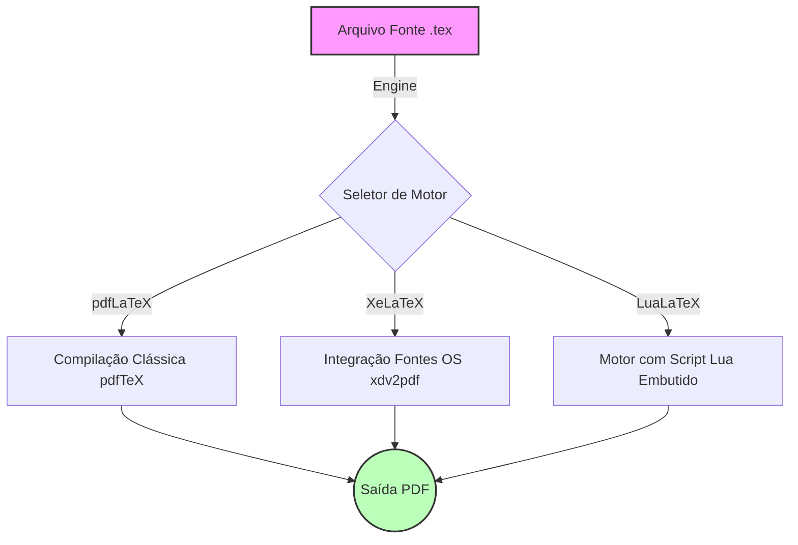

# Aula 11: Arquitetura do Kernel LaTeX2e, Motores PDFLaTeX/LuaLaTeX/XeLaTeX e Estrutura do Preâmbulo .tex

**Professor Responsável:** Prof. Dr. Pedro Henrique Rocha de Andrade
**Carga Horária Equivalente:** 4 tempos de 50 minutos (3h20m / 4 horas-aula diárias)

> **Aviso Institucional:** Os materiais didáticos vinculados a esta aula estão protegidos por senha institucional (`escritaiff2026`).

| Material Didático | Link Institucional (Acesso Restrito / Senha Protegida) |
| :--- | :--- |
| 📄 **Slides LaTeX (.pdf)** | [Acessar Slide LaTeX](/assets/biblioteca/latex-escrita/slides-latex/aula-11.pdf) |
| 📊 **Slides PPTX (.pdf)** | [Acessar Slide PPTX](/assets/biblioteca/latex-escrita/slides-pptx/aula-11.pdf) |

## 1. Introdução à Arquitetura do Sistema TeX e LaTeX2e

O sistema TeX, criado por Donald Knuth no final da década de 1970, representa um marco na editoração eletrônica e na tipografia digital. Sua arquitetura foi concebida com o rigor matemático necessário para garantir a estabilidade do layout de documentos ao longo de décadas. O LaTeX, concebido inicialmente por Leslie Lamport como um conjunto de macros para simplificar o uso do TeX, evoluiu para o padrão de fato na escrita acadêmica, culminando na versão LaTeX2e.

### 1.1 O Kernel LaTeX2e
O kernel do LaTeX2e atua como a interface entre as primitivas de baixo nível do TeX (como manipulação de caixas, colas e penalidades - *boxes, glue, and penalties*) e a semântica abstrata desejada pelos autores (como seções, figuras e referências). A arquitetura modular do kernel permite a extensão através de pacotes (`.sty`) e classes (`.cls`). 

O processamento de um documento LaTeX segue um pipeline rigoroso:
1. **Tokenização:** Leitura do arquivo `.tex` em caracteres e macros.
2. **Expansão:** Resolução de comandos encadeados até atingir as primitivas do TeX.
3. **Execução:** Alocação de memória tipográfica e formação de parágrafos.
4. **Output:** Geração do formato final (DVI ou, modernamente, PDF).

### 1.2 Diferenciação dos Motores TeX: PDFLaTeX, LuaLaTeX e XeLaTeX

A escolha do motor (engine) TeX determina não apenas a velocidade de compilação, mas também o suporte a fontes nativas e scripts complexos.

- **PDFLaTeX:** O motor clássico por excelência. Ele traduz diretamente as primitivas do TeX para o formato PDF. Seu suporte a fontes é restrito aos formatos Type 1 e requer pacotes como `inputenc` e `fontenc` para mapear os caracteres de entrada para os glifos corretos. Apesar de ser extremamente maduro e estável, sua falta de suporte nativo a UTF-8 e fontes OpenType (OTF) sem manipulações complexas impulsionou o desenvolvimento de novos motores.
- **XeLaTeX:** O pioneiro na integração nativa do TeX com fontes do sistema operacional via OpenType (OTF) e TrueType (TTF). Ele processa nativamente caracteres Unicode. Utilizando o pacote `fontspec`, é possível definir fontes de forma muito intuitiva. O XeLaTeX, contudo, realiza a geração do PDF utilizando um passo intermediário (xdv).
- **LuaLaTeX:** O sucessor oficial do pdfTeX e motor de compilação do futuro. Ele embarca a linguagem de script Lua diretamente no kernel do TeX, abrindo o "caixa-preta" do TeX e permitindo manipulações programáticas complexas nos nodos tipográficos, algoritmos de hifenização e leitura de arquivos. Ele suporta nativamente UTF-8 e OTF via `fontspec` e `luaotfload`.

## 2. Estrutura Profunda do Preâmbulo `.tex`

O preâmbulo é a seção do documento LaTeX compreendida entre o `\documentclass` e o `\begin{document}`. Ele atua como o "cérebro" da configuração tipográfica. No contexto da escrita acadêmica e das normas ABNT (NBR 14724, NBR 6023, NBR 10520), o preâmbulo é vital para estabelecer as margens, fontes, espaçamentos entrelinhas e estilos bibliográficos.

### 2.1 Sintaxe de Invocação de Classe

A declaração `\documentclass[opções]{classe}` não apenas inicia a leitura, mas carrega o arquivo `.cls` correspondente. 

```latex
% Exemplo de inicialização baseada em abntex2 ou ifftese
\documentclass[
  12pt,        % Tamanho da fonte (NBR 14724)
  openright,   % Capítulos começam em página ímpar
  twoside,     % Impressão frente e verso
  a4paper,     % Tamanho do papel
  brazil       % Idioma principal (babel)
]{abntex2}
```

### 2.2 Carregamento Estratégico de Pacotes

A ordem de carregamento dos pacotes (`\usepackage`) no preâmbulo é crítica. Conflitos (package clashes) ocorrem frequentemente se pacotes que modificam os mesmos registradores ou comandos são carregados em ordem incorreta. 

Para LuaLaTeX/XeLaTeX:
```latex
\usepackage{fontspec}
\setmainfont{Times New Roman} % Em atendimento à NBR 14724 que sugere Times ou Arial
\usepackage{polyglossia}
\setmainlanguage{brazil}
```

Para PDFLaTeX:
```latex
\usepackage[utf8]{inputenc}
\usepackage[T1]{fontenc}
\usepackage{mathptmx} % Fonte similar a Times
```

## 3. Estudo de Caso: Migração de PDFLaTeX para LuaLaTeX em uma Tese

O Prof. João, da Engenharia de Materiais, estava desenvolvendo sua tese em PDFLaTeX. Ele enfrentava problemas de lentidão extrema e erros de *out of memory* (*TeX capacity exceeded*) ao lidar com mais de 200 figuras em alta resolução e extensos blocos de código TikZ, além de dificuldades para incorporar uma fonte OpenType exigida pelo padrão visual da universidade.

A intervenção requerida foi a alteração do motor para **LuaLaTeX**. O preâmbulo foi refatorado:
1. Remoção total de `\usepackage[utf8]{inputenc}` e `\usepackage[T1]{fontenc}`.
2. Inclusão de `\usepackage{fontspec}` e definição nativa da fonte.
3. Utilização da capacidade dinâmica de memória do LuaTeX para lidar com gráficos vetoriais imensos sem estourar registradores (*save size* ou *main memory*).

## 4. Diagrama de Arquitetura dos Motores



## 5. Exercício Prático

**Objetivo:** Criar um preâmbulo "à prova de balas" para LuaLaTeX compatível com as margens da NBR 14724.
1. Crie um arquivo `exercicio.tex`.
2. Utilize a classe `article` com `12pt` e `a4paper`.
3. Configure o pacote `geometry` para margens ABNT: Esquerda e Superior: 3cm, Direita e Inferior: 2cm.
4. Carregue o `fontspec` e configure a fonte 'Arial' (ou similar disponível no seu SO).
5. Compile com o motor LuaLaTeX.

## 6. Referências Bibliográficas (NBR 6023:2018)

ASSOCIAÇÃO BRASILEIRA DE NORMAS TÉCNICAS. **NBR 14724**: Informação e documentação — Trabalhos acadêmicos — Apresentação. Rio de Janeiro: ABNT, 2011.
KNUTH, Donald E. **The TeXbook**. Reading, Massachusetts: Addison-Wesley, 1984.
LAMPORT, Leslie. **LaTeX: A Document Preparation System**. 2. ed. Reading, Massachusetts: Addison-Wesley, 1994.
MITTELBACH, Frank et al. **The LaTeX Companion**. 2. ed. Boston: Addison-Wesley, 2004.
