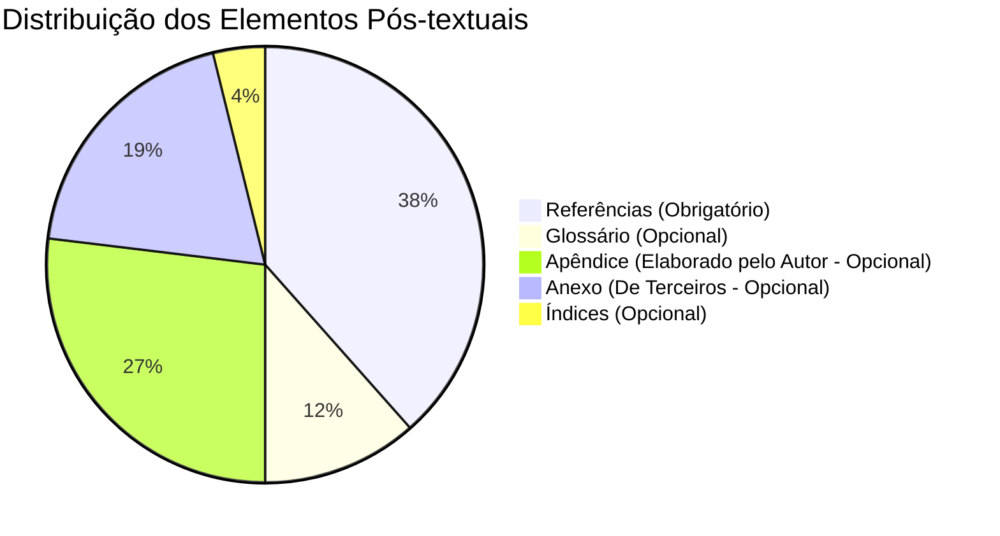

# Aula 12 - Referências, Apêndices e Anexos

**Carga Horária:** 2h - Aula Diária

> **Aviso:** Os materiais complementares e templates estão protegidos. Utilize a senha `escritaiff2026` para acessá-los.

## 1. Slide Referente da Aula (Beamer)

```latex
\documentclass[aspectratio=169]{beamer}
\usetheme{Madrid}
\usepackage[utf8]{inputenc}
\usepackage[T1]{fontenc}
\usepackage[brazil]{babel}

\title{Escrita Acadêmica e LaTeX}
\subtitle{Aula 12: Referências, Apêndices e Anexos}
\author{Prof. Dr. Pedro}
\institute{Instituto Federal Fluminense (IFF)}
\date{\today}

\begin{document}

\begin{frame}
    \titlepage
\end{frame}

\begin{frame}{Referências (NBR 6023:2018/2020)}
    \begin{itemize}
        \item Elemento Pós-textual OBRIGATÓRIO.
        \item Alinhamento exclusivamente à margem esquerda, espaçamento simples, separadas por uma linha em branco.
        \item Uso do BibTeX e Arquivos \texttt{.bib} no LaTeX automatiza o processo.
    \end{itemize}
\end{frame}

\begin{frame}{Apêndices vs. Anexos}
    \begin{block}{Apêndice}
        Documento ou texto elaborado pelo \textbf{próprio autor} a fim de complementar sua argumentação. (Ex: Questionário estruturado pelo aluno).
    \end{block}
    
    \begin{block}{Anexo}
        Documento ou texto \textbf{não elaborado pelo autor}, que serve de fundamentação, comprovação e ilustração. (Ex: Cópia da Lei X, Manual do Fabricante Y).
    \end{block}
\end{frame}

\end{document}
```

## 2. Detalhamento Minucioso das Normas ABNT (NBR 6023, 6027, 6028, 12225)
A **NBR 6023:2018** (com as erratas de 2020) dita as regras para as **Referências**. Uma exigência capital: a formatação do título do documento deve estar em destaque (negrito, itálico ou sublinhado). Se a obra tiver até 3 autores, cita-se todos; mais de 3 autores pode-se usar *et al.* (em itálico). O alinhamento das referências na folha deve ser à esquerda, diferente do texto principal que é justificado.
Os **Apêndices e Anexos** (NBR 14724) são elementos pós-textuais opcionais. Eles são identificados por letras maiúsculas seguidas de travessão (ex: APÊNDICE A — Questionário Demográfico; ANEXO A — Mapa do IBGE).

## 3. Estudo de Caso (Use Case) Real
**Contexto:** Um TCC sobre automação industrial.
- O aluno precisa inserir o código-fonte gigante do seu microcontrolador Arduino e a ficha de especificações (Datasheet) original de um sensor da Texas Instruments.
- **Decisão Metodológica ABNT:** O código-fonte foi desenvolvido pelo aluno, logo vai para o **APÊNDICE A — Código-fonte do Firmware em C++**. O Datasheet foi criado pela fabricante (terceiros), então vai para o **ANEXO A — Datasheet do Sensor LM35 (Texas Instruments)**. 
- O LaTeX oferece os comandos `\appendix` e, com pacotes específicos, facilita essa transição de contagem e titulação sem causar dor de cabeça.

## 4. Diagramas e Ilustrações



## 5. Exercício Prático
1. Identifique no seu TCC/Dissertação: você possui documentos complementares? Classifique-os em Apêndices ou Anexos.
2. Crie um arquivo `bibliografia.bib` com 3 referências (1 livro, 1 artigo de periódico e 1 site) utilizando a sintaxe do BibTeX, e chame no seu documento principal.

## 6. Referências Bibliográficas
- ASSOCIAÇÃO BRASILEIRA DE NORMAS TÉCNICAS. **NBR 6023**: Informação e documentação: referências: elaboração. Rio de Janeiro: ABNT, 2018 (versão corrigida 2020).
- ASSOCIAÇÃO BRASILEIRA DE NORMAS TÉCNICAS. **NBR 14724**: Informação e documentação: trabalhos acadêmicos: apresentação. Rio de Janeiro: ABNT, 2011.


## Slide Referente da Aula (Beamer — Modelo Institucional IFF)

Abaixo apresentamos o código LaTeX integral dos slides institucionais desta aula, construído com a classe **`slidesiffmodelo.cls`** (na proporção 16:9), integrando automaticamente os metadados oficiais do Instituto Federal Fluminense (IFF):

```latex
\documentclass[aspectratio=169]{slidesiffmodelo}
\usepackage[utf8]{inputenc}
\usepackage[T1]{fontenc}
\usepackage[brazil]{babel}
\usepackage{amsmath,amssymb}
\usepackage{booktabs}
\usepackage{tikz}

% ==============================================================================
% METADADOS INSTITUCIONAIS - IFF (PROJETO RELATEX)
% ==============================================================================
\titulo{Aula 12: Referências Bibliográficas (NBR 6023:2018/2020)}
\subtitulo{Curso Profissional de Escrita Acadêmica e LaTeX (80h)}
\autor{Prof. Dr. Pedro Henrique Silva}
\orientador{Projeto ReLaTeX -- IFF Campus Bom Jesus do Itabapoana}
\curso{Engenharia de Computação / Pós-Graduação}
\campus{Campus Bom Jesus do Itabapoana}
\instituicao{Instituto Federal de Educação, Ciência e Tecnologia Fluminense}
\data{\today}

\begin{document}

% ------------------------------------------------------------------------------
% SLIDE 1: CAPA INSTITUCIONAL IFF
% ------------------------------------------------------------------------------
\begin{frame}[plain]
    \imprimircapa
\end{frame}

% ------------------------------------------------------------------------------
% SLIDE 2: SUMÁRIO E ROTEIRO DA AULA
% ------------------------------------------------------------------------------
\begin{frame}{Roteiro da Aula 12}
    \tableofcontents
\end{frame}

% ------------------------------------------------------------------------------
% SLIDE 3: FUNDAMENTAÇÃO TEÓRICA / NORMATIVA ABNT
% ------------------------------------------------------------------------------
\section{Fundamentação e Normativa}
\begin{frame}{Fundamentação Teórica e Normativa ABNT/IBGE}
    \begin{block}{Diretriz Institucional --- Normativa ABNT NBR 6023:2018 / Emenda 1:2020}
        Formatação canônica para monografias, artigos, sites, patentes e inclusão obrigatória de DOI.
    \end{block}
    \vspace{0.3cm}
    \textbf{Pontos-Chave da Aula 12:}
    \begin{itemize}
        \item \textbf{Alinhamento Normativo:} Obediência estrita aos padrões canônicos da ABNT e IBGE.
        \item \textbf{Rigor Metodológico:} Estruturação de Apêndices (produção do autor) e Anexos (documentos de terceiros).
        \item \textbf{Prática em LaTeX:} Automação tipográfica sem intervenção manual de formatação.
    \end{itemize}
\end{frame}

% ------------------------------------------------------------------------------
% SLIDE 4: ARQUITETURA E FLUXO METODOLÓGICO (COLUNAS)
% ------------------------------------------------------------------------------
\section{Arquitetura e Metodologia}
\begin{frame}{Arquitetura de Implementação e Boas Práticas}
    \begin{columns}[c]
        \begin{column}{0.48\textwidth}
            \begin{alertblock}{Atenção Epistemológica}
                Evite desvios normativos ou formatações ad-hoc no código principal. Separe conteúdo de estilo.
            \end{alertblock}
        \end{column}
        \begin{column}{0.48\textwidth}
            \begin{exampleblock}{Padrão Oficial ReLaTeX}
                Utilize as macros centralizadas do pacote \texttt{ifftese.cls} e \texttt{metadados.sty} para manter a conformidade.
            \end{exampleblock}
        \end{column}
    \end{columns}
\end{frame}

% ------------------------------------------------------------------------------
% SLIDE 5: IMPLEMENTAÇÃO NO CÓDIGO (LATEX / ABNT)
% ------------------------------------------------------------------------------
\section{Exemplo Prático (Código)}
\begin{frame}[fragile]{Implementação Prática em LaTeX / ABNT}
    \begin{block}{Snippet de Referência --- Aula 12}
\begin{verbatim}
\printbibliography[title={Referências}] \appendix \chapter{...}
\end{verbatim}
    \end{block}
\end{frame}

% ------------------------------------------------------------------------------
% SLIDE 6: SÍNTESE E REFERÊNCIAS BIBLIOGRÁFICAS
% ------------------------------------------------------------------------------
\section{Síntese e Referências}
\begin{frame}{Síntese da Aula e Referências Normativas}
    \begin{itemize}
        \item Consolidação dos conhecimentos da Aula 12 no ecossistema IFF.
        \item Próxima etapa: Aplicação no arquivo \texttt{metadados.sty} e validação do build.
    \end{itemize}
    \vspace{0.4cm}
    \footnotesize
    \textbf{Referência Principal:}
    \begin{thebibliography}{10}
        \bibitem{ref1} ABNT. NBR 6023: Informação e documentação - Referências - Elaboração. 2018.
    \end{thebibliography}
\end{frame}

\end{document}
```

## Slide Referente da Aula (PPTX — Modelo Institucional IFF)

Para apresentações em auditórios do IFF ou defesas que utilizam o **Microsoft PowerPoint (.pptx)** (compatível com LibreOffice Impress e Google Slides), disponibilizamos o modelo institucional Widescreen (16:9) pronto para uso e estruturado nas normas canônicas da ABNT/IBGE abordadas nesta aula:

### 1. Especificação Visual e Identidade IFF (Widescreen 16:9)
- **Paleta Institucional:**
  - Verde Oficial IFF: `#2D6238` (`RGB: 45, 98, 56`) — Primária para Títulos e Capa.
  - Vermelho Destaque IFF: `#B3282D` (`RGB: 179, 40, 45`) — Secundária para Alertas e Código.
  - Cinza Chumbo: `#333333` (`RGB: 51, 51, 51`) — Corpo de Texto.
- **Rodapé Institucional Padronizado:** `Prof. Dr. Pedro Henrique Silva | IFF Campus Bom Jesus do Itabapoana | Curso de Escrita Acadêmica e LaTeX (80h) | Aula 12`.

### 2. Download do Arquivo PPTX Institucional
O arquivo `.pptx` institucional desta aula encontra-se gerado no repositório com todos os 4 slides (Capa, Roteiro, Fundamentação Teórica e Exemplo Prático/Referências):

> [!TIP] **Download da Apresentação**
> **[📥 Baixar Apresentação Institucional em PPTX — Aula 12: Referências Bibliográficas (NBR 6023:2018/2020)](/assets/biblioteca/latex-escrita/slides-pptx/aula-12-iff-institucional.pptx)**

### 3. Conversão Direta via Terminal (Pandoc)
Caso prefira compilar seus próprios slides localmente a partir deste texto Markdown utilizando o template mestre institucional:
```bash
pandoc aula-12.md -o aula-12-iff-institucional.pptx --reference-doc=template-iff-widescreen.pptx --slide-level=2
```

