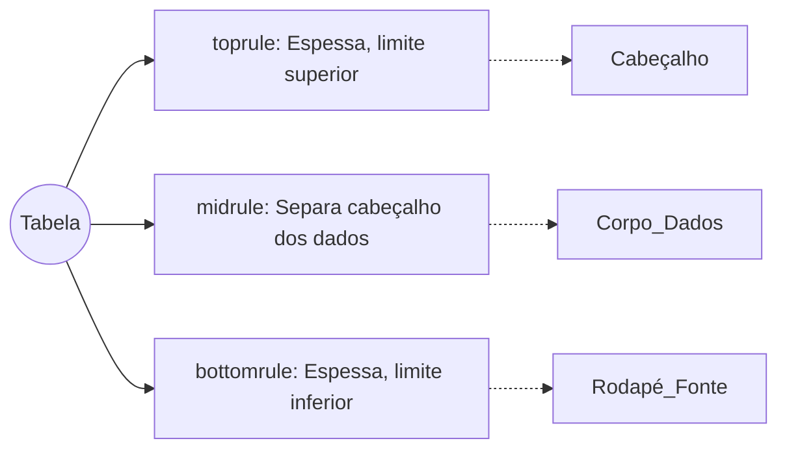

| Material Didático | Link Institucional (Acesso Aberto / PDF & PPTX) |
| :--- | :--- |
| 📄 **Slides LaTeX — Modelo Branco (.pdf)** | [Acessar Slide Branco](/assets/biblioteca/latex-escrita/slides-latex/aula-12-branco.pdf) |
| 📄 **Slides LaTeX — Modelo Preto (.pdf)** | [Acessar Slide Preto](/assets/biblioteca/latex-escrita/slides-latex/aula-12-preto.pdf) |
| 📊 **Slides PPTX — Modelo Branco (.pptx)** | [Acessar PPTX Branco](/assets/biblioteca/latex-escrita/slides-pptx/aula-12-branco.pptx) |
| 📊 **Slides PPTX — Modelo Preto (.pptx)** | [Acessar PPTX Preto](/assets/biblioteca/latex-escrita/slides-pptx/aula-12-preto.pptx) |
| 📝 **Notas de Aula Institucionais (.pdf)** | [Acessar Notas Institucionais](/assets/biblioteca/latex-escrita/notes-latex/aula-12.pdf) |

## 📋 Sumário da Aula
- 1. Introdução e Fundamentação Teórica
- 2. Normalização ABNT e Rigor Metodológico
- 3. Prática e Engenharia no Ecossistema ReLaTeX
- 4. Estudo de Caso Real e Resolução de Problemas
- 5. Síntese e Conclusão


## 1. O Pacote amsmath: O Coração da Matemática no LaTeX

O LaTeX possui capacidades matemáticas nativas robustas, mas foi a Sociedade Americana de Matemática (American Mathematical Society - AMS) que elevou a tipografia matemática a um patamar definitivo com o pacote `amsmath` (e suas extensões `amssymb`, `amsthm`, e o moderno `mathtools`).

A sintaxe matemática exige clareza e precisão. Evita-se o uso dos antigos ambientes `eqnarray` em favor dos ambientes fornecidos pelo `amsmath`, devido a problemas conhecidos de espaçamento e alinhamento do `eqnarray`.

### 1.1 Ambientes Alinhados e Equações Multilinhas

Os principais ambientes para diagramação de equações são:
- `equation`: Equação simples e numerada.
- `align`: Múltiplas equações com alinhamento explícito pelo caracter `&`.
- `gather`: Múltiplas equações centralizadas, sem alinhamento específico.
- `split`: Utilizado dentro de um ambiente `equation` para dividir uma única equação longa em várias linhas mantendo uma única numeração.

Exemplo avançado utilizando `align`:
```latex
\begin{align}
  f(x) &= \int_a^b g(x,t) \, dt \\
  &= \left( \frac{1}{2} \sum_{i=1}^n x_i^2 \right) + C
\end{align}
```

### 1.2 Mathtools: Extensões e Melhorias

O pacote `mathtools` deve ser carregado no preâmbulo em substituição ao `amsmath` (ele internamente carrega e conserta bugs do `amsmath`). Ele provê comandos cruciais como `\DeclarePairedDelimiter` para criação de delimitadores automáticos de norma e valor absoluto:
```latex
\usepackage{mathtools}
\DeclarePairedDelimiter{\norm}{\lVert}{\rVert}
```
Assim, `\norm*{A}` redimensionará automaticamente as barras verticais para englobar o conteúdo da matriz ou fração.

## 2. Diagramação de Tabelas Profissionais com booktabs

Na escrita acadêmica e científica de alto nível, tabelas não devem se assemelhar a grades de planilhas. A filosofia da tipografia clássica estipula que linhas verticais (`|`) devem ser abolidas e linhas horizontais devem ser reduzidas ao mínimo essencial. O pacote `booktabs` provê comandos otimizados de espessura e espaçamento.

### 2.1 Regras de Ouro (Normas IBGE e Práticas Acadêmicas)
A norma de Apresentação Tabular (IBGE, 1993), muitas vezes referenciada por instituições brasileiras, concorda com a abolição das bordas laterais.

1. Não utilize linhas verticais.
2. Não utilize linha dupla horizontal (`\hline\hline`).
3. Utilize os comandos do `booktabs`: `\toprule`, `\midrule`, e `\bottomrule`.

### 2.2 Exemplo Comparativo

Tabela "Amadora" (a evitar):
```latex
\begin{tabular}{|c|c|c|}
\hline
Modelo & Acurácia & Erro \\
\hline
ResNet & 95\% & 5\% \\
VGG16 & 92\% & 8\% \\
\hline
\end{tabular}
```

Tabela Profissional (`booktabs`):
```latex
\begin{table}[htbp]
\centering
\caption{Comparativo de Desempenho de Redes Neurais}
\begin{tabular}{l cc}
\toprule
Modelo de Rede & Acurácia (\%) & Erro Residual (\%) \\
\midrule
ResNet-50      & 95.2         & 4.8 \\
VGG-16         & 92.1         & 7.9 \\
Inception-v3   & 94.5         & 5.5 \\
\bottomrule
\end{tabular}
\fonte{Elaborado pelo autor (2026).}
\end{table}
```

## 3. Estudo de Caso: Adequação Visual de uma Dissertação
A aluna Maria defendeu seu mestrado e a banca solicitou que as 35 tabelas de sua dissertação perdessem as "grades" de Excel. Ao longo de 4 horas, utilizando expressões regulares e o pacote `booktabs`, foi feita uma refatoração em massa. 
Os ganhos foram imensos em legibilidade e profissionalismo, sendo elogiado pela banca avaliadora na entrega da versão final em conformidade com as normas IBGE/ABNT.

## 4. Diagrama de Estrutura de Tabela



## 5. Exercício Prático
1. Inicie um documento e importe `mathtools` e `booktabs`.
2. Escreva o Teorema de Pitágoras e a Fórmula de Bhaskara utilizando o ambiente `align`.
3. Crie uma tabela apresentando resultados experimentais (3 colunas, 4 linhas de dados) utilizando estritamente a filosofia do `booktabs`.
4. Inclua uma legenda (caption) superior e uma fonte inferior (padrão ABNT).

## 6. Referências Bibliográficas
IBGE. Centro de Documentação e Disseminação de Informações. **Normas de apresentação tabular**. 3. ed. Rio de Janeiro: IBGE, 1993.
OETIKER, Tobias et al. **The Not So Short Introduction to LaTeX2e**. Version 6.4, 2021.
FEAR, Simon. **Publication quality tables in LaTeX**. CTAN, 2020.


## 🛠️ Recursos Adicionais e Material Suplementar

- **[🏛️ Guia Oficial de Modelos, Classes e Pacotes ReLaTeX](/pt-br/resource/latex/modelos-de-documento)** — Exemplos canônicos de código, classes (`ifftese.cls`, `slidesiffmodelo.cls`) e documentação interna.
- **[📅 Planejamento Letivo e Cronograma de Atividades](/pt-br/resource/latex/planejamento-e-cronograma)** — Matriz analítica de 80h (Terças, 14h30-17h30) e avaliação em 2 bimestres.
- **[📜 Código de Conduta e Diretrizes Acadêmicas](/pt-br/resource/latex/codigo-de-conduta-e-diretrizes)** — Regimento ético, normas CEP/CONEP e uso transparente de IA.
- **[CTAN (Comprehensive TeX Archive Network)](https://ctan.org/)** — Portal oficial mundial de pacotes LaTeX2e.
- **[ABNT Catálogo de Normas](https://www.abnt.org.br/)** — Acesso e consulta às normas técnicas vigentes.
- **[Overleaf Documentation](https://www.overleaf.com/learn)** — Base de conhecimento e guias práticos sobre compilação TeX.

