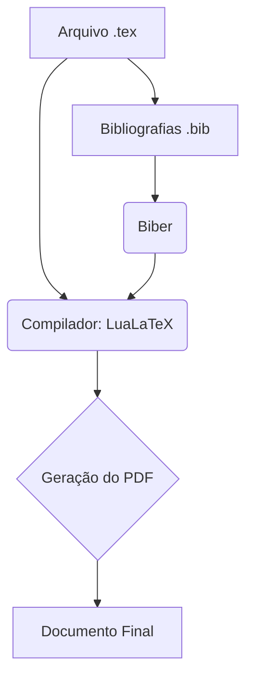

> **Aviso:** Os recursos adicionais desta aula (listas de exercícios estendidas, gabaritos e templates) são protegidos. Utilize a senha `escritaiff2026` para acessá-los no portal do aluno.

**Carga Horária:** 2h (Aula Diária)


## Objetivos da Aula
Compreender a arquitetura do TeX/LaTeX, instalar a distribuição adequada e configurar um ambiente de desenvolvimento (VS Code ou Overleaf).


## Slide Referente da Aula (PPTX — Modelo Institucional IFF)

Para apresentações em auditórios do IFF ou defesas que utilizam o **Microsoft PowerPoint (.pptx)** (compatível com LibreOffice Impress e Google Slides), disponibilizamos o modelo institucional Widescreen (16:9) pronto para uso e estruturado nas normas canônicas da ABNT/IBGE abordadas nesta aula:

### 1. Especificação Visual e Identidade IFF (Widescreen 16:9)
- **Paleta Institucional:**
  - Verde Oficial IFF: `#2D6238` (`RGB: 45, 98, 56`) — Primária para Títulos e Capa.
  - Vermelho Destaque IFF: `#B3282D` (`RGB: 179, 40, 45`) — Secundária para Alertas e Código.
  - Cinza Chumbo: `#333333` (`RGB: 51, 51, 51`) — Corpo de Texto.
- **Rodapé Institucional Padronizado:** `Prof. Dr. Pedro Henrique Rocha de Andrade | IFF Campus Bom Jesus do Itabapoana | Curso de Escrita Acadêmica e LaTeX (80h) | Aula 13`.

### 2. Download do Arquivo PPTX Institucional
O arquivo `.pptx` institucional desta aula encontra-se gerado no repositório com todos os 4 slides (Capa, Roteiro, Fundamentação Teórica e Exemplo Prático/Referências):

> [!TIP] **Download da Apresentação**
> **[📥 Baixar Apresentação Institucional em PPTX — Aula 13: Instalação, Compiladores e Ambientes LaTeX](/assets/biblioteca/latex-escrita/slides-pptx/aula-13-iff-institucional.pptx)**

### 3. Conversão Direta via Terminal (Pandoc)
Caso prefira compilar seus próprios slides localmente a partir deste texto Markdown utilizando o template mestre institucional:
```bash
pandoc aula-13.md -o aula-13-iff-institucional.pptx --reference-doc=template-iff-widescreen.pptx --slide-level=2
```


## Normas ABNT Aplicáveis
Embora o LaTeX trate da tipografia, a NBR 14724 (Trabalhos acadêmicos — Apresentação) dita as margens (3cm superior e esquerda, 2cm inferior e direita), espaçamento (1,5 entre linhas), e fontes (tamanho 12 para texto regular). A configuração do LaTeX, por meio da classe `abntex2` ou pacotes customizados, deve espelhar estritamente estas diretrizes.

## Estudo de Caso
Um aluno de mestrado migrando do Word para o LaTeX enfrentava problemas com formatação de imagens e referências. Ao adotar o Overleaf, facilitou a colaboração com o orientador, eliminando quebras de formatação no envio de arquivos.

## Diagramas e Ilustrações


## Exercício Prático
1. Crie uma conta no Overleaf ou instale o TeX Live e o VS Code.
2. Escreva um documento mínimo (`\documentclass{article}`) com seu nome e a estrutura de seções.
3. Compile o documento em PDFLaTeX.

## Referências Bibliográficas
ASSOCIAÇÃO BRASILEIRA DE NORMAS TÉCNICAS. **NBR 14724**: Informação e documentação — Trabalhos acadêmicos — Apresentação. Rio de Janeiro: ABNT, 2011.
