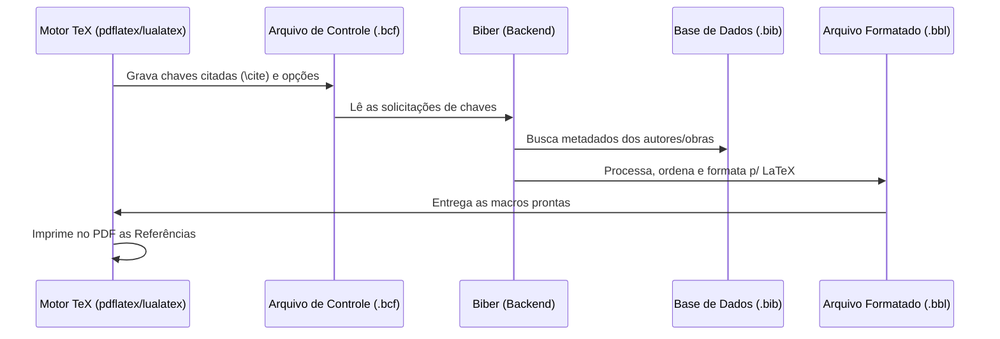

| Material Didático | Link Institucional (Acesso Aberto / PDF) |
| :--- | :--- |
| 📄 **Slides LaTeX — Modelo Branco (.pdf)** | [Acessar Slide Branco](/assets/biblioteca/latex-escrita/slides-latex/aula-13-branco.pdf) |
| 📄 **Slides LaTeX — Modelo Preto (.pdf)** | [Acessar Slide Preto](/assets/biblioteca/latex-escrita/slides-latex/aula-13-preto.pdf) |
| 📄 **Notas de Aula Institucionais (.pdf)** | [Acessar Notas Institucionais](/assets/biblioteca/latex-escrita/notes-latex/aula-13.pdf) |

## 📋 Sumário da Aula
- 1. Introdução e Fundamentação Teórica
- 2. Normalização ABNT e Rigor Metodológico
- 3. Prática e Engenharia no Ecossistema ReLaTeX
- 4. Estudo de Caso Real e Resolução de Problemas
- 5. Síntese e Conclusão


## 1. Engenharia de Projetos: Modularização de Documentos Extensos

Teses e dissertações facilmente ultrapassam 100 páginas e centenas de milhares de toques. Manter todo o conteúdo em um único arquivo `main.tex` é uma prática anti-padrão que prejudica o controle de versão (Git), dificulta a depuração e sobrecarrega o editor de texto. O LaTeX provê os comandos `\input` e `\include` para realizar a subdivisão da árvore de arquivos.

### 1.1 Diferença entre `\input` e `\include`

- `\input{arquivo}`: Funciona como um simples *copy and paste* literal no momento da compilação. Não força quebras de página. Ideal para incluir sub-arquivos de código, pequenos blocos, ou separar o preâmbulo do corpo principal. Ex: `\input{preambulo.tex}`.
- `\include{arquivo}`: Possui lógica interna. Insere automaticamente uma quebra de página (`\clearpage`) antes e depois do arquivo incluído. Gera arquivos `.aux` individuais, permitindo a recompilação seletiva usando `\includeonly{cap1, cap2}`. Ideal para capítulos inteiros de um trabalho acadêmico. Ex: `\include{capitulos/1-introducao}`.

Estrutura recomendada de diretórios:
```text
projeto-tese/
├── main.tex
├── preambulo.tex
├── referencias.bib
├── figuras/
│   └── logo.png
└── capitulos/
    ├── 1-introducao.tex
    ├── 2-revisao.tex
    └── 3-metodologia.tex
```

## 2. A Evolução da Gestão Bibliográfica: Do BibTeX ao Biber/BibLaTeX

Historicamente, o LaTeX geria referências utilizando o motor BibTeX (desenvolvido na década de 1980) emparelhado com arquivos de estilo `.bst`. Este sistema é altamente inflexível, sofre com problemas de codificação não-ASCII (acentuação brasileira) e possui um limite fixo de alocação de memória para as matrizes de processamento de texto.

### 2.1 A Modernização com `biblatex` e `biber`

O `biblatex` reescreveu todo o sistema de processamento bibliográfico, trazendo a formatação das referências para o ambiente de macros do próprio LaTeX. Seu motor de backend, o `biber` (escrito em Perl), lida de forma nativa e perfeita com codificações Unicode/UTF-8 e possibilita ordenações complexas e multilinguagem.

### 2.2 O Padrão `biblatex-abnt`
Para o contexto da pós-graduação no Brasil (normas NBR 6023:2018 para formato da referência e NBR 10520:2023 para sistema de chamada autor-data), o uso do estilo `biblatex-abnt` é mandatório nos novos templates contemporâneos.

Configuração no preâmbulo:
```latex
\usepackage[
  style=abnt,
  justify,
  sorting=lnt, % Letra, Nome, Título
  backend=biber,
  extrayear
]{biblatex}

\addbibresource{referencias.bib}
```

Comandos de Citação (NBR 10520:2023):
- `\cite{chave}` ou `\textcite{chave}`: Citação indireta inserida no texto (Ex: Silva (2020) afirma que...).
- `\parencite{chave}`: Citação entre parênteses (Ex: O céu é azul (SILVA, 2020).). Nas revisões mais recentes da NBR 10520 (2023), as citações entre parênteses passaram a ter a primeira letra maiúscula e as demais minúsculas, mas a depender da exigência do manual da instituição, a formatação exata é tratada internamente pelo estilo.

Impressão da bibliografia no final do documento:
```latex
\printbibliography[title=Referências]
```

## 3. Estudo de Caso: Colaboração em Grupo via Overleaf / Git
Uma equipe de pesquisadores do IFF precisava compor um relatório técnico extenso. A ausência de modularização gerava conflitos de *merge* frequentes no controle de versão Git. A aplicação do método de modularização isolou cada pesquisador em um arquivo `capitulo-x.tex` distinto, invocado via `\include`. Paralelamente, migraram do motor obsoleto `abntex2cite` (baseado no antigo BibTeX) para o moderno `biblatex-abnt`, o que extinguiu subitamente os erros grotescos de compilação em sobrenomes franceses e alemães cheios de tremas e diacríticos.

## 4. Diagrama do Pipeline de Compilação Bibliográfica



## 5. Exercício Prático
1. Separe um documento LaTeX existente em pelo menos três arquivos: um `main.tex`, um arquivo de capítulo na pasta `secoes/` e um preâmbulo.
2. Integre-os utilizando o comando `\input` (para configurações) e `\include` (para texto).
3. Crie um arquivo `bibliografia.bib` com 2 entradas (um `article` e um `book`).
4. Configure o pacote `biblatex` com backend `biber` e estilo `abnt`.
5. Insira duas citações ao longo do texto usando `\parencite` e compile (a sequência correta é: LaTeX -> Biber -> LaTeX -> LaTeX).

## 6. Referências Bibliográficas
ALMEIDA, Daniel. **biblatex-abnt: Estilos bibliográficos ABNT para biblatex**. CTAN, 2023.
ASSOCIAÇÃO BRASILEIRA DE NORMAS TÉCNICAS. **NBR 6023**: Informação e documentação — Referências — Elaboração. Rio de Janeiro: ABNT, 2018.
ASSOCIAÇÃO BRASILEIRA DE NORMAS TÉCNICAS. **NBR 10520**: Informação e documentação — Citações em documentos — Apresentação. Rio de Janeiro: ABNT, 2023.


## 🛠️ Recursos Adicionais e Material Suplementar

- **[🏛️ Guia Oficial de Modelos, Classes e Pacotes ReLaTeX](/pt-br/resource/latex/modelos-de-documento)** — Exemplos canônicos de código, classes (`ifftese.cls`, `slidesiffmodelo.cls`) e documentação interna.
- **[📅 Planejamento Letivo e Cronograma de Atividades](/pt-br/resource/latex/planejamento-e-cronograma)** — Matriz analítica de 80h (Terças, 14h30-17h30) e avaliação em 2 bimestres.
- **[📜 Código de Conduta e Diretrizes Acadêmicas](/pt-br/resource/latex/codigo-de-conduta-e-diretrizes)** — Regimento ético, normas CEP/CONEP e uso transparente de IA.
- **[CTAN (Comprehensive TeX Archive Network)](https://ctan.org/)** — Portal oficial mundial de pacotes LaTeX2e.
- **[ABNT Catálogo de Normas](https://www.abnt.org.br/)** — Acesso e consulta às normas técnicas vigentes.
- **[Overleaf Documentation](https://www.overleaf.com/learn)** — Base de conhecimento e guias práticos sobre compilação TeX.

