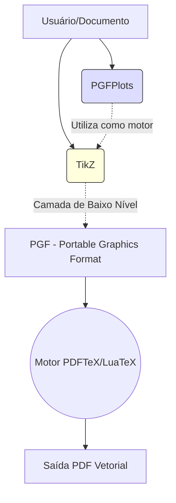

# Aula 14: Computação Gráfica Vetorial Programável com TikZ e Gráficos PGFPlots

**Professor Responsável:** Prof. Dr. Pedro Henrique Rocha de Andrade
**Carga Horária Equivalente:** 4 tempos de 50 minutos (3h20m / 4 horas-aula diárias)

> **Aviso Institucional:** Os materiais didáticos vinculados a esta aula estão protegidos por senha institucional (`escritaiff2026`).

| Material Didático | Link Institucional (Acesso Restrito / Senha Protegida) |
| :--- | :--- |
| 📄 **Slides LaTeX (.pdf)** | [Acessar Slide LaTeX](/assets/biblioteca/latex-escrita/slides-latex/aula-14.pdf) |
| 📊 **Slides PPTX (.pdf)** | [Acessar Slide PPTX](/assets/biblioteca/latex-escrita/slides-pptx/aula-14.pdf) |

## 1. A Revolução do TikZ: "TikZ ist kein Zeichenprogramm"

A inclusão de imagens PNG ou JPEG geradas em editores externos constitui o fluxo de trabalho mais comum, porém é frágil para a tipografia científica: as fontes das legendas dos gráficos frequentemente ficam destoantes da fonte principal do documento, resoluções perdem nitidez ao escalar (no caso de rasters) e inconsistências de espessura de linhas ocorrem sistematicamente.

A solução canônica do mundo LaTeX é o pacote PGF (Portable Graphics Format) e seu frontend, o TikZ (um acrônimo recursivo para "TikZ ist kein Zeichenprogramm" - TikZ não é um programa de desenho).

### 1.1 Sintaxe Básica do TikZ

O TikZ opera através de caminhos (paths) programados em uma sintaxe declarativa imperativa. Todo comando TikZ termina com um ponto e vírgula (`;`).

```latex
\usepackage{tikz}

\begin{tikzpicture}
  % Desenhando uma reta e um círculo
  \draw[thick, blue] (0,0) -- (4,0);
  \draw[fill=red!20, draw=red, thick] (2,2) circle (1.5cm);
  
  % Adicionando um node (texto ancorado no espaço)
  \node at (2,2) {Centro};
\end{tikzpicture}
```
Os elementos centrais do TikZ são os `nodes`. Eles permitem a inserção de texto tipograficamente exato, posicionado em coordenadas específicas ou ligando objetos com setas.

## 2. PGFPlots: Visualização Científica de Dados

Se o TikZ é excelente para desenhar diagramas de bloco, fluxogramas, grafos, e esquemas de engenharia, construir gráficos matemáticos (eixos cartesianos, distribuições) na mão em TikZ seria extremamente laborioso. 
Aqui entra o `pgfplots`, um pacote construído sobre o TikZ, desenhado para plotagem 2D e 3D de alta qualidade com sintaxe amigável e eixos automáticos.

### 2.1 Plotagem de Funções Matemáticas

```latex
\usepackage{pgfplots}
\pgfplotsset{compat=1.18}

\begin{tikzpicture}
\begin{axis}[
    title={Função Quadrática e Cosseno},
    xlabel={Eixo $x$},
    ylabel={Eixo $y$},
    domain=-5:5,
    samples=100,
    axis lines=center,
    legend pos=outer north east
]
\addplot [color=red, thick] {x^2 - x + 4};
\addlegendentry{$f(x) = x^2 - x + 4$}

\addplot [color=blue, mark=none] {10 * cos(deg(x))};
\addlegendentry{$g(x) = 10\cos(x)$}
\end{axis}
\end{tikzpicture}
```

### 2.2 Plotagem a partir de Dados de Dados Brutos (CSV)
O grande poder na engenharia e nas ciências experimentais é a capacidade do `pgfplots` ler arquivos `.csv` de resultados de laboratório ou simulações numéricas (Matlab/Python) diretamente durante a compilação:

```latex
\addplot table [x=tempo, y=erro, col sep=comma] {dados_experimento.csv};
```

## 3. Estudo de Caso: Uniformidade Tipográfica em Artigo Qualis A1
No submetimento de um artigo à IEEE Transactions, a equipe autoral notou que gráficos gerados pelo Excel e pelo matplotlib apresentavam tamanhos de fonte diferentes, distorcendo o visual formal exigido.
A intervenção adotada foi exportar os dados puros (Arrays/Pandas DataFrames) de suas análises estatísticas para arquivos CSV ou TSV leves. A geração visual dos gráficos foi delegada integralmente ao LaTeX utilizando PGFPlots. 
O resultado foi a compatibilidade absoluta de fontes (as fontes matemáticas do gráfico herdaram a família Times configurada para o documento) e máxima nitidez vetorial. 

## 4. Diagrama do Ecossistema Gráfico do LaTeX



## 5. Exercício Prático
1. Instancie o ambiente `tikzpicture` e desenhe um triângulo retângulo usando a ferramenta `\draw` do TikZ com vértices em `(0,0)`, `(3,0)` e `(0,4)`.
2. Adicione rótulos (nodes) nas arestas indicando seus respectivos comprimentos (catetos e hipotenusa).
3. Importe o pacote `pgfplots`. Crie um gráfico simples plotando a função seno no domínio de 0 a $2\pi$.
4. Ajuste os eixos e adicione legendas, verificando se a fonte dos números acompanha a do documento.

## 6. Referências Bibliográficas
FEUERSÄNGER, Christian. **Manual for Package pgfplots**. Version 1.18. CTAN, 2021.
TANTau, Till. **The TikZ and PGF Packages: Manual for version 3.1.9a**. CTAN, 2021.
