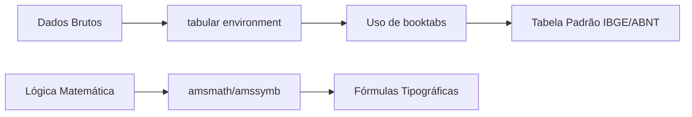

> **Aviso:** Os recursos adicionais desta aula (listas de exercícios estendidas, gabaritos e templates) são protegidos. Utilize a senha `escritaiff2026` para acessá-los no portal do aluno.

**Carga Horária:** 2h (Aula Diária)


## Objetivos da Aula
Dominar a sintaxe fundamental do LaTeX, construção de fórmulas matemáticas complexas e tabelas profissionais com `booktabs`, conforme normas IBGE.


## Slide Referente da Aula (PPTX — Modelo Institucional IFF)

Para apresentações em auditórios do IFF ou defesas que utilizam o **Microsoft PowerPoint (.pptx)** (compatível com LibreOffice Impress e Google Slides), disponibilizamos o modelo institucional Widescreen (16:9) pronto para uso e estruturado nas normas canônicas da ABNT/IBGE abordadas nesta aula:

### 1. Especificação Visual e Identidade IFF (Widescreen 16:9)
- **Paleta Institucional:**
  - Verde Oficial IFF: `#2D6238` (`RGB: 45, 98, 56`) — Primária para Títulos e Capa.
  - Vermelho Destaque IFF: `#B3282D` (`RGB: 179, 40, 45`) — Secundária para Alertas e Código.
  - Cinza Chumbo: `#333333` (`RGB: 51, 51, 51`) — Corpo de Texto.
- **Rodapé Institucional Padronizado:** `Prof. Dr. Pedro Henrique Silva | IFF Campus Bom Jesus do Itabapoana | Curso de Escrita Acadêmica e LaTeX (80h) | Aula 14`.

### 2. Download do Arquivo PPTX Institucional
O arquivo `.pptx` institucional desta aula encontra-se gerado no repositório com todos os 4 slides (Capa, Roteiro, Fundamentação Teórica e Exemplo Prático/Referências):

> [!TIP] **Download da Apresentação**
> **[📥 Baixar Apresentação Institucional em PPTX — Aula 14: Sintaxe Fundamental, Matemática e Tabelas](/assets/biblioteca/latex-escrita/slides-pptx/aula-14-iff-institucional.pptx)**

### 3. Conversão Direta via Terminal (Pandoc)
Caso prefira compilar seus próprios slides localmente a partir deste texto Markdown utilizando o template mestre institucional:
```bash
pandoc aula-14.md -o aula-14-iff-institucional.pptx --reference-doc=template-iff-widescreen.pptx --slide-level=2
```


## Normas ABNT Aplicáveis
A norma do IBGE (1993) estabelece regras para apresentação tabular estatística adotada pelas normas ABNT. Tabelas estatísticas devem ter as laterais abertas (sem bordas verticais), topo e base fechados. O pacote `booktabs` no LaTeX (`\toprule`, `\midrule`, `\bottomrule`) é essencial para implementar perfeitamente essa norma tipográfica.

## Estudo de Caso
Um engenheiro redigindo sua dissertação precisa apresentar um vasto conjunto de equações diferenciais e resultados tabulados. O uso do pacote `amsmath` garantiu o alinhamento adequado das equações multilinhas, e o `booktabs` conferiu rigor acadêmico à apresentação dos resultados de seus testes de tração, validando-se diante da banca de revisão.

## Diagramas e Ilustrações


## Exercício Prático
1. Transcreva a fórmula da Equação do Segundo Grau e sua resolução (Fórmula de Bhaskara) usando os ambientes `equation` e `align`.
2. Crie uma tabela seguindo a norma do IBGE, comparando o PIB de 3 países, usando `booktabs`.

## Referências Bibliográficas
IBGE. **Normas de apresentação tabular**. 3. ed. Rio de Janeiro: Centro de Documentação e Disseminação de Informações, 1993.
