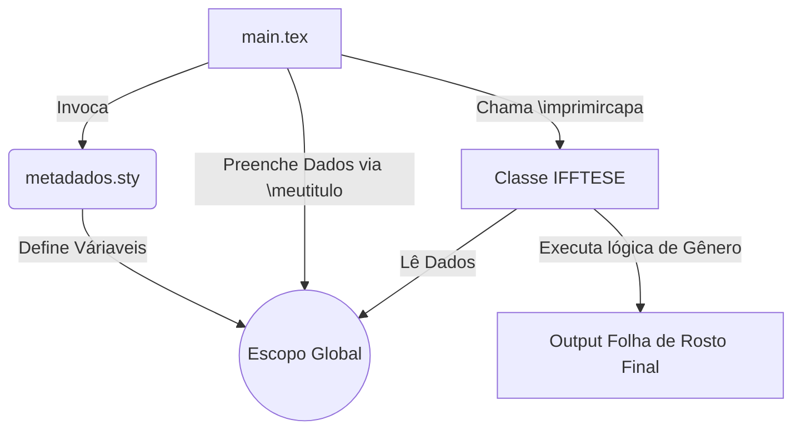

# Aula 15: Engenharia de Metadados: Estrutura de metadados.sty, Escopo e Flexão de Gênero

**Professor Responsável:** Prof. Dr. Pedro Henrique Rocha de Andrade
**Carga Horária Equivalente:** 4 tempos de 50 minutos (3h20m / 4 horas-aula diárias)

> **Aviso Institucional:** Os materiais didáticos vinculados a esta aula estão protegidos por senha institucional (`escritaiff2026`).

| Material Didático | Link Institucional (Acesso Restrito / Senha Protegida) |
| :--- | :--- |
| 📄 **Slides LaTeX (.pdf)** | [Acessar Slide LaTeX](/assets/biblioteca/latex-escrita/slides-latex/aula-15.pdf) |
| 📊 **Slides PPTX (.pdf)** | [Acessar Slide PPTX](/assets/biblioteca/latex-escrita/slides-pptx/aula-15.pdf) |

## 1. Por que construir seu próprio pacote (`.sty`)?

Quando as configurações do preâmbulo (carregamento de pacotes, definições de comandos, ambientes de cor e bibliografia) se tornam extensas (mais de 100-200 linhas), o arquivo `main.tex` se torna ineficiente e "sujo". Mais além, comandos reutilizáveis entre vários projetos se perdem se permanecerem presos ao preâmbulo de um único documento. 
A arquitetura do LaTeX encoraja a externalização da lógica de comandos para arquivos de estilo `.sty`. Na criação do framework de tese, convencionamos um arquivo chamado `metadados.sty` ou `iff-config.sty` para orquestrar essas definições.

### 1.1 Sintaxe de Provisão de Pacotes
Um pacote bem comportado deve se declarar utilizando primitivas específicas da API de pacotes do kernel do LaTeX2e:

```latex
\NeedsTeXFormat{LaTeX2e}
\ProvidesPackage{metadados}[2026/08/04 Pacote de Metadados IFF]

% Em pacotes, usamos \RequirePackage ao invés de \usepackage
\RequirePackage{etoolbox}
\RequirePackage{xcolor}
```
No arquivo central (main.tex), a chamada fica incrivelmente limpa: `\usepackage{metadados}`.

## 2. Variáveis de Escopo e Engenharia de Metadados Acadêmicos
As normas ABNT (especialmente a folha de rosto e folha de aprovação segundo NBR 14724) exigem a reutilização de múltiplos dados: nome do autor, título, orientador, instituição, linha de pesquisa. Definir o título fisicamente na capa e redigitá-lo na folha de aprovação fere o princípio DRY (*Don't Repeat Yourself*).

Utilizamos a criação de macros encapsuladas para gerir esses metadados:

```latex
% Em metadados.sty
\newcommand{\meutitulo}[1]{\def\imprimirmeutitulo{#1}}
\newcommand{\meuautor}[1]{\def\imprimirmeuautor{#1}}
```
No `main.tex`, o usuário declara:
```latex
\meutitulo{Análise Computacional de Materiais em LaTeX}
\meuautor{João da Silva}
```
E nas classes ou comandos internos que geram as folhas preliminares, o LaTeX chamará internamente `\imprimirmeutitulo`, acessando o conteúdo alocado dinamicamente.

## 3. O Problema da Flexão de Gênero Institucional (ReLaTeX)

Um dos grandes entraves na formatação automática de trabalhos acadêmicos em português é a flexão de gênero. "Orientador" ou "Orientadora"? "Aluno" ou "Aluna"?
Templates legados obrigavam o aluno a editar brutalmente a classe do documento, buscando `Orientador(a):`. Para automatizar e respeitar a diversidade linguística contemporânea, pacotes avançados usam condicionais booleanos ou pacotes lógicos como `etoolbox` e `xifthen`.

Implementação de flexão de gênero usando lógicas `ifthenelse`:
```latex
\RequirePackage{ifthen}

\newboolean{isOrientadora}
\setboolean{isOrientadora}{false} % Padrão

\newcommand{\orientadora}[1]{
  \def\imprimirorientador{#1}
  \setboolean{isOrientadora}{true}
}

\newcommand{\orientador}[1]{
  \def\imprimirorientador{#1}
  \setboolean{isOrientadora}{false}
}

% No momento da impressão da folha de rosto:
\ifthenelse{\boolean{isOrientadora}}{Orientadora: }{Orientador: } \imprimirorientador
```
Este nível de polidez algorítmica transforma um simples modelo de documento numa plataforma inteligente de auto-diagramação.

## 4. Estudo de Caso: Criação do IFFTese Template
No programa de pós-graduação, os secretários sofriam para validar os formatos de entrega (PDFs com margens falhas, espaçamento incorreto, ou a palavra "Orientador" usada para professoras). 
A coordenação solicitou um projeto ReLaTeX. A equipe liderada pelo professor Pedro criou um pacote `ifftese.sty` centralizado. O arquivo implementou mais de 15 *flags* booleanas para controle fino, desde o grau (`[Mestrado]` vs `[Doutorado]`) até o papel (`[Orientador]` vs `[Coorientador]`).
O resultado foi a emissão de mais de 50 diplomas sem um único atraso ou devolução devido a inconformidades ABNT, com ganho extremo de UX (User Experience) para os estudantes no manuseio das macros de metadados.

## 5. Diagrama da Arquitetura do Pacote Personalizado



## 6. Exercício Prático
1. Crie um arquivo `meupacote.sty` na mesma pasta do seu projeto.
2. Inicie com `\ProvidesPackage` e obrigue o LaTeX2e.
3. Transfira 3 comandos de uso geral ou carregamento de pacotes do seu `main.tex` para dentro desse `.sty` (lembre de usar `\RequirePackage`).
4. Crie um comando personalizado (macro) para receber e imprimir a data de defesa.
5. Invoque seu novo pacote no preâmbulo do documento e garanta que ele continue compilando.

## 7. Referências Bibliográficas
ASSOCIAÇÃO BRASILEIRA DE NORMAS TÉCNICAS. **NBR 14724**: Informação e documentação — Trabalhos acadêmicos — Apresentação. Rio de Janeiro: ABNT, 2011.
LEHMAN, Philipp; KIME, Philip. **The etoolbox package**. CTAN, 2020.
WRIGHT, Joseph et al. **LaTeX2e for class and package writers**. The LaTeX3 Project, 2022.
