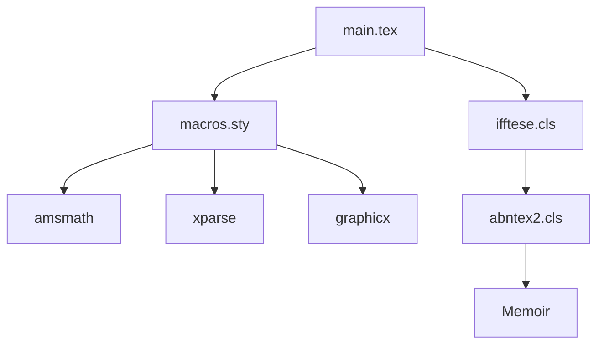

| Material Didático | Link Institucional (Acesso Aberto / PDF) |
| :--- | :--- |
| 📄 **Slides LaTeX — Modelo Branco (.pdf)** | [Acessar Slide Branco](/assets/biblioteca/latex-escrita/slides-latex/aula-16-branco.pdf) |
| 📄 **Slides LaTeX — Modelo Preto (.pdf)** | [Acessar Slide Preto](/assets/biblioteca/latex-escrita/slides-latex/aula-16-preto.pdf) |
| 📄 **Notas de Aula Institucionais (.pdf)** | [Acessar Notas Institucionais](/assets/biblioteca/latex-escrita/notes-latex/aula-16.pdf) |

## 📋 Sumário da Aula
- 1. Introdução e Fundamentação Teórica
- 2. Normalização ABNT e Rigor Metodológico
- 3. Prática e Engenharia no Ecossistema ReLaTeX
- 4. Estudo de Caso Real e Resolução de Problemas
- 5. Síntese e Conclusão


---

## 1. Introdução à Programação TeX e Arquivos `.sty`

O LaTeX é não apenas um sistema de formatação de documentos, mas uma linguagem de programação turing-completa, construída sobre o motor do TeX. A verdadeira potência do LaTeX para trabalhos acadêmicos de longa duração (como teses e dissertações) emerge quando paramos de copiar e colar preâmbulos gigantescos e passamos a modularizar nosso código em pacotes estritamente lógicos, ou seja, arquivos `.sty` (Style Files). 

Nesta aula, aprenderemos a separar o conteúdo (arquivos `.tex`) da formatação e da definição de comandos (arquivos `.sty`), através do desenvolvimento de pacotes personalizados de macros, ambientes, teoremas e ferramentas de produtividade. Esta abordagem não apenas facilita a legibilidade do documento principal, mas também assegura consistência visual e semântica ao longo de todo o texto, requisito basilar nas diretrizes da ABNT.

### 1.1 A Necessidade de Modularização

Ao iniciar a escrita de uma dissertação, é comum que o arquivo `main.tex` inicie com dezenas de linhas de `\usepackage{...}` e `\newcommand{...}`. Com o avanço do trabalho, esse preâmbulo tende a crescer e se tornar incontrolável. 

A solução elegante, e recomendada em engenharia de documentos, é criar um arquivo próprio, por exemplo, `macros.sty`. 

## 2. Estrutura Básica de um Arquivo `.sty`

A anatomia de um arquivo `.sty` requer alguns comandos fundamentais para que o LaTeX o reconheça como um pacote legítimo. 

```latex
% Arquivo: macros.sty
% Autor: Pedro Henrique Rocha de Andrade
% Descrição: Pacote customizado de macros e teoremas para teses.

\NeedsTeXFormat{LaTeX2e}
\ProvidesPackage{macros}[2026/08/04 v1.0 Pacote customizado do IFF]

% A partir daqui, declaramos os pacotes requeridos pelo NOSSO pacote
\RequirePackage{amsmath, amsthm, amssymb}
\RequirePackage{xcolor}
\RequirePackage{hyperref}
\RequirePackage{graphicx}

% Definição de Comandos Pessoais
\newcommand{\R}{\mathbb{R}} % Conjunto dos números reais
\newcommand{\Z}{\mathbb{Z}} % Conjunto dos números inteiros
\newcommand{\E}{\mathbb{E}} % Esperança matemática

% Fim do arquivo
\endinput
```

Note a utilização de `\RequirePackage` ao invés de `\usepackage`. Quando escrevemos arquivos `.sty` ou `.cls`, o padrão é utilizar `\RequirePackage` para evitar problemas de carregamento no preâmbulo, pois ele garante que o pacote não será carregado mais de uma vez caso já tenha sido invocado com as mesmas opções.

### 2.1 Passagem de Opções no `.sty`

Um pacote profissional frequentemente precisa aceitar opções. Por exemplo, podemos querer que o pacote tenha um modo "rascunho" ou um modo "final".

```latex
\DeclareOption{rascunho}{
  \newcommand{\todoremark}[1]{\textcolor{red}{\textbf{TODO:} #1}}
}
\DeclareOption{final}{
  \newcommand{\todoremark}[1]{} % No modo final, o comando não gera saída
}

% Opção padrão caso nenhuma seja passada
\ExecuteOptions{final}

% Processa as opções
\ProcessOptions\relax
```

## 3. Definição Avançada de Comandos (\newcommand vs \DeclareDocumentCommand)

Historicamente, utilizamos `\newcommand` para criar atalhos:
```latex
\newcommand{\vetor}[1]{\mathbf{#1}}
```

Entretanto, o LaTeX3 (via pacote `xparse`, hoje nativo no LaTeX moderno) introduziu `\DeclareDocumentCommand`, que provê uma sintaxe infinitamente superior para definição de comandos com múltiplos argumentos opcionais e validação de tipos.

```latex
\RequirePackage{xparse}

% Comando com 1 argumento opcional (O) com valor padrão "blue", e 1 obrigatório (m)
\DeclareDocumentCommand{\destaque}{ O{blue} m }{%
  \textcolor{#1}{\textbf{#2}}%
}
```
Uso no `.tex`:
- `\destaque{Texto}` -> Texto em negrito e azul.
- `\destaque[red]{Texto}` -> Texto em negrito e vermelho.

## 4. Ambientes e Teoremas (Pacote amsthm)

Na redação acadêmica (especialmente exatas e engenharias), a formatação de Definições, Teoremas e Provas precisa seguir uma sequência lógica e numeração dependente do capítulo (Ex: Teorema 2.1).

O pacote `amsthm` é o padrão ouro. Em nosso `macros.sty`:

```latex
\RequirePackage{amsthm}

% Estilo de Teorema em Itálico (Padrão)
\theoremstyle{plain}
\newtheorem{teorema}{Teorema}[chapter]
\newtheorem{proposicao}[teorema]{Proposição}
\newtheorem{lema}[teorema]{Lema}
\newtheorem{corolario}[teorema]{Corolário}

% Estilo de Definição em Texto Normal
\theoremstyle{definition}
\newtheorem{definicao}{Definição}[chapter]
\newtheorem{exemplo}{Exemplo}[chapter]

% Estilo de Observação (Não numerado)
\theoremstyle{remark}
\newtheorem*{observacao}{Observação}
```

O comando `[chapter]` diz ao LaTeX para reiniciar a contagem a cada capítulo, prefixando com o número do capítulo (ex: Lema 4.2). O argumento `[teorema]` no Lema faz com que ambos compartilhem o mesmo contador, evitando confusões (Teorema 1.1, Lema 1.2, Proposição 1.3...).

## 5. Estudo de Caso (Use Case): O Pacote `macros.sty` do Prof. Pedro

Durante a escrita de artigos no Instituto Federal Fluminense, a necessidade de padronização gerou o seguinte módulo prático, focado na produtividade:

**Situação:** O autor perdia muito tempo digitando frações parciais complexas, destacando textos para revisão e inserindo figuras com código repetitivo.

**Solução (`macros.sty`):**
```latex
\NeedsTeXFormat{LaTeX2e}
\ProvidesPackage{macros}[2026/08/04 Ferramentas IFF]
\RequirePackage{xparse, graphicx, xcolor}

% 1. Revisão e Co-autoria
\DeclareDocumentCommand{\revisar}{m}{\textcolor{red}{[REVISAR: #1]}}
\DeclareDocumentCommand{\pedro}{m}{\textcolor{blue}{\textbf{Pedro diz:} #1}}

% 2. Figura Padronizada com XParse (Opcional Largura, Obrigatório Arquivo, Obrigatório Legenda, Obrigatório Label)
\DeclareDocumentCommand{\figuraIFF}{ O{0.8\textwidth} m m m }{
  \begin{figure}[htpb]
    \centering
    \includegraphics[width=#1]{#2}
    \caption{#3}
    \label{#4}
  \end{figure}
}
```

**Uso no `main.tex`:**
```latex
\documentclass{article}
\usepackage{macros}

\begin{document}
  \figuraIFF[0.5\textwidth]{images/logo.png}{Logo Institucional}{fig:logo}
  \pedro{Verificar se a logo está em alta resolução.}
\end{document}
```

## 6. Diagrama de Inclusão de Pacotes

Abaixo, a representação de como a modularização de `.sty` limpa o fluxo de compilação.



## 7. Exercício Prático

1. Crie um arquivo chamado `meupacote.sty`.
2. Adicione os cabeçalhos obrigatórios (`\NeedsTeXFormat` e `\ProvidesPackage`).
3. Declare um comando chamado `\abntref` usando `\DeclareDocumentCommand` que aceite o nome de um autor e um ano, formatando o texto como "(AUTOR, ANO)", por exemplo: "(SILVA, 2026)".
4. Faça com que o pacote receba a opção `[rascunho]` que imprime uma marca d'água no fundo das páginas (utilize `\RequirePackage{draftwatermark}`).
5. No seu documento `teste.tex`, importe `\usepackage[rascunho]{meupacote}` e teste suas macros.

## 8. Referências Bibliográficas

ASSOCIAÇÃO BRASILEIRA DE NORMAS TÉCNICAS. **NBR 14724**: Informação e documentação: Trabalhos acadêmicos: Apresentação. Rio de Janeiro: ABNT, 2011.
LAMPORT, Leslie. **LaTeX: A Document Preparation System**. 2. ed. Reading, Mass: Addison-Wesley Professional, 1994.
MITTELBACH, Frank et al. **The LaTeX Companion**. 2. ed. Boston: Addison-Wesley, 2004.
WRIGHT, Joseph. *xparse: A document command parser*. The LaTeX Project, 2024.


## 🛠️ Recursos Adicionais e Material Suplementar

- **[🏛️ Guia Oficial de Modelos, Classes e Pacotes ReLaTeX](/pt-br/resource/latex/modelos-de-documento)** — Exemplos canônicos de código, classes (`ifftese.cls`, `slidesiffmodelo.cls`) e documentação interna.
- **[📅 Planejamento Letivo e Cronograma de Atividades](/pt-br/resource/latex/planejamento-e-cronograma)** — Matriz analítica de 80h (Terças, 14h30-17h30) e avaliação em 2 bimestres.
- **[📜 Código de Conduta e Diretrizes Acadêmicas](/pt-br/resource/latex/codigo-de-conduta-e-diretrizes)** — Regimento ético, normas CEP/CONEP e uso transparente de IA.
- **[CTAN (Comprehensive TeX Archive Network)](https://ctan.org/)** — Portal oficial mundial de pacotes LaTeX2e.
- **[ABNT Catálogo de Normas](https://www.abnt.org.br/)** — Acesso e consulta às normas técnicas vigentes.
- **[Overleaf Documentation](https://www.overleaf.com/learn)** — Base de conhecimento e guias práticos sobre compilação TeX.

