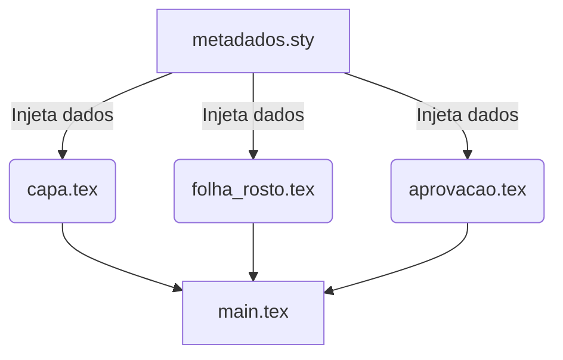

> **Aviso:** Os recursos adicionais desta aula (listas de exercícios estendidas, gabaritos e templates) são protegidos. Utilize a senha `escritaiff2026` para acessá-los no portal do aluno.

**Carga Horária:** 2h (Aula Diária)


## Objetivos da Aula
Aprender a estruturar dados variáveis do documento (autor, título, orientador, banca) através de um arquivo `metadados.sty` para separar a lógica e o conteúdo do documento (Ecossistema ReLaTeX).

## Slide Referente da Aula (Beamer — Modelo Institucional IFF)

Abaixo apresentamos o código LaTeX integral dos slides institucionais desta aula, construído com a classe **`slidesiffmodelo.cls`** (na proporção 16:9), integrando automaticamente os metadados oficiais do Instituto Federal Fluminense (IFF):

```latex
\documentclass[aspectratio=169]{slidesiffmodelo}
\usepackage[utf8]{inputenc}
\usepackage[T1]{fontenc}
\usepackage[brazil]{babel}
\usepackage{amsmath,amssymb}
\usepackage{booktabs}
\usepackage{tikz}

% ==============================================================================
% METADADOS INSTITUCIONAIS - IFF (PROJETO RELATEX)
% ==============================================================================
\titulo{Aula 17: Arquivo de Metadados (metadados.sty)}
\subtitulo{Curso Profissional de Escrita Acadêmica e LaTeX (80h)}
\autor{Prof. Dr. Pedro Henrique Silva}
\orientador{Projeto ReLaTeX -- IFF Campus Bom Jesus do Itabapoana}
\curso{Engenharia de Computação / Pós-Graduação}
\campus{Campus Bom Jesus do Itabapoana}
\instituicao{Instituto Federal de Educação, Ciência e Tecnologia Fluminense}
\data{\today}

\begin{document}

% ------------------------------------------------------------------------------
% SLIDE 1: CAPA INSTITUCIONAL IFF
% ------------------------------------------------------------------------------
\begin{frame}[plain]
    \imprimircapa
\end{frame}

% ------------------------------------------------------------------------------
% SLIDE 2: SUMÁRIO E ROTEIRO DA AULA
% ------------------------------------------------------------------------------
\begin{frame}{Roteiro da Aula 17}
    \tableofcontents
\end{frame}

% ------------------------------------------------------------------------------
% SLIDE 3: FUNDAMENTAÇÃO TEÓRICA / NORMATIVA ABNT
% ------------------------------------------------------------------------------
\section{Fundamentação e Normativa}
\begin{frame}{Fundamentação Teórica e Normativa ABNT/IBGE}
    \begin{block}{Diretriz Institucional --- Isolamento Total de Dados e Formatação}
        A filosofia ReLaTeX: o aluno edita exclusivamente metadados.sty, nunca a classe .cls.
    \end{block}
    \vspace{0.3cm}
    \textbf{Pontos-Chave da Aula 17:}
    \begin{itemize}
        \item \textbf{Alinhamento Normativo:} Obediência estrita aos padrões canônicos da ABNT e IBGE.
        \item \textbf{Rigor Metodológico:} Preenchimento de título, autor, orientador, banca com flexão dinâmica de gênero gramatical.
        \item \textbf{Prática em LaTeX:} Automação tipográfica sem intervenção manual de formatação.
    \end{itemize}
\end{frame}

% ------------------------------------------------------------------------------
% SLIDE 4: ARQUITETURA E FLUXO METODOLÓGICO (COLUNAS)
% ------------------------------------------------------------------------------
\section{Arquitetura e Metodologia}
\begin{frame}{Arquitetura de Implementação e Boas Práticas}
    \begin{columns}[c]
        \begin{column}{0.48\textwidth}
            \begin{alertblock}{Atenção Epistemológica}
                Evite desvios normativos ou formatações ad-hoc no código principal. Separe conteúdo de estilo.
            \end{alertblock}
        \end{column}
        \begin{column}{0.48\textwidth}
            \begin{exampleblock}{Padrão Oficial ReLaTeX}
                Utilize as macros centralizadas do pacote \texttt{ifftese.cls} e \texttt{metadados.sty} para manter a conformidade.
            \end{exampleblock}
        \end{column}
    \end{columns}
\end{frame}

% ------------------------------------------------------------------------------
% SLIDE 5: IMPLEMENTAÇÃO NO CÓDIGO (LATEX / ABNT)
% ------------------------------------------------------------------------------
\section{Exemplo Prático (Código)}
\begin{frame}[fragile]{Implementação Prática em LaTeX / ABNT}
    \begin{block}{Snippet de Referência --- Aula 17}
\begin{verbatim}
\titulo{...} \autor{...} \orientador{...} \orientadorfeminino{sim}
\end{verbatim}
    \end{block}
\end{frame}

% ------------------------------------------------------------------------------
% SLIDE 6: SÍNTESE E REFERÊNCIAS BIBLIOGRÁFICAS
% ------------------------------------------------------------------------------
\section{Síntese e Referências}
\begin{frame}{Síntese da Aula e Referências Normativas}
    \begin{itemize}
        \item Consolidação dos conhecimentos da Aula 17 no ecossistema IFF.
        \item Próxima etapa: Aplicação no arquivo \texttt{metadados.sty} e validação do build.
    \end{itemize}
    \vspace{0.4cm}
    \footnotesize
    \textbf{Referência Principal:}
    \begin{thebibliography}{10}
        \bibitem{ref1} MITTELBACH, F. et al. The LaTeX Companion. 3. ed. Addison-Wesley, 2023.
    \end{thebibliography}
\end{frame}

\end{document}
```


## Slide Referente da Aula (PPTX — Modelo Institucional IFF)

Para apresentações em auditórios do IFF ou defesas que utilizam o **Microsoft PowerPoint (.pptx)** (compatível com LibreOffice Impress e Google Slides), disponibilizamos o modelo institucional Widescreen (16:9) pronto para uso e estruturado nas normas canônicas da ABNT/IBGE abordadas nesta aula:

### 1. Especificação Visual e Identidade IFF (Widescreen 16:9)
- **Paleta Institucional:**
  - Verde Oficial IFF: `#2D6238` (`RGB: 45, 98, 56`) — Primária para Títulos e Capa.
  - Vermelho Destaque IFF: `#B3282D` (`RGB: 179, 40, 45`) — Secundária para Alertas e Código.
  - Cinza Chumbo: `#333333` (`RGB: 51, 51, 51`) — Corpo de Texto.
- **Rodapé Institucional Padronizado:** `Prof. Dr. Pedro Henrique Silva | IFF Campus Bom Jesus do Itabapoana | Curso de Escrita Acadêmica e LaTeX (80h) | Aula 17`.

### 2. Download do Arquivo PPTX Institucional
O arquivo `.pptx` institucional desta aula encontra-se gerado no repositório com todos os 4 slides (Capa, Roteiro, Fundamentação Teórica e Exemplo Prático/Referências):

> [!TIP] **Download da Apresentação**
> **[📥 Baixar Apresentação Institucional em PPTX — Aula 17: Arquivo de Metadados (metadados.sty)](/assets/biblioteca/latex-escrita/slides-pptx/aula-17-iff-institucional.pptx)**

### 3. Conversão Direta via Terminal (Pandoc)
Caso prefira compilar seus próprios slides localmente a partir deste texto Markdown utilizando o template mestre institucional:
```bash
pandoc aula-17.md -o aula-17-iff-institucional.pptx --reference-doc=template-iff-widescreen.pptx --slide-level=2
```


## Normas ABNT Aplicáveis
A NBR 14724 regulamenta a estrutura pré-textual (Capa, Folha de Rosto, Folha de Aprovação). Esses elementos repetem os mesmos dados: Título, Autor, Instituição. A centralização dessas informações em um arquivo de metadados garante a consistência entre todos os elementos pré-textuais exigidos pela norma, evitando discrepâncias caso o título seja alterado de última hora.

## Estudo de Caso
A coordenadoria de TCC de uma universidade criou um template central (ReLaTeX). Os alunos precisam apenas preencher o arquivo `metadados.sty` com seus dados, sem jamais tocar no arquivo `capa.tex` ou `folha_de_rosto.tex`. Isso reduziu em 90% as devoluções de trabalhos por erros nas páginas iniciais.

## Diagramas e Ilustrações


## Exercício Prático
1. Crie um arquivo `metadados.sty`.
2. Defina nele três comandos: `\imprimirautor`, `\imprimirtitulo`, e `\imprimirdata`.
3. No seu arquivo `.tex` principal, faça `\usepackage{metadados}` e crie uma capa simples chamando esses comandos.

## Referências Bibliográficas
ASSOCIAÇÃO BRASILEIRA DE NORMAS TÉCNICAS. **NBR 14724**: Informação e documentação — Trabalhos acadêmicos — Apresentação. Rio de Janeiro: ABNT, 2011.
