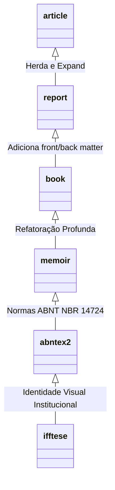

| Material Didático | Link Institucional (Acesso Aberto / PDF & PPTX) |
| :--- | :--- |
| 📄 **Slides LaTeX — Modelo Branco (.pdf)** | [Acessar Slide Branco](/assets/biblioteca/latex-escrita/slides-latex/aula-17-branco.pdf) |
| 📄 **Slides LaTeX — Modelo Preto (.pdf)** | [Acessar Slide Preto](/assets/biblioteca/latex-escrita/slides-latex/aula-17-preto.pdf) |
| 📊 **Slides PPTX — Modelo Branco (.pptx)** | [Acessar PPTX Branco](/assets/biblioteca/latex-escrita/slides-pptx/aula-17-branco.pptx) |
| 📊 **Slides PPTX — Modelo Preto (.pptx)** | [Acessar PPTX Preto](/assets/biblioteca/latex-escrita/slides-pptx/aula-17-preto.pptx) |
| 📝 **Notas de Aula Institucionais (.pdf)** | [Acessar Notas Institucionais](/assets/biblioteca/latex-escrita/notes-latex/aula-17.pdf) |

## 📋 Sumário da Aula
- 1. Introdução e Fundamentação Teórica
- 2. Normalização ABNT e Rigor Metodológico
- 3. Prática e Engenharia no Ecossistema ReLaTeX
- 4. Estudo de Caso Real e Resolução de Problemas
- 5. Síntese e Conclusão


---

## 1. Do Artigo para a Tese: O Papel das Classes `.cls`

No LaTeX, a formatação global de um documento, como margens, fontes base, espaçamentos capitulares e regras de hifenização, é definida pela *Classe de Documento*, arquivo com extensão `.cls` (Class File), invocado logo na primeira linha do documento via `\documentclass{...}`.

A norma ABNT NBR 14724 especifica regras rígidas para a apresentação de trabalhos acadêmicos no Brasil: margem superior/esquerda de 3cm, inferior/direita de 2cm, recuo de parágrafo em 1.25cm a 1.5cm, paginação no canto superior direito, etc. 

A classe `abntex2` consolidou essas regras ao herdar as poderosas engrenagens da classe `memoir`. Por sua vez, a classe `ifftese.cls` (foco do nosso estudo) é construída **por cima** do `abntex2`, inserindo elementos institucionais, como Capa e Folha de Rosto formatadas estritamente para os padrões do Instituto Federal Fluminense.

## 2. Anatomia Interna de um `.cls` e o Comando `\LoadClass`

Diferente de um arquivo `.sty` (que foca em macros e ferramentas, podendo ser chamado várias vezes num mesmo documento), o arquivo `.cls` estabelece o layout fundamental. Um documento LaTeX pode ter múltiplos pacotes `\usepackage`, mas **apenas uma** `\documentclass`.

Vejamos a inicialização do arquivo `ifftese.cls`:

```latex
% Arquivo: ifftese.cls
\NeedsTeXFormat{LaTeX2e}
\ProvidesClass{ifftese}[2026/08/04 v2.1 Classe de Teses do IFF]

% 1. Declaração de Variáveis Institucionais
\newcommand{\@programa}{}
\newcommand{\programa}[1]{\renewcommand{\@programa}{#1}}
\newcommand{\@linhapesquisa}{}
\newcommand{\linhapesquisa}[1]{\renewcommand{\@linhapesquisa}{#1}}

% 2. Repassando opções desconhecidas para a classe base (abntex2)
\DeclareOption*{\PassOptionsToClass{\CurrentOption}{abntex2}}
\ProcessOptions\relax

% 3. Carregando a Classe Base
\LoadClass[12pt, openright, twoside, a4paper, english, french, spanish, brazil]{abntex2}
```

A linha `\LoadClass` é a essência da Herança no LaTeX. Ao carregar `abntex2`, o `ifftese` herda o `memoir` e todas as configurações da ABNT. O comando `\DeclareOption*{\PassOptionsToClass...}` garante que se o usuário digitar `\documentclass[draft]{ifftese}`, a opção `draft` seja enviada ao `abntex2`.

## 3. Elementos Pré-textuais NBR 14724 e NBR 10520

A ABNT estipula os Elementos Pré-textuais (Capa, Folha de Rosto, Ficha Catalográfica, Folha de Aprovação, Dedicatória, Agradecimentos, Epígrafe, Resumo, Abstract).

Na classe `ifftese.cls`, nós "sobrecrevemos" (override) o comando `\imprimircapa` do abntex2 para que ele insira os logos do IFF e formate a folha conforme nosso padrão:

```latex
% Sobrescrevendo a Capa da ABNT
\renewcommand{\imprimircapa}{%
  \begin{capa}%
    \center
    \vspace*{-2cm}
    \includegraphics[width=3cm]{logo-iff.pdf} \\ % Logo da Instituição
    {\ABNTEXchapterfont\large INSTITUTO FEDERAL FLUMINENSE} \\
    {\ABNTEXchapterfont\large PROGRAMA DE \MakeUppercase{\@programa}} \\
    \vspace{4cm}
    
    {\ABNTEXchapterfont\large\imprimirautor}

    \vfill
    \begin{center}
    \ABNTEXchapterfont\bfseries\LARGE\imprimirtitulo
    \end{center}
    \vfill
    
    \large\imprimirlocal \\
    \large\imprimirdata
    
    \vspace*{1cm}
  \end{capa}
}
```
Onde comandos como `\imprimirautor` vêm nativamente do `abntex2`.

## 4. Margens e Geometria da Página (NBR 14724)

O abntex2 já regula as margens usando a suíte `memoir`. No entanto, se quisermos forçar ajustes rigorosos no `ifftese.cls`, garantindo que não haja desvios por parte dos alunos:

```latex
\RequirePackage[
    left=3cm,
    top=3cm,
    right=2cm,
    bottom=2cm,
    a4paper,
    bindingoffset=0.5cm % Adicional para encadernação no anverso/verso
]{geometry}
```
Isso impõe as dimensões de 3cm e 2cm previstas na NBR 14724. Além disso, o espaçamento entrelinhas obrigatório da ABNT (1.5) é forçado com `\OnehalfSpacing` oriundo do `setspace`.

## 5. Estudo de Caso (Use Case): A Folha de Aprovação Customizada

A Folha de Aprovação requer assinaturas da banca. Historicamente, os alunos sofrem com tabelas LaTeX. Para mitigar isso, o `ifftese.cls` propõe um ambiente dedicado:

**Código na Classe (`ifftese.cls`):**
```latex
\newenvironment{folhaaprovacaoiff}{
  \begin{folhadeaprovacao}
  \begin{center}
    {\ABNTEXchapterfont\large\imprimirautor}
    
    \vspace*{\fill}\vspace*{\fill}
    \begin{center}
      \ABNTEXchapterfont\bfseries\Large\imprimirtitulo
    \end{center}
    \vspace*{\fill}
    
    \hspace{.45\textwidth}
    \begin{minipage}{.5\textwidth}
        \imprimirpreambulo
    \end{minipage}%
    \vspace*{\fill}
}{
  \end{center}
  \end{folhadeaprovacao}
}

% Macro para Assinaturas
\newcommand{\assinaturabanca}[2]{
    \vspace*{2cm}
    \rule{10cm}{0.5pt} \\
    \textbf{#1} \\ #2 \\
}
```

**Uso pelo Discente (`main.tex`):**
```latex
\begin{folhaaprovacaoiff}
   Aprovada em 04 de Agosto de 2026.
   \assinaturabanca{Prof. Dr. Pedro Andrade}{Orientador - IFF}
   \assinaturabanca{Prof. Dr. João Silva}{Avaliador Interno - UENF}
\end{folhaaprovacaoiff}
```

## 6. Diagrama de Herança Orientada a Objetos em LaTeX

A arquitetura de classes pode ser vista como uma herança clássica:



## 7. Exercício Prático

1. Crie um arquivo `minhatese.cls`.
2. Herde a classe `abntex2` passando as opções de folha A4 e tamanho 12pt (via `\LoadClass`).
3. Sobrescreva o comando `\imprimirfolhaderosto` do `abntex2`.
4. Faça com que o título da tese apareça em azul (`\textcolor{blue}`).
5. Compile um arquivo `.tex` chamando `\documentclass{minhatese}` e rode `\imprimirfolhaderosto` no escopo do documento.

## 8. Referências Bibliográficas

ASSOCIAÇÃO BRASILEIRA DE NORMAS TÉCNICAS. **NBR 14724**: Informação e documentação: Trabalhos acadêmicos: Apresentação. Rio de Janeiro: ABNT, 2011.
ASSOCIAÇÃO BRASILEIRA DE NORMAS TÉCNICAS. **NBR 10520**: Informação e documentação: Citações em documentos: Apresentação. Rio de Janeiro: ABNT, 2023.
SOUZA, L. F.; ARAÚJO, L. C. **O Pacote abntex2: Documentação Oficial**. Brasil, 2018.
WILSON, Peter. **The Memoir Class for Configurable Typesetting**. The LaTeX Project, 2004.


## 🛠️ Recursos Adicionais e Material Suplementar

- **[🏛️ Guia Oficial de Modelos, Classes e Pacotes ReLaTeX](/pt-br/resource/latex/modelos-de-documento)** — Exemplos canônicos de código, classes (`ifftese.cls`, `slidesiffmodelo.cls`) e documentação interna.
- **[📅 Planejamento Letivo e Cronograma de Atividades](/pt-br/resource/latex/planejamento-e-cronograma)** — Matriz analítica de 80h (Terças, 14h30-17h30) e avaliação em 2 bimestres.
- **[📜 Código de Conduta e Diretrizes Acadêmicas](/pt-br/resource/latex/codigo-de-conduta-e-diretrizes)** — Regimento ético, normas CEP/CONEP e uso transparente de IA.
- **[CTAN (Comprehensive TeX Archive Network)](https://ctan.org/)** — Portal oficial mundial de pacotes LaTeX2e.
- **[ABNT Catálogo de Normas](https://www.abnt.org.br/)** — Acesso e consulta às normas técnicas vigentes.
- **[Overleaf Documentation](https://www.overleaf.com/learn)** — Base de conhecimento e guias práticos sobre compilação TeX.

