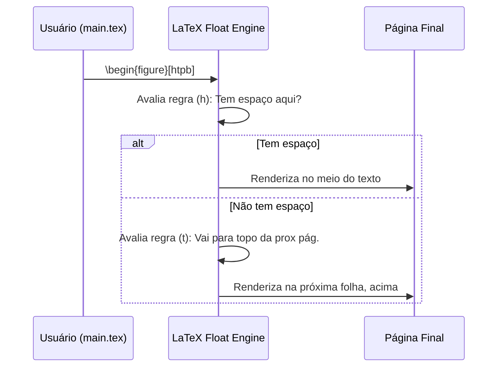

| Material Didático | Link Institucional (Acesso Aberto / PDF) |
| :--- | :--- |
| 📄 **Slides LaTeX — Modelo Branco (.pdf)** | [Acessar Slide Branco](/assets/biblioteca/latex-escrita/slides-latex/aula-18-branco.pdf) |
| 📄 **Slides LaTeX — Modelo Preto (.pdf)** | [Acessar Slide Preto](/assets/biblioteca/latex-escrita/slides-latex/aula-18-preto.pdf) |
| 📄 **Notas de Aula Institucionais (.pdf)** | [Acessar Notas Institucionais](/assets/biblioteca/latex-escrita/notes-latex/aula-18.pdf) |

## 📋 Sumário da Aula
- 1. Introdução e Fundamentação Teórica
- 2. Normalização ABNT e Rigor Metodológico
- 3. Prática e Engenharia no Ecossistema ReLaTeX
- 4. Estudo de Caso Real e Resolução de Problemas
- 5. Síntese e Conclusão


---

## 1. O Paradigma de Floats no LaTeX

Um dos maiores choques para os usuários oriundos do Microsoft Word é o comportamento das Figuras e Tabelas no LaTeX. O LaTeX trata esses elementos como *Floats* (objetos flutuantes). Em vez de ancorar o elemento exatamente no caractere onde foi digitado, o motor tipográfico procura o "melhor" lugar da página para colocá-lo (geralmente no topo ou no fundo), visando evitar espaços em branco aberrantes e órfãos textuais.

O pacote base para gerir imagens é o `graphicx`, mas o posicionamento é regido pelo núcleo do LaTeX através de restrições topológicas.

### 1.1 Modificadores de Posição

Ao declarar `\begin{figure}[htpb]`, o autor expressa uma ordem de preferência:
1. `h` (Here): Se couber perfeitamente aqui, coloque aqui.
2. `t` (Top): Topo da página atual ou da próxima.
3. `p` (Page): Em uma página dedicada só para floats.
4. `b` (Bottom): Fundo da página atual ou da próxima.

A exclamação `[!ht]` força o motor a ignorar as regras de estética internas e obedecer cegamente. Entretanto, o abuso do `!` ou do pacote `float` com `[H]` geralmente destrói o layout harmônico das páginas de uma Tese.

## 2. Tabelas na ABNT e o pacote `booktabs`

A ABNT e a norma do IBGE (1993) para tabelas (apresentação tabular) proíbem expressamente fechar tabelas com linhas verticais externas laterais. Além disso, as linhas horizontais não devem ser excessivas.

A forma canônica, elegante e científica de criar tabelas em LaTeX exige o pacote `booktabs`.

```latex
\RequirePackage{booktabs}
\RequirePackage{multirow}
\RequirePackage{tabularx}

% Exemplo de tabela padronizada IBGE/ABNT
\begin{table}[htb]
  \caption{Métricas de Validação do Modelo Matemático}
  \label{tab:metricas}
  \centering
  \begin{tabular}{lcc}
    \toprule
    \textbf{Variável} & \textbf{Erro Médio (\%)} & \textbf{Acurácia} \\
    \midrule
    Temperatura & 2.1 & 0.95 \\
    Pressão     & 4.5 & 0.89 \\
    Umidade     & 1.2 & 0.98 \\
    \bottomrule
  \end{tabular}
  \fonte{O autor (2026).}
\end{table}
```
Observe o uso de `\toprule`, `\midrule` e `\bottomrule` que oferecem espessuras diferentes e respiro visual para o conteúdo da tabela.

## 3. Listas Customizadas: Quadros e Algoritmos

Pela ABNT (e normas complementares), existe distinção clara entre Figura, Tabela e Quadro. 
- **Tabela:** Tem dados estatísticos quantitativos e bordas abertas laterais (IBGE, 1993).
- **Quadro:** Tem dados textuais, descritivos e qualitativos, com bordas fechadas.

Para criar uma lista de Quadros (LOQ - *List of Quadros*) no LaTeX, utilizamos o pacote `float` associado ao `tocloft` ou as facilidades do `abntex2`.

```latex
\newcommand{\quadroname}{Quadro}
\newcommand{\listofquadrosname}{Lista de quadros}

\newfloat[chapter]{quadro}{loq}{\quadroname}
\newlistof{listofquadros}{loq}{\listofquadrosname}
\newlistentry{quadro}{loq}{0}

% Configurações de alinhamento e fonte para bater com a NBR
\counterwithout{quadro}{chapter}
\renewcommand{\cftquadroname}{\quadroname\space} 
\renewcommand*{\cftquadroaftersnum}{\hfill--\hfill}
```
Isso permite ao aluno invocar `\listofquadros` e usar o ambiente `\begin{quadro} \end{quadro}` de forma indolor.

## 4. Sumários Dinâmicos NBR 6027 e Pacote `titletoc`

A NBR 6027 regula o Sumário. Ela prevê que os itens devem ter o mesmo destaque tipográfico que possuem no corpo do texto (Se a Seção 1 é em MAIÚSCULO NEGRITO, no sumário ela também será MAIÚSCULA NEGRITO).

Para manipular o "Table of Contents" (TOC) de forma profunda, os pacotes `tocloft` e `titletoc` são os preferidos. 

```latex
% Ajuste de recuo dos elementos do sumário para ABNT
\setlength{\cftsecindent}{0pt}
\setlength{\cftsubsecindent}{0pt}
\setlength{\cftsubsubsecindent}{0pt}

% Fonte de Capítulos no Sumário em Negrito e Maiúsculo
\renewcommand{\cftchapterfont}{\bfseries\uppercase}
\renewcommand{\cftchapterpagefont}{\normalsize\bfseries}
```

O `fancyhdr` complementa esse controle ditando o cabeçalho das páginas textuais (numeração da página no canto superior direito, a 2cm da borda superior).

```latex
\RequirePackage{fancyhdr}
\fancypagestyle{abnt}{
  \fancyhf{} % Limpa tudo
  \fancyhead[R]{\thepage} % Número na direita
  \renewcommand{\headrulewidth}{0pt} % Sem linha
  \renewcommand{\footrulewidth}{0pt}
}
\pagestyle{abnt}
```

## 5. Estudo de Caso (Use Case): Fluxo de Rendering de um Quadro e TOC

No Instituto, o discente precisava criar uma "Lista de Algoritmos" e um "Sumário Executivo". 

1. **Definiu a nova lista `loalg`** via pacote `float`.
2. **Definiu a macro `\listofalgoritmos`**.
3. Inseriu o pacote `algorithm2e`.
4. Configurou o `fancyhdr` para alterar o cabeçalho temporariamente nos apêndices.

```latex
\begin{algorithm}[H]
\SetAlgoLined
\KwResult{Escrever em LaTeX de forma profissional}
 inicialização\;
 \While{não formou}{
  compilar main.tex\;
  \eIf{erro de Float}{
   estudar NBR 6027\;
   ajustar posicionamento htb\;
   }{
   prosseguir redação\;
  }
 }
 \caption{Fluxo de Produtividade do Aluno IFF}
\end{algorithm}
```

## 6. Diagrama do Subsistema de Floats



## 7. Exercício Prático

1. Crie uma Tabela (ambiente `table` e `tabular`) com três colunas, formatando as linhas exclusivamente com `\toprule`, `\midrule` e `\bottomrule` do pacote `booktabs`.
2. Configure o cabeçalho do documento (via `fancyhdr`) para que mostre o nome da disciplina no canto superior esquerdo e a página no superior direito.
3. Teste os modificadores de posição da tabela (`[b]`, `[t]`, `[h]`) em uma página com bastante texto cego (`\usepackage{lipsum}`) e veja a flutuação ocorrer.

## 8. Referências Bibliográficas

ASSOCIAÇÃO BRASILEIRA DE NORMAS TÉCNICAS. **NBR 6027**: Informação e documentação: Sumário: Apresentação. Rio de Janeiro: ABNT, 2012.
IBGE - Instituto Brasileiro de Geografia e Estatística. **Normas de Apresentação Tabular**. 3. ed. Rio de Janeiro: IBGE, 1993.
OETIKER, Tobias et al. **The Not So Short Introduction to LaTeX2e**. Version 6.4, 2021.
PETERNAK, O. **The float package**. Comprehensive TeX Archive Network, 2001.


## 🛠️ Recursos Adicionais e Material Suplementar

- **[🏛️ Guia Oficial de Modelos, Classes e Pacotes ReLaTeX](/pt-br/resource/latex/modelos-de-documento)** — Exemplos canônicos de código, classes (`ifftese.cls`, `slidesiffmodelo.cls`) e documentação interna.
- **[📅 Planejamento Letivo e Cronograma de Atividades](/pt-br/resource/latex/planejamento-e-cronograma)** — Matriz analítica de 80h (Terças, 14h30-17h30) e avaliação em 2 bimestres.
- **[📜 Código de Conduta e Diretrizes Acadêmicas](/pt-br/resource/latex/codigo-de-conduta-e-diretrizes)** — Regimento ético, normas CEP/CONEP e uso transparente de IA.
- **[CTAN (Comprehensive TeX Archive Network)](https://ctan.org/)** — Portal oficial mundial de pacotes LaTeX2e.
- **[ABNT Catálogo de Normas](https://www.abnt.org.br/)** — Acesso e consulta às normas técnicas vigentes.
- **[Overleaf Documentation](https://www.overleaf.com/learn)** — Base de conhecimento e guias práticos sobre compilação TeX.

