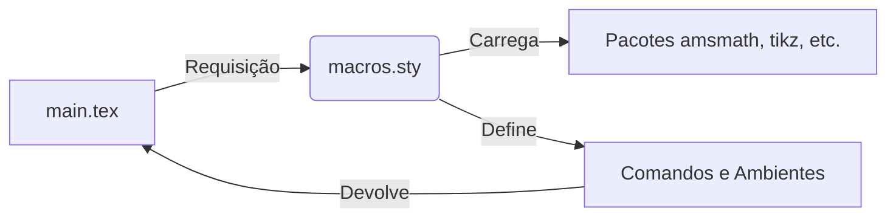

> **Aviso:** Os recursos adicionais desta aula (listas de exercícios estendidas, gabaritos e templates) são protegidos. Utilize a senha `escritaiff2026` para acessá-los no portal do aluno.

**Carga Horária:** 2h (Aula Diária)


## Objetivos da Aula
Desenvolver `macros.sty` para encapsular configurações de pacotes, criar novos comandos (`\newcommand`) e ambientes (`\newenvironment`), aumentando a produtividade e a consistência.


## Slide Referente da Aula (PPTX — Modelo Institucional IFF)

Para apresentações em auditórios do IFF ou defesas que utilizam o **Microsoft PowerPoint (.pptx)** (compatível com LibreOffice Impress e Google Slides), disponibilizamos o modelo institucional Widescreen (16:9) pronto para uso e estruturado nas normas canônicas da ABNT/IBGE abordadas nesta aula:

### 1. Especificação Visual e Identidade IFF (Widescreen 16:9)
- **Paleta Institucional:**
  - Verde Oficial IFF: `#2D6238` (`RGB: 45, 98, 56`) — Primária para Títulos e Capa.
  - Vermelho Destaque IFF: `#B3282D` (`RGB: 179, 40, 45`) — Secundária para Alertas e Código.
  - Cinza Chumbo: `#333333` (`RGB: 51, 51, 51`) — Corpo de Texto.
- **Rodapé Institucional Padronizado:** `Prof. Dr. Pedro Henrique Silva | IFF Campus Bom Jesus do Itabapoana | Curso de Escrita Acadêmica e LaTeX (80h) | Aula 18`.

### 2. Download do Arquivo PPTX Institucional
O arquivo `.pptx` institucional desta aula encontra-se gerado no repositório com todos os 4 slides (Capa, Roteiro, Fundamentação Teórica e Exemplo Prático/Referências):

> [!TIP] **Download da Apresentação**
> **[📥 Baixar Apresentação Institucional em PPTX — Aula 18: Produtividade e Macros Personalizadas (macros.sty)](/assets/biblioteca/latex-escrita/slides-pptx/aula-18-iff-institucional.pptx)**

### 3. Conversão Direta via Terminal (Pandoc)
Caso prefira compilar seus próprios slides localmente a partir deste texto Markdown utilizando o template mestre institucional:
```bash
pandoc aula-18.md -o aula-18-iff-institucional.pptx --reference-doc=template-iff-widescreen.pptx --slide-level=2
```


## Normas ABNT Aplicáveis
A NBR 10520 exige citações diretas longas (mais de 3 linhas) recuadas em 4cm, tamanho de fonte reduzido e espaçamento simples. Podemos criar um macro ou ambiente em LaTeX (e.g., `\newenvironment{citacaolonga}`) que aplique automaticamente essa formatação rígida, prevenindo erros de espaçamento pelo autor, cumprindo estritamente a norma e poupando tempo na formatação manual.

## Estudo de Caso
Um professor de Matemática redigia notas de aula de 500 páginas e se cansou de digitar `\begin{pmatrix} ... \end{pmatrix}` constantemente, além de regras complexas para teoremas e corolários. Ao criar seu próprio `macros.sty`, ele reduziu a verbosidade do código, acelerou a digitação e garantiu que todas as suas apostilas futuras tivessem o mesmo padrão tipográfico instantaneamente.

## Diagramas e Ilustrações


## Exercício Prático
1. Crie o arquivo `macros.sty`.
2. Programe um macro `\newcommand{\citacaoabnt}[1]{...}` que mude a cor do texto para azul e coloque o recuo (simulando a ideia de formatação especial).
3. Teste o uso no seu documento principal.

## Referências Bibliográficas
ASSOCIAÇÃO BRASILEIRA DE NORMAS TÉCNICAS. **NBR 10520**: Informação e documentação — Citações em documentos — Apresentação. Rio de Janeiro: ABNT, 2023.
