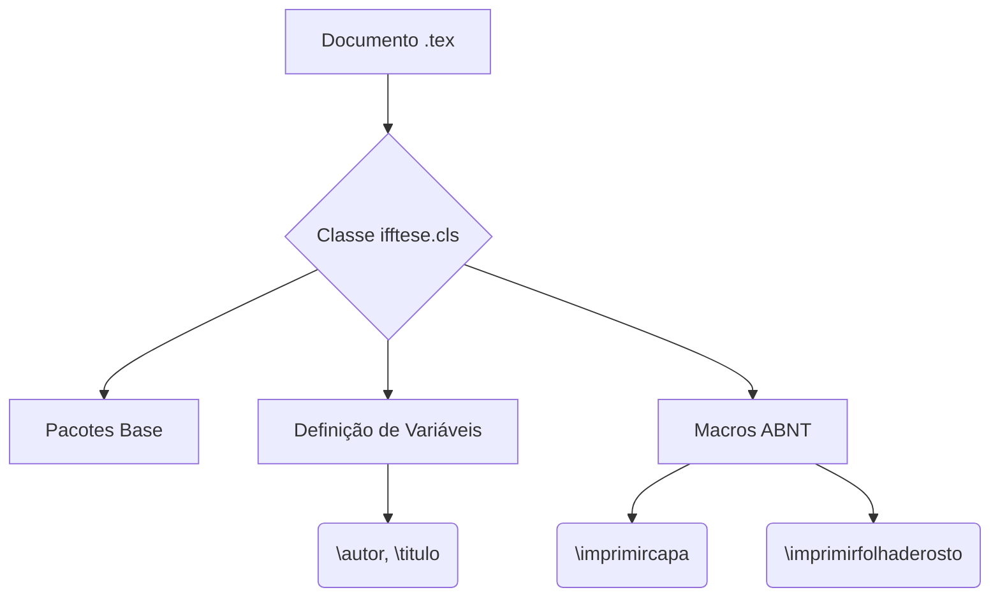

# Aula 19 - Engenharia de Macros e Estrutura Interna da Classe ifftese.cls

**Carga horária:** 2h (Aula Diária)

> [!WARNING]
> **Aviso:** Os recursos adicionais desta aula estão protegidos pela senha "escritaiff2026".


## Slide Referente da Aula (PPTX — Modelo Institucional IFF)

Para apresentações em auditórios do IFF ou defesas que utilizam o **Microsoft PowerPoint (.pptx)** (compatível com LibreOffice Impress e Google Slides), disponibilizamos o modelo institucional Widescreen (16:9) pronto para uso e estruturado nas normas canônicas da ABNT/IBGE abordadas nesta aula:

### 1. Especificação Visual e Identidade IFF (Widescreen 16:9)
- **Paleta Institucional:**
  - Verde Oficial IFF: `#2D6238` (`RGB: 45, 98, 56`) — Primária para Títulos e Capa.
  - Vermelho Destaque IFF: `#B3282D` (`RGB: 179, 40, 45`) — Secundária para Alertas e Código.
  - Cinza Chumbo: `#333333` (`RGB: 51, 51, 51`) — Corpo de Texto.
- **Rodapé Institucional Padronizado:** `Prof. Dr. Pedro Henrique Rocha de Andrade | IFF Campus Bom Jesus do Itabapoana | Curso de Escrita Acadêmica e LaTeX (80h) | Aula 19`.

### 2. Download do Arquivo PPTX Institucional
O arquivo `.pptx` institucional desta aula encontra-se gerado no repositório com todos os 4 slides (Capa, Roteiro, Fundamentação Teórica e Exemplo Prático/Referências):

> [!TIP] **Download da Apresentação**
> **[📥 Baixar Apresentação Institucional em PPTX — Aula 19: Engenharia de Macros e ifftese.cls](/assets/biblioteca/latex-escrita/slides-pptx/aula-19-iff-institucional.pptx)**

### 3. Conversão Direta via Terminal (Pandoc)
Caso prefira compilar seus próprios slides localmente a partir deste texto Markdown utilizando o template mestre institucional:
```bash
pandoc aula-19.md -o aula-19-iff-institucional.pptx --reference-doc=template-iff-widescreen.pptx --slide-level=2
```


## Detalhamento da Norma ABNT NBR 14724

A NBR 14724 é a principal norma para trabalhos acadêmicos (teses, dissertações e TCCs). O projeto da classe `ifftese.cls` visa automatizar a conformidade com estas regras estritas:
- **Elementos Pré-Textuais:** Capa, Folha de Rosto, Ficha Catalográfica, Errata, Folha de Aprovação, Dedicatória, Agradecimentos, Epígrafe, Resumo, Abstract, Listas e Sumário.
- **Formatação de Páginas:** As macros da classe ajustam margens (3cm superior/esquerda, 2cm inferior/direita) usando o pacote `geometry`.
- **Numeração de Páginas:** Deve constar a partir da primeira folha da parte textual, em algarismos arábicos. O controle interno de contadores em LaTeX é feito com a redefinição de comandos padrão do ambiente de documento.

## Estudo de Caso (Use Case)

**Contexto:** Um aluno de Engenharia precisa gerar automaticamente a folha de aprovação do seu TCC.
**Problema:** A formatação manual usando espaços e quebras de linha gera inconsistências na impressão.
**Solução:** Implementação da macro `\imprimirfolhadeaprovacao` na classe `ifftese.cls` que captura metadados (`\bancaum`, `\bancadois`) e desenha caixas de assinatura padrão utilizando os ambientes `minipage` e `tabular`, garantindo conformidade rigorosa.

## Diagramas e Ilustrações



## Exercício Prático

1. Acesse o arquivo interno `ifftese.cls`.
2. Localize a definição do comando `\imprimircapa`.
3. Altere a fonte do título para o tamanho `\Huge` e observe as mudanças ao compilar seu TCC.
4. Crie uma macro `\meunovocomando` que imprima um texto de aviso formatado.

## Referências Bibliográficas

ASSOCIAÇÃO BRASILEIRA DE NORMAS TÉCNICAS. **NBR 14724**: Informação e documentação — Trabalhos acadêmicos — Apresentação. Rio de Janeiro: ABNT, 2011.
