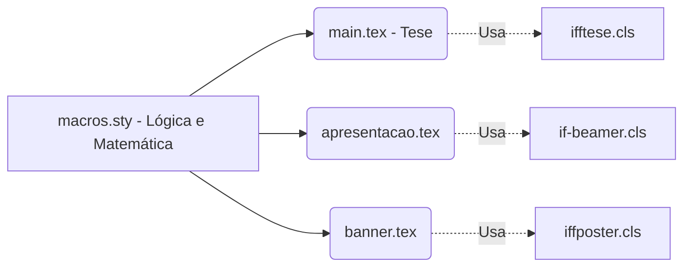

| Material Didático | Link Institucional (Acesso Aberto / PDF & PPTX) |
| :--- | :--- |
| 📄 **Slides LaTeX (52 slides - .pdf)** | [Acessar Slide LaTeX](/assets/biblioteca/latex-escrita/slides-latex/aula-19.pdf) |
| 📊 **Slides PPTX Institucional (.pptx)** | [Acessar Slide PPTX](/assets/biblioteca/latex-escrita/slides-pptx/aula-19.pptx) |
| 📝 **Notas de Aula LaTeX (100% .tex - .pdf)** | [Acessar Notas LaTeX](/assets/biblioteca/latex-escrita/notes-latex/aula-19.pdf) |

## 📋 Sumário da Aula
- 1. Introdução e Fundamentação Teórica
- 2. Normalização ABNT e Rigor Metodológico
- 3. Prática e Engenharia no Ecossistema ReLaTeX
- 4. Estudo de Caso Real e Resolução de Problemas
- 5. Síntese e Conclusão


---

## 1. O Ecossistema TeX e a Diversidade Documental

Embora os Trabalhos de Conclusão de Curso (TCC) e Dissertações demandem arquivos regidos estritamente pelas NBRs (resolvidos pela classe `ifftese.cls`), a vida acadêmica não se limita a monografias. Apresentações em eventos, defesa de bancas, relatórios corporativos para agências de fomento (FAPERJ, CNPq) e exibições gráficas (Banners/Posters) exigem classes próprias.

Nesta aula, desvendaremos a engenharia e customização das três classes suplementares do ecossistema IFF:
1. `if-beamer.cls` para Apresentações de Defesa.
2. `iffposter.cls` para Congressos e Mostras de Extensão.
3. `relatoriocorp.cls` para envio de relatórios parciais e finais aos financiadores.

## 2. Anatomia do `if-beamer.cls`

O LaTeX Beamer é o estado da arte para criação de apresentações acadêmicas. No entanto, o tema padrão carece de identidade visual da instituição. Ao criarmos o `if-beamer.cls`, nós fazemos herança da classe nativa `beamer` e modificamos o ambiente de Cores e Templates.

### 2.1 Código Interno do Template Institucional

Para forçar um padrão de cores e rodapé, a classe `if-beamer.cls` sobrecarrega os elementos internos (chamados de `Inner` e `Outer` themes do Beamer).

```latex
% Arquivo if-beamer.cls
\NeedsTeXFormat{LaTeX2e}
\ProvidesClass{if-beamer}[2026/08/04 Classe para Apresentações IFF]
\LoadClass[aspectratio=169, 11pt]{beamer}

% Cores Oficiais da Marca IFF (Verde e Vermelho)
\definecolor{VerdeIFF}{RGB}{43,142,40}
\definecolor{VermelhoIFF}{RGB}{198,39,26}

% Configuração de Paleta do Beamer
\setbeamercolor{palette primary}{bg=VerdeIFF,fg=white}
\setbeamercolor{palette secondary}{bg=VermelhoIFF,fg=white}
\setbeamercolor{title}{bg=VerdeIFF,fg=white}
\setbeamercolor{frametitle}{bg=VerdeIFF,fg=white}

% Rodapé com Número da Página
\setbeamertemplate{footline}{
  \leavevmode%
  \hbox{%
  \begin{beamercolorbox}[wd=.333333\paperwidth,ht=2.25ex,dp=1ex,center]{author in head/foot}%
    \usebeamerfont{author in head/foot}\insertshortauthor
  \end{beamercolorbox}%
  \begin{beamercolorbox}[wd=.333333\paperwidth,ht=2.25ex,dp=1ex,center]{title in head/foot}%
    \usebeamerfont{title in head/foot}\insertshorttitle
  \end{beamercolorbox}%
  \begin{beamercolorbox}[wd=.333333\paperwidth,ht=2.25ex,dp=1ex,right]{date in head/foot}%
    \usebeamerfont{date in head/foot} \insertframenumber{} / \inserttotalframenumber\hspace*{2ex} 
  \end{beamercolorbox}}%
  \vskip0pt%
}

% Desativa símbolos de navegação inúteis do Beamer
\setbeamertemplate{navigation symbols}{}
```

## 3. Anatomia do `iffposter.cls` (Pacote TikZposter)

Para impressão gráfica de Banners (tamanho A0), o LaTeX oferece os pacotes `beamerposter`, `a0poster` ou `tikzposter`. Optamos por herdar o `tikzposter` por sua capacidade absurda de criar caixas (blocks) responsivos baseados no poderoso motor TikZ PGF.

```latex
% Arquivo iffposter.cls
\NeedsTeXFormat{LaTeX2e}
\ProvidesClass{iffposter}[2026/08/04 Poster A0 para o IFF]

\DeclareOption*{\PassOptionsToClass{\CurrentOption}{tikzposter}}
\ProcessOptions\relax

\LoadClass[25pt, a0paper, portrait, margin=0mm, innermargin=15mm]{tikzposter}

\RequirePackage{anyfontsize}
\RequirePackage{lipsum}

% Bloco Padrão do IFF
\colorlet{blocktitlebgcolor}{VerdeIFF}
\colorlet{blockbodybgcolor}{white}
\colorlet{blocktitlefgcolor}{white}

% Macro para Logos Institucionais
\newcommand{\makeposterheader}{
   \begin{columns}
     \column{0.15}
     \node[inner sep=0pt] {\includegraphics[width=\linewidth]{logo-iff.png}};
     \column{0.7}
     \node[inner sep=0pt, align=center] {
       {\huge \textbf{\@title}}\\[1cm]
       {\Large \@author}
     };
   \end{columns}
}
```

## 4. Anatomia do `relatoriocorp.cls` para Agências de Fomento

Diferente da Tese (com 100+ páginas), o Relatório Parcial é ágil, contendo 10 a 20 páginas, onde o foco está no alinhamento às planilhas financeiras e cronogramas (Gantt) pactuados com a FAPERJ. 

A herança mais leve faz-se da classe `article`:

```latex
% Arquivo relatoriocorp.cls
\LoadClass[12pt, a4paper]{article}
\RequirePackage{geometry}
\geometry{top=2cm, bottom=2cm, left=2.5cm, right=2.5cm}

% Ambiente para Tabela de Execução Orçamentária
\RequirePackage{pgfgantt}
\newcommand{\tabelagastos}[1]{
   \begin{center}
   \textbf{Tabela 1: Resumo Orçamentário} \\
   \vspace{0.5cm}
   #1
   \end{center}
}
```

## 5. Estudo de Caso (Use Case): Transição de Tese para Banner

Um aluno precisa ir a um Congresso divulgar sua Tese recém escrita. O ecossistema modular brilha aqui:
1. Os teoremas e equações estão salvos em `macros.sty`.
2. A Tese principal usa `\documentclass{ifftese}` e puxa `macros.sty`.
3. O aluno cria `poster.tex` usando `\documentclass{iffposter}`, e simplesmente puxa **o mesmo** `macros.sty`.
Nenhum código matemático precisa ser reescrito ou reformatado; a consistência é mantida (DRY - Don't Repeat Yourself).

## 6. Diagrama de Integração do Ecossistema IFF LaTeX



## 7. Exercício Prático

1. Baixe o pacote `tikzposter` no seu editor online (ex: Overleaf) ou local (TeXLive).
2. Escreva um documento chamando `\documentclass[25pt, a0paper]{tikzposter}`.
3. Teste o comando `\block{Título do Bloco}{Seu texto aqui}` e observe como o LaTeX cuida do redimensionamento vetorial em uma folha de 1 metro quadrado (A0) sem perder a qualidade gráfica das fontes.

## 8. Referências Bibliográficas

TANTAM, Till. **The TikZ and PGF Packages**. Manual for version 3.1.5. The LaTeX Project, 2020.
TANTAM, Till; WRIGHT, Joseph; MILETIĆ, Vedran. **The BEAMER class**. User Guide for version 3.62. The LaTeX Project, 2021.
EGNOR, Dan et al. **tikzposter: A LaTeX class to create posters with TikZ**. Comprehensive TeX Archive Network, 2014.


## 🛠️ Recursos Adicionais e Material Suplementar

- **[🏛️ Guia Oficial de Modelos, Classes e Pacotes ReLaTeX](/pt-br/resource/latex/modelos-de-documento)** — Exemplos canônicos de código, classes (`ifftese.cls`, `slidesiffmodelo.cls`) e documentação interna.
- **[📅 Planejamento Letivo e Cronograma de Atividades](/pt-br/resource/latex/planejamento-e-cronograma)** — Matriz analítica de 80h (Terças, 14h30-17h30) e avaliação em 2 bimestres.
- **[📜 Código de Conduta e Diretrizes Acadêmicas](/pt-br/resource/latex/codigo-de-conduta-e-diretrizes)** — Regimento ético, normas CEP/CONEP e uso transparente de IA.
- **[CTAN (Comprehensive TeX Archive Network)](https://ctan.org/)** — Portal oficial mundial de pacotes LaTeX2e.
- **[ABNT Catálogo de Normas](https://www.abnt.org.br/)** — Acesso e consulta às normas técnicas vigentes.
- **[Overleaf Documentation](https://www.overleaf.com/learn)** — Base de conhecimento e guias práticos sobre compilação TeX.

