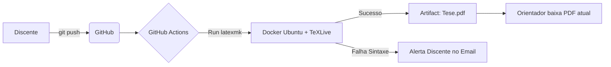

| Material Didático | Link Institucional (Acesso Aberto / PDF & PPTX) |
| :--- | :--- |
| 📄 **Slides LaTeX — Modelo Branco (.pdf)** | [Acessar Slide Branco](/assets/biblioteca/latex-escrita/slides-latex/aula-20-branco.pdf) |
| 📄 **Slides LaTeX — Modelo Preto (.pdf)** | [Acessar Slide Preto](/assets/biblioteca/latex-escrita/slides-latex/aula-20-preto.pdf) |
| 📊 **Slides PPTX — Modelo Branco (.pptx)** | [Acessar PPTX Branco](/assets/biblioteca/latex-escrita/slides-pptx/aula-20-branco.pptx) |
| 📊 **Slides PPTX — Modelo Preto (.pptx)** | [Acessar PPTX Preto](/assets/biblioteca/latex-escrita/slides-pptx/aula-20-preto.pptx) |
| 📝 **Notas de Aula Institucionais (.pdf)** | [Acessar Notas Institucionais](/assets/biblioteca/latex-escrita/notes-latex/aula-20.pdf) |

## 📋 Sumário da Aula
- 1. Introdução e Fundamentação Teórica
- 2. Normalização ABNT e Rigor Metodológico
- 3. Prática e Engenharia no Ecossistema ReLaTeX
- 4. Estudo de Caso Real e Resolução de Problemas
- 5. Síntese e Conclusão


---

## 1. O Problema da Compilação Múltipla

Escrever em LaTeX de forma profissional significa lidar com o processamento em cadeia. Para que um documento contendo sumário (TOC), citações bibliográficas (BibTeX) e referências cruzadas (`\label` e `\ref`) seja gerado perfeitamente, o motor tipográfico precisa ser invocado múltiplas vezes:
1. `pdflatex main.tex` (Lê a estrutura inicial)
2. `biber main` ou `bibtex main` (Associa as chaves `.bib`)
3. `pdflatex main.tex` (Insere as referências, mas as páginas mudam)
4. `pdflatex main.tex` (Consolida os números de páginas e TOC)

Executar esses comandos manualmente no terminal Linux/Windows é tedioso, ineficiente e propenso a esquecimentos (ocasionando sinais de interrogação `[?]` no PDF).

## 2. A Solução Ouro: `latexmk` e o arquivo `.latexmkrc`

A ferramenta nativa e soberana para automação no ecossistema TeX é o `latexmk` (um script Perl). Ele analisa inteligentemente as dependências do seu documento e dispara os compiladores (pdflatex, lualatex, biber) exatamente quantas vezes forem necessárias, e nenhuma vez a mais.

Para personalizar o `latexmk`, criamos o arquivo oculto `.latexmkrc` na raiz do projeto da Tese:

```perl
# Arquivo: .latexmkrc na raiz do repositório da Tese
$pdf_mode = 1; # Força a compilação gerando PDF
$pdflatex = 'pdflatex -interaction=nonstopmode -synctex=1 -file-line-error %O %S';
$biber = 'biber %O %S';
$bibtex = 'bibtex %O %S';
$out_dir = 'build'; # Joga o lixo e o PDF para a pasta /build/
$clean_ext = 'paux lox pdfsync out bbl bcf run.xml snm nav toc'; # Extensões para limpar
```

Executando o comando `latexmk main.tex`, todo o processo de 4 etapas descrito ocorre automaticamente. E com o comando `latexmk -c`, ele varre (limpa) todos os arquivos auxiliares residuais que sujam o seu diretório.

## 3. Versionamento Git em Projetos LaTeX

Trabalhos Acadêmicos são o alvo perfeito para o Git (Versionamento de Código). O LaTeX gera puramente arquivos de texto em formato plano (`.tex`), o que permite diffs perfeitos e um histórico seguro contra perda de dados.

Entretanto, o LaTeX produz dezenas de arquivos auxiliares sujos (`.aux`, `.log`, `.fls`, `.bbl`, `.gz`). Se esses arquivos forem enviados para o Github/Gitlab, os commits ficarão imensos e gerarão conflitos de merge insolúveis. 

### 3.1 O arquivo `.gitignore` Perfeito para TeX

O arquivo `.gitignore` assegura que apenas o código-fonte útil seja versionado.

```bash
# Arquivo .gitignore

# Arquivos de Build do LaTeX
*.aux
*.bbl
*.bcf
*.blg
*.brf
*.fls
*.lof
*.log
*.lot
*.out
*.run.xml
*.toc
*.synctex.gz
*.fdb_latexmk

# Pasta de Saída do Latexmkrc
build/

# Ignorar o PDF final caso seja re-gerado por CI/CD
*.pdf
```

## 4. CI/CD: Integração Contínua (Pipelines) para Teses

Um fluxo moderno de produção científica hospeda o projeto LaTeX no GitHub e utiliza o **GitHub Actions** para compilar o PDF automaticamente toda vez que há um novo `git push`. Assim, o professor/orientador sempre pode baixar o PDF mais atualizado da Tese sem precisar instalar o LaTeX na máquina dele.

### 4.1 Arquivo YAML do GitHub Actions

Cria-se a pasta `.github/workflows/` e dentro dela o arquivo `latex-build.yml`:

```yaml
name: Build Tese PDF
on:
  push:
    branches:
      - main
jobs:
  build_latex:
    runs-on: ubuntu-latest
    steps:
      - name: Checkout Code
        uses: actions/checkout@v3

      - name: Compile LaTeX using latexmk
        uses: xu-cheng/latex-action@v2
        with:
          root_file: main.tex
          args: -pdf -file-line-error -interaction=nonstopmode
          compiler: pdflatex

      - name: Upload PDF Artifact
        uses: actions/upload-artifact@v3
        with:
          name: Tese-Final.pdf
          path: main.pdf
```

Toda vez que o aluno finaliza um capítulo e roda `git commit -m "Finaliza Capitulo 2" && git push`, a nuvem da Microsoft levanta um contêiner Ubuntu, instala o TeXLive, roda o `latexmk` e disponibiliza um link para o download do PDF atualizado.

## 5. Criptografia Automática (Optional)

Em pesquisas envolvendo patentes IFF ou dados corporativos sensíveis sob NDA (Non-Disclosure Agreement), os arquivos PDF podem ser gerados de forma cifrada no Pipeline, integrando o `qpdf` ou `pdftk` logo após o build para proteger o documento com a senha institucional "escritaiff2026", evitando vazamentos se o link do Github for público.

## 6. Estudo de Caso (Use Case): Orientação Assíncrona

No IFF, o Prof. Pedro adotou o fluxo CI/CD para co-orientar um aluno de mestrado que morava no exterior:
1. Aluno submetia o texto (`.tex`) e figuras via Git (Branch).
2. O GitLab CI gerava o PDF instantaneamente.
3. O Professor realizava comentários (Issues/Pull Requests) na linha exata do erro ortográfico, visualizando o PDF em tempo real.
A produtividade aumentou 300% eliminando a troca de pen-drives e e-mails "Tese_VersaoFinal_3_AgoraVai.docx".

## 7. Diagrama de CI/CD para Escrita Científica



## 8. Exercício Prático

1. Crie uma conta no GitHub.
2. Inicie um repositório local vazio e crie o arquivo `.gitignore` utilizando o conteúdo mostrado na Seção 3.
3. Crie um `main.tex` simples.
4. Execute `git init`, `git add .`, `git commit -m "Inicio"`. Observe que nenhum arquivo `.aux` ou `.log` foi adicionado à árvore.
5. Crie localmente o arquivo `.latexmkrc` e execute o comando de compilação automática para comprovar o direcionamento dos arquivos para a pasta de build.

## 9. Referências Bibliográficas

COLLINS, John. **latexmk: Fully automated LaTeX document generation**. Comprehensive TeX Archive Network, 2023.
CHACON, Scott; STRAUB, Ben. **Pro Git**. 2. ed. New York: Apress, 2014.
GITHUB. **GitHub Actions Documentation**. Microsoft Corporation, 2024. Disponível em: https://docs.github.com.
WRIGHT, Joseph. *Best Practices in Version Control for TeX Documents*. TUGboat, vol. 31, no. 1, 2010.


## 🛠️ Recursos Adicionais e Material Suplementar

- **[🏛️ Guia Oficial de Modelos, Classes e Pacotes ReLaTeX](/pt-br/resource/latex/modelos-de-documento)** — Exemplos canônicos de código, classes (`ifftese.cls`, `slidesiffmodelo.cls`) e documentação interna.
- **[📅 Planejamento Letivo e Cronograma de Atividades](/pt-br/resource/latex/planejamento-e-cronograma)** — Matriz analítica de 80h (Terças, 14h30-17h30) e avaliação em 2 bimestres.
- **[📜 Código de Conduta e Diretrizes Acadêmicas](/pt-br/resource/latex/codigo-de-conduta-e-diretrizes)** — Regimento ético, normas CEP/CONEP e uso transparente de IA.
- **[CTAN (Comprehensive TeX Archive Network)](https://ctan.org/)** — Portal oficial mundial de pacotes LaTeX2e.
- **[ABNT Catálogo de Normas](https://www.abnt.org.br/)** — Acesso e consulta às normas técnicas vigentes.
- **[Overleaf Documentation](https://www.overleaf.com/learn)** — Base de conhecimento e guias práticos sobre compilação TeX.

