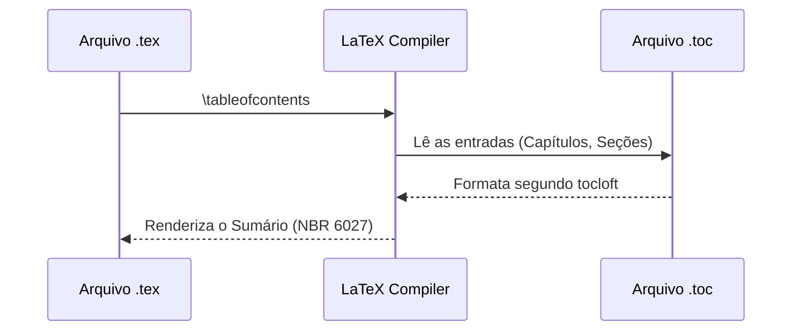

# Aula 20 - Customização Avançada de Floats, Listas e Sumário Dinâmico (ABNT NBR 6027)

**Carga horária:** 2h (Aula Diária)

> [!WARNING]
> **Aviso:** Os recursos adicionais desta aula estão protegidos pela senha "escritaiff2026".

## Slide Referente da Aula (Beamer — Modelo Institucional IFF)

Abaixo apresentamos o código LaTeX integral dos slides institucionais desta aula, construído com a classe **`slidesiffmodelo.cls`** (na proporção 16:9), integrando automaticamente os metadados oficiais do Instituto Federal Fluminense (IFF):

```latex
\documentclass[aspectratio=169]{slidesiffmodelo}
\usepackage[utf8]{inputenc}
\usepackage[T1]{fontenc}
\usepackage[brazil]{babel}
\usepackage{amsmath,amssymb}
\usepackage{booktabs}
\usepackage{tikz}

% ==============================================================================
% METADADOS INSTITUCIONAIS - IFF (PROJETO RELATEX)
% ==============================================================================
\titulo{Aula 20: Floats Customizados e Sumário Dinâmico}
\subtitulo{Curso Profissional de Escrita Acadêmica e LaTeX (80h)}
\autor{Prof. Dr. Pedro Henrique Silva}
\orientador{Projeto ReLaTeX -- IFF Campus Bom Jesus do Itabapoana}
\curso{Engenharia de Computação / Pós-Graduação}
\campus{Campus Bom Jesus do Itabapoana}
\instituicao{Instituto Federal de Educação, Ciência e Tecnologia Fluminense}
\data{\today}

\begin{document}

% ------------------------------------------------------------------------------
% SLIDE 1: CAPA INSTITUCIONAL IFF
% ------------------------------------------------------------------------------
\begin{frame}[plain]
    \imprimircapa
\end{frame}

% ------------------------------------------------------------------------------
% SLIDE 2: SUMÁRIO E ROTEIRO DA AULA
% ------------------------------------------------------------------------------
\begin{frame}{Roteiro da Aula 20}
    \tableofcontents
\end{frame}

% ------------------------------------------------------------------------------
% SLIDE 3: FUNDAMENTAÇÃO TEÓRICA / NORMATIVA ABNT
% ------------------------------------------------------------------------------
\section{Fundamentação e Normativa}
\begin{frame}{Fundamentação Teórica e Normativa ABNT/IBGE}
    \begin{block}{Diretriz Institucional --- Floats, Listas Especiais e NBR 6027}
        Criação de listas personalizadas (Lista de Quadros, Lista de Fluxogramas, Lista de Algoritmos).
    \end{block}
    \vspace{0.3cm}
    \textbf{Pontos-Chave da Aula 20:}
    \begin{itemize}
        \item \textbf{Alinhamento Normativo:} Obediência estrita aos padrões canônicos da ABNT e IBGE.
        \item \textbf{Rigor Metodológico:} Ajuste fino de cabeçalhos e rodapés automáticos via pacote fancyhdr na classe ifftese.cls.
        \item \textbf{Prática em LaTeX:} Automação tipográfica sem intervenção manual de formatação.
    \end{itemize}
\end{frame}

% ------------------------------------------------------------------------------
% SLIDE 4: ARQUITETURA E FLUXO METODOLÓGICO (COLUNAS)
% ------------------------------------------------------------------------------
\section{Arquitetura e Metodologia}
\begin{frame}{Arquitetura de Implementação e Boas Práticas}
    \begin{columns}[c]
        \begin{column}{0.48\textwidth}
            \begin{alertblock}{Atenção Epistemológica}
                Evite desvios normativos ou formatações ad-hoc no código principal. Separe conteúdo de estilo.
            \end{alertblock}
        \end{column}
        \begin{column}{0.48\textwidth}
            \begin{exampleblock}{Padrão Oficial ReLaTeX}
                Utilize as macros centralizadas do pacote \texttt{ifftese.cls} e \texttt{metadados.sty} para manter a conformidade.
            \end{exampleblock}
        \end{column}
    \end{columns}
\end{frame}

% ------------------------------------------------------------------------------
% SLIDE 5: IMPLEMENTAÇÃO NO CÓDIGO (LATEX / ABNT)
% ------------------------------------------------------------------------------
\section{Exemplo Prático (Código)}
\begin{frame}[fragile]{Implementação Prática em LaTeX / ABNT}
    \begin{block}{Snippet de Referência --- Aula 20}
\begin{verbatim}
\newfloat{quadro}{loa}{LOQ} \floatname{quadro}{Quadro}
\end{verbatim}
    \end{block}
\end{frame}

% ------------------------------------------------------------------------------
% SLIDE 6: SÍNTESE E REFERÊNCIAS BIBLIOGRÁFICAS
% ------------------------------------------------------------------------------
\section{Síntese e Referências}
\begin{frame}{Síntese da Aula e Referências Normativas}
    \begin{itemize}
        \item Consolidação dos conhecimentos da Aula 20 no ecossistema IFF.
        \item Próxima etapa: Aplicação no arquivo \texttt{metadados.sty} e validação do build.
    \end{itemize}
    \vspace{0.4cm}
    \footnotesize
    \textbf{Referência Principal:}
    \begin{thebibliography}{10}
        \bibitem{ref1} ABNT. NBR 6027: Informação e documentação - Sumário - Apresentação. 2012.
    \end{thebibliography}
\end{frame}

\end{document}
```


## Slide Referente da Aula (PPTX — Modelo Institucional IFF)

Para apresentações em auditórios do IFF ou defesas que utilizam o **Microsoft PowerPoint (.pptx)** (compatível com LibreOffice Impress e Google Slides), disponibilizamos o modelo institucional Widescreen (16:9) pronto para uso e estruturado nas normas canônicas da ABNT/IBGE abordadas nesta aula:

### 1. Especificação Visual e Identidade IFF (Widescreen 16:9)
- **Paleta Institucional:**
  - Verde Oficial IFF: `#2D6238` (`RGB: 45, 98, 56`) — Primária para Títulos e Capa.
  - Vermelho Destaque IFF: `#B3282D` (`RGB: 179, 40, 45`) — Secundária para Alertas e Código.
  - Cinza Chumbo: `#333333` (`RGB: 51, 51, 51`) — Corpo de Texto.
- **Rodapé Institucional Padronizado:** `Prof. Dr. Pedro Henrique Silva | IFF Campus Bom Jesus do Itabapoana | Curso de Escrita Acadêmica e LaTeX (80h) | Aula 20`.

### 2. Download do Arquivo PPTX Institucional
O arquivo `.pptx` institucional desta aula encontra-se gerado no repositório com todos os 4 slides (Capa, Roteiro, Fundamentação Teórica e Exemplo Prático/Referências):

> [!TIP] **Download da Apresentação**
> **[📥 Baixar Apresentação Institucional em PPTX — Aula 20: Floats Customizados e Sumário Dinâmico](/assets/biblioteca/latex-escrita/slides-pptx/aula-20-iff-institucional.pptx)**

### 3. Conversão Direta via Terminal (Pandoc)
Caso prefira compilar seus próprios slides localmente a partir deste texto Markdown utilizando o template mestre institucional:
```bash
pandoc aula-20.md -o aula-20-iff-institucional.pptx --reference-doc=template-iff-widescreen.pptx --slide-level=2
```


## Detalhamento da Norma ABNT NBR 6027:2012

A **NBR 6027** regulamenta a elaboração do sumário. As regras estritas incluem:
- **Localização:** O sumário é o último elemento pré-textual.
- **Tipografia:** Os indicativos das seções (1, 1.1, 1.1.1) devem estar alinhados à esquerda. O título das seções pode ter destaque tipográfico hierárquico (negrito, maiúsculas, etc.), mas este destaque deve ser idêntico ao utilizado no corpo do texto.
- No LaTeX, pacotes como `tocloft` permitem redefinir macros internas como `\cftsecfont` e `\cftsecpagefont` para manter a coerência exigida pela norma entre o sumário e as seções reais do documento.

## Estudo de Caso (Use Case)

**Contexto:** Um pesquisador nota que as seções terciárias no sumário não estão recebendo a formatação itálico que ele aplicou no corpo do texto.
**Problema:** A classe padrão de LaTeX não sincroniza estilos tipográficos entre o título da seção no texto e no `.toc` (Table of Contents).
**Solução:** Configuração do pacote `tocloft` para injetar comandos de estilo diretamente na entrada do sumário. Exemplo de solução implementada: `\renewcommand{\cftsubsubsectionfont}{\itshape}`.

## Diagramas e Ilustrações



## Exercício Prático

1. Inclua uma figura no seu documento usando o ambiente `figure`.
2. Assegure-se de que a figura está ancorada corretamente com o parâmetro `[htpb]`.
3. Configure o sumário para não apresentar as linhas pontilhadas (dots) para capítulos, seguindo as variações da NBR 6027, usando `\renewcommand{\cftchapdotsep}{\cftnodots}`.

## Referências Bibliográficas

ASSOCIAÇÃO BRASILEIRA DE NORMAS TÉCNICAS. **NBR 6027**: Informação e documentação — Sumário — Apresentação. Rio de Janeiro: ABNT, 2012.
