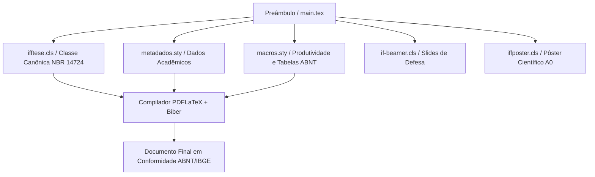

# LaTeX & Escrita Acadêmica

Bem-vindo ao repositório oficial da formação em **LaTeX & Escrita Acadêmica** do **Instituto Federal Fluminense (IFF) — Campus Bom Jesus do Itabapoana**, ministrada pelo **Prof. Dr. Pedro Henrique Rocha de Andrade**.

Esta plataforma centraliza o referencial teórico-metodológico e a arquitetura de automação documental **ReLaTeX**, promovendo o alinhamento integral entre rigor científico (**ABNT NBR 14724, NBR 10520, NBR 6023, NBR 6027, NBR 6028 e IBGE 1993**) e excelência tipográfica.

---

## 🔒 Material Suplementar e Documentos Oficiais

Os documentos institucionais abaixo contêm a programação integral, critérios de avaliação, código de ética científica e diretrizes de uso transparente de Inteligência Artificial.  
*(Acesso Restrito Institucional — Protegido por senha interna no arquivo PDF)*

- **[📅 Cronograma Geral e Ementa Analítica (PDF Protegido)](/assets/biblioteca/latex-escrita/documentos/cronograma-e-ementa.pdf)**  
  *Planejamento letivo detalhado das 80 horas (24 aulas de 2h/dia ao longo de 6 meses), matriz de competências e normas técnicas abordadas.*
- **[📖 Guia do Estudante e Diretrizes Acadêmicas (PDF Protegido)](/assets/biblioteca/latex-escrita/documentos/guia-e-diretrizes.pdf)**  
  *Código de conduta científica, política de tolerância zero contra plágio/autoplágio, regimento para declaração de uso de IA (LLMs) e 4 mandamentos do ecossistema ReLaTeX.*
- **[🏛️ Guia Oficial de Modelos, Classes e Pacotes ReLaTeX](pt-br/resource/latex/modelos-de-documento)**  
  *Referência técnica unificada com documentação e código canônico das classes `ifftese.cls`, `iffposter.cls`, `relatoriocorp.cls` e pacotes `metadados.sty` e `macros.sty`.*

---

## 🎨 Carrossel de Aulas (Acesso Rápido)

Acesse diretamente as notas de aula ilustradas pelas capas autênticas dos slides institucionais de cada encontro:

-  **[Aula 01: Epistemologia e Problematização](pt-br/resource/latex/aula-01-epistemologia-problematizacao)**  
  *Ruptura epistemológica, falsificacionismo de Popper, método hipotético-dedutivo e formulação de hipóteses.*
-  **[Aula 02: Objetivos e Justificativa](pt-br/resource/latex/aula-02-objetivos-e-justificativa)**  
  *Taxonomia de Bloom no domínio cognitivo, verbos científicos e argumentação de relevância técnica e social.*
-  **[Aula 03: Resumo, Abstract e Palavras-Chave](pt-br/resource/latex/aula-03-resumo-abstract-palavras-chave)**  
  *Norma ABNT NBR 6028:2021: estrutura de parágrafo único informativo e vocabulários controlados (DeCS/IEEE).*
-  **[Aula 04: Dedicatória e Agradecimentos](pt-br/resource/latex/aula-04-dedicatoria-agradecimentos-epigrafe)**  
  *Elementos pré-textuais opcionais na NBR 14724, ética no reconhecimento de fomento e epígrafe científica.*
-  **[Aula 05: Introdução e Contextualização](pt-br/resource/latex/aula-05-introducao-e-contextualizacao)**  
  *Técnica do funil argumentativo, delimitação do tema e evidenciação precisa da lacuna de pesquisa.*
-  **[Aula 06: Revisão Sistemática da Literatura](pt-br/resource/latex/aula-06-revisao-sistematica-literatura)**  
  *Protocolo PRISMA 2020, busca booleana em bases indexadas (Scopus/WoS/IEEE) e matriz de síntese.*
-  **[Aula 07: Metodologia e Reprodutibilidade](pt-br/resource/latex/aula-07-metodologia-e-materiais)**  
  *Delineamento experimental, amostragem, instrumentação e critérios canônicos de replicabilidade.*
-  **[Aula 08: Ética na Pesquisa e IA](pt-br/resource/latex/aula-08-etica-na-pesquisa-e-ia)**  
  *Plataforma Brasil, TCLE e declaração institucional obrigatória de uso transparente de LLMs.*
-  **[Aula 09: Resultados e Apresentação de Dados](pt-br/resource/latex/aula-09-resultados-e-apresentacao-de-dados)**  
  *Normas IBGE 1993 (Tabelas numéricas abertas) vs. ABNT (Quadros textuais fechados) e regras de legenda.*
-  **[Aula 10: Discussão e Conclusão](pt-br/resource/latex/aula-10-discussao-e-conclusao)**  
  *Triangulação com a literatura, declaração de limitações experimentais e agenda de trabalhos futuros.*
-  **[Aula 11: Citações e Paráfrases](pt-br/resource/latex/aula-11-citacoes-e-parafrases)**  
  *ABNT NBR 10520:2023: chamadas autor-data em caixa baixa, recuo em citações longas e prevenção contra plágio.*
-  **[Aula 12: Referências Bibliográficas](pt-br/resource/latex/aula-12-referencias-apendices-anexos)**  
  *ABNT NBR 6023:2018/2020: monografias, artigos com DOI, ordenação UTF-8 e distinção Apêndice vs. Anexo.*
-  **[Aula 13: Ambientes e Compiladores LaTeX](pt-br/resource/latex/aula-13-instalacao-ambiente-latex.md)**  
  *TeX Live, MacTeX, VS Code + LaTeX Workshop, Overleaf e motores TeX (PDFLaTeX, XeLaTeX, LuaLaTeX).*
-  **[Aula 14: Sintaxe, Matemática e Tabelas](pt-br/resource/latex/aula-14-sintaxe-latex-e-matematica)**  
  *Sintaxe canônica LaTeX2e, ambientes matemáticos numerados (`amsmath`) e tabelas formais (`booktabs`).*
-  **[Aula 15: Modularização e BibLaTeX](pt-br/resource/latex/aula-15-modularizacao-e-biblatex)**  
  *Arquitetura multi-arquivo (`\input` e `\include`) e bibliografia `.bib` automatizada com `biblatex-abnt`.*
-  **[Aula 16: Gráficos Vetoriais (TikZ)](pt-br/resource/latex/aula-16-graphics-tikz-pgfplots)**  
  *Desenho programável de diagramas de bloco, fluxogramas de processos e curvas estatísticas (`PGFPlots`).*
-  **[Aula 17: Arquivo de Metadados](pt-br/resource/latex/aula-17-arquivo-metadados-sty)**  
  *Isolamento de dados do estudante em `metadados.sty` com lógica automática de flexão gramatical.*
-  **[Aula 18: Pacote de Macros](pt-br/resource/latex/aula-18-pacote-macros-sty)**  
  *Produtividade com `macros.sty`: inserção de figuras em comando único e ambientes de teoremas.*
-  **[Aula 19: Classe Canônica ifftese.cls](pt-br/resource/latex/aula-19-classe-ifftese-engenharia)**  
  *Engenharia de macros, herança do `abntex2`, margens NBR 14724 e customização da folha de rosto.*
-  **[Aula 20: Floats e Sumário Dinâmico](pt-br/resource/latex/aula-20-floats-e-sumario-dinamico)**  
  *Criação de listas customizadas (LOQ, LOA) e cabeçalhos normatizados pela ABNT NBR 6027 (`fancyhdr`).*
-  **[Aula 21: Slides de Defesa Institucionais](pt-br/resource/latex/aula-21-beamer-slides-defesa)**  
  *Apresentações Widescreen 16:9 em Beamer (`if-beamer.cls`) com identidade institucional IFF.*
-  **[Aula 22: Pôster Científico em LaTeX](pt-br/resource/latex/aula-22-poster-cientifico-iffposter)**  
  *Editoração de banners em A0/A1 com `iffposter.cls`, escalonamento de fontes e cabeçalho oficial.*
-  **[Aula 23: Relatórios Corporativos](pt-br/resource/latex/aula-23-relatorios-corporativos)**  
  *Classes `relatoriocorp.cls` e `marca.sty`: pareceres técnicos industriais e sumário executivo.*
-  **[Aula 24: Automação e Submissão](pt-br/resource/latex/aula-24-latexmk-git-e-submissao)**  
  *Compilação em ciclo contínuo (`latexmk`), versionamento Git (`.gitignore`) e checklist de depósito.*

---

## 📅 Ementa Analítica por Módulos

A programação do curso está estruturada em **6 Módulos Mensais**, cada um composto por 4 encontros intensivos (2h/dia). Para cada aula, o estudante dispõe de **Notas de Aula** completas em português e dos **Slides de Apresentação** nos formatos LaTeX Institucional (`if-beamer.cls`) e PowerPoint Widescreen (`.pptx` / 16:9).

*(Acesso Restrito Institucional — Arquivos PDF Protegidos por Senha)*

### 📘 Módulo I — Epistemologia, Metodologia e Elementos Pré-Textuais (Aulas 01 a 04)

| Aula | Título da Lição & Conteúdo | Normas (ABNT / IBGE) | Material Didático |
| :---: | :--- | :---: | :--- |
| **01** | **Epistemologia e Problematização** Conhecimento científico vs. senso comum e falsificacionismo de Popper. | — | [Notas de Aula](pt-br/resource/latex/aula-01-epistemologia-problematizacao) [Slides LaTeX (.pdf)](/assets/biblioteca/latex-escrita/slides-latex/aula-01.pdf) [Slides PPTX (.pdf)](/assets/biblioteca/latex-escrita/slides-pptx/aula-01.pdf) |
| **02** | **Objetivos e Justificativa** Taxonomia de Bloom e argumentação de relevância técnica/social. | — | [Notas de Aula](pt-br/resource/latex/aula-02-objetivos-e-justificativa) [Slides LaTeX (.pdf)](/assets/biblioteca/latex-escrita/slides-latex/aula-02.pdf) [Slides PPTX (.pdf)](/assets/biblioteca/latex-escrita/slides-pptx/aula-02.pdf) |
| **03** | **Resumo, Abstract e Palavras-Chave** Redação canônica em parágrafo único de 150 a 500 palavras e vocabulários controlados. | **ABNT NBR 6028:2021** | [Notas de Aula](pt-br/resource/latex/aula-03-resumo-abstract-palavras-chave) [Slides LaTeX (.pdf)](/assets/biblioteca/latex-escrita/slides-latex/aula-03.pdf) [Slides PPTX (.pdf)](/assets/biblioteca/latex-escrita/slides-pptx/aula-03.pdf) |
| **04** | **Dedicatória e Agradecimentos** Elementos opcionais pré-textuais e crédito ético a agências de fomento (CNPq/CAPES). | **ABNT NBR 14724:2011** | [Notas de Aula](pt-br/resource/latex/aula-04-dedicatoria-agradecimentos-epigrafe) [Slides LaTeX (.pdf)](/assets/biblioteca/latex-escrita/slides-latex/aula-04.pdf) [Slides PPTX (.pdf)](/assets/biblioteca/latex-escrita/slides-pptx/aula-04.pdf) |

---

### 📘 Módulo II — Estrutura Textual e Construção Argumentativa (Aulas 05 a 08)

| Aula | Título da Lição & Conteúdo | Normas (ABNT / IBGE) | Material Didático |
| :---: | :--- | :---: | :--- |
| **05** | **Introdução e Contextualização** Técnica do funil argumentativo e explicitação da lacuna científica (*Research Gap*). | **ABNT NBR 14724:2011** | [Notas de Aula](pt-br/resource/latex/aula-05-introducao-e-contextualizacao) [Slides LaTeX (.pdf)](/assets/biblioteca/latex-escrita/slides-latex/aula-05.pdf) [Slides PPTX (.pdf)](/assets/biblioteca/latex-escrita/slides-pptx/aula-05.pdf) |
| **06** | **Revisão Sistemática da Literatura** Protocolo PRISMA 2020, buscas indexadas (Scopus/WoS/IEEE) e matriz de síntese. | **PRISMA 2020** | [Notas de Aula](pt-br/resource/latex/aula-06-revisao-sistematica-literatura) [Slides LaTeX (.pdf)](/assets/biblioteca/latex-escrita/slides-latex/aula-06.pdf) [Slides PPTX (.pdf)](/assets/biblioteca/latex-escrita/slides-pptx/aula-06.pdf) |
| **07** | **Metodologia e Reprodutibilidade** Delineamento experimental, universo, amostra, instrumentos e replicabilidade. | **ABNT NBR 14724:2011** | [Notas de Aula](pt-br/resource/latex/aula-07-metodologia-e-materiais) [Slides LaTeX (.pdf)](/assets/biblioteca/latex-escrita/slides-latex/aula-07.pdf) [Slides PPTX (.pdf)](/assets/biblioteca/latex-escrita/slides-pptx/aula-07.pdf) |
| **08** | **Ética na Pesquisa e Uso de IA** Plataforma Brasil, TCLE, autoplágio e uso ético, transparente e declarável de LLMs. | **CEP / CONEP** | [Notas de Aula](pt-br/resource/latex/aula-08-etica-na-pesquisa-e-ia) [Slides LaTeX (.pdf)](/assets/biblioteca/latex-escrita/slides-latex/aula-08.pdf) [Slides PPTX (.pdf)](/assets/biblioteca/latex-escrita/slides-pptx/aula-08.pdf) |

---

### 📘 Módulo III — Resultados, Discussão e Elementos Pós-Textuais (Aulas 09 a 12)

| Aula | Título da Lição & Conteúdo | Normas (ABNT / IBGE) | Material Didático |
| :---: | :--- | :---: | :--- |
| **09** | **Resultados e Apresentação de Dados** Diferenciação canônica entre Tabelas (numéricas abertas) e Quadros (textuais fechados). | **IBGE 1993 / ABNT** | [Notas de Aula](pt-br/resource/latex/aula-09-resultados-e-apresentacao-de-dados) [Slides LaTeX (.pdf)](/assets/biblioteca/latex-escrita/slides-latex/aula-09.pdf) [Slides PPTX (.pdf)](/assets/biblioteca/latex-escrita/slides-pptx/aula-09.pdf) |
| **10** | **Discussão, Limitações e Conclusão** Triangulação com a literatura, declaração de limitações e agenda de trabalhos futuros. | **ABNT NBR 14724:2011** | [Notas de Aula](pt-br/resource/latex/aula-10-discussao-e-conclusao) [Slides LaTeX (.pdf)](/assets/biblioteca/latex-escrita/slides-latex/aula-10.pdf) [Slides PPTX (.pdf)](/assets/biblioteca/latex-escrita/slides-pptx/aula-10.pdf) |
| **11** | **Citações e Paráfrases** Sistema autor-data em caixa baixa, citações curtas/longas (>3 linhas com recuo) e plágio. | **ABNT NBR 10520:2023** | [Notas de Aula](pt-br/resource/latex/aula-11-citacoes-e-parafrases) [Slides LaTeX (.pdf)](/assets/biblioteca/latex-escrita/slides-latex/aula-11.pdf) [Slides PPTX (.pdf)](/assets/biblioteca/latex-escrita/slides-pptx/aula-11.pdf) |
| **12** | **Referências Bibliográficas e Anexos** Monografias, artigos com DOI, ordenação UTF-8 e distinção Apêndice vs. Anexo. | **ABNT NBR 6023:2018** | [Notas de Aula](pt-br/resource/latex/aula-12-referencias-apendices-anexos) [Slides LaTeX (.pdf)](/assets/biblioteca/latex-escrita/slides-latex/aula-12.pdf) [Slides PPTX (.pdf)](/assets/biblioteca/latex-escrita/slides-pptx/aula-12.pdf) |

---

### 📗 Módulo IV — Fundamentos de LaTeX e Arquitetura de Documentos (Aulas 13 a 16)

| Aula | Título da Lição & Conteúdo | Normas (ABNT / IBGE) | Material Didático |
| :---: | :--- | :---: | :--- |
| **13** | **Instalação e Ambientes LaTeX** TeX Live, MacTeX, VS Code + LaTeX Workshop, Overleaf e motores TeX. | — | [Notas de Aula](pt-br/resource/latex/aula-13-instalacao-ambiente-latex.md) [Slides LaTeX (.pdf)](/assets/biblioteca/latex-escrita/slides-latex/aula-13.pdf) [Slides PPTX (.pdf)](/assets/biblioteca/latex-escrita/slides-pptx/aula-13.pdf) |
| **14** | **Sintaxe, Matemática e Tabelas** Sintaxe LaTeX2e, equações numeradas (`amsmath`) e tabelas formais (`booktabs`). | **ABNT NBR 14724:2011** | [Notas de Aula](pt-br/resource/latex/aula-14-sintaxe-latex-e-matematica) [Slides LaTeX (.pdf)](/assets/biblioteca/latex-escrita/slides-latex/aula-14.pdf) [Slides PPTX (.pdf)](/assets/biblioteca/latex-escrita/slides-pptx/aula-14.pdf) |
| **15** | **Modularização e BibLaTeX** Arquitetura multi-arquivo (`\input`/`\include`) e bibliografia `.bib` via `biber`. | **ABNT NBR 6023:2018** | [Notas de Aula](pt-br/resource/latex/aula-15-modularizacao-e-biblatex) [Slides LaTeX (.pdf)](/assets/biblioteca/latex-escrita/slides-latex/aula-15.pdf) [Slides PPTX (.pdf)](/assets/biblioteca/latex-escrita/slides-pptx/aula-15.pdf) |
| **16** | **Gráficos Vetoriais com TikZ** Desenho vetorial nativo em código: fluxogramas, diagramas de bloco e `PGFPlots`. | — | [Notas de Aula](pt-br/resource/latex/aula-16-graphics-tikz-pgfplots) [Slides LaTeX (.pdf)](/assets/biblioteca/latex-escrita/slides-latex/aula-16.pdf) [Slides PPTX (.pdf)](/assets/biblioteca/latex-escrita/slides-pptx/aula-16.pdf) |

---

### 📗 Módulo V — Domínio da Classe `ifftese.cls` e Ecossistema ReLaTeX (Aulas 17 a 20)

| Aula | Título da Lição & Conteúdo | Normas (ABNT / IBGE) | Material Didático |
| :---: | :--- | :---: | :--- |
| **17** | **Arquivo de Metadados (`metadados.sty`)** Isolamento de dados do estudante, títulos e comissão examinadora com flexão de gênero. | **ABNT NBR 14724:2011** | [Notas de Aula](pt-br/resource/latex/aula-17-arquivo-metadados-sty) [Slides LaTeX (.pdf)](/assets/biblioteca/latex-escrita/slides-latex/aula-17.pdf) [Slides PPTX (.pdf)](/assets/biblioteca/latex-escrita/slides-pptx/aula-17.pdf) |
| **18** | **Pacote de Macros (`macros.sty`)** Inclusão unificada de figuras/quadros com 1 comando e ambientes de teoremas. | **ABNT NBR 14724:2011** | [Notas de Aula](pt-br/resource/latex/aula-18-pacote-macros-sty) [Slides LaTeX (.pdf)](/assets/biblioteca/latex-escrita/slides-latex/aula-18.pdf) [Slides PPTX (.pdf)](/assets/biblioteca/latex-escrita/slides-pptx/aula-18.pdf) |
| **19** | **Engenharia da Classe `ifftese.cls`** Herança do `abntex2`, margens NBR 14724 e redefinição de folha de rosto/aprovação. | **ABNT NBR 14724:2011** | [Notas de Aula](pt-br/resource/latex/aula-19-classe-ifftese-engenharia) [Slides LaTeX (.pdf)](/assets/biblioteca/latex-escrita/slides-latex/aula-19.pdf) [Slides PPTX (.pdf)](/assets/biblioteca/latex-escrita/slides-pptx/aula-19.pdf) |
| **20** | **Floats e Sumário Dinâmico** Criação de listas customizadas (LOQ, LOA) e cabeçalhos normatizados (`fancyhdr`). | **ABNT NBR 6027:2012** | [Notas de Aula](pt-br/resource/latex/aula-20-floats-e-sumario-dinamico) [Slides LaTeX (.pdf)](/assets/biblioteca/latex-escrita/slides-latex/aula-20.pdf) [Slides PPTX (.pdf)](/assets/biblioteca/latex-escrita/slides-pptx/aula-20.pdf) |

---

### 📗 Módulo VI — Defesa, Apresentação Científica, Pôsteres e Relatórios (Aulas 21 a 24)

| Aula | Título da Lição & Conteúdo | Normas (ABNT / IBGE) | Material Didático |
| :---: | :--- | :---: | :--- |
| **21** | **Slides de Defesa (`if-beamer.cls`)** Apresentação Widescreen 16:9 em Beamer com régua e identidade visual IFF. | **Identidade IFF** | [Notas de Aula](pt-br/resource/latex/aula-21-beamer-slides-defesa) [Slides LaTeX (.pdf)](/assets/biblioteca/latex-escrita/slides-latex/aula-21.pdf) [Slides PPTX (.pdf)](/assets/biblioteca/latex-escrita/slides-pptx/aula-21.pdf) |
| **22** | **Pôster Científico (`iffposter.cls`)** Editoração de banners para feiras e mostras em A0/A1 com logomarcas oficiais. | **Identidade IFF** | [Notas de Aula](pt-br/resource/latex/aula-22-poster-cientifico-iffposter) [Slides LaTeX (.pdf)](/assets/biblioteca/latex-escrita/slides-latex/aula-22.pdf) [Slides PPTX (.pdf)](/assets/biblioteca/latex-escrita/slides-pptx/aula-22.pdf) |
| **23** | **Relatórios Corporativos (`relatoriocorp.cls`)** Governança de paleta com `marca.sty`, sumário executivo em destaque e booktabs. | **Corporativo** | [Notas de Aula](pt-br/resource/latex/aula-23-relatorios-corporativos) [Slides LaTeX (.pdf)](/assets/biblioteca/latex-escrita/slides-latex/aula-23.pdf) [Slides PPTX (.pdf)](/assets/biblioteca/latex-escrita/slides-pptx/aula-23.pdf) |
| **24** | **Automação (`latexmk`) e Versionamento Git** Compilação contínua em CI/CD, `.gitignore` para TeX e checklist de depósito. | — | [Notas de Aula](pt-br/resource/latex/aula-24-latexmk-git-e-submissao) [Slides LaTeX (.pdf)](/assets/biblioteca/latex-escrita/slides-latex/aula-24.pdf) [Slides PPTX (.pdf)](/assets/biblioteca/latex-escrita/slides-pptx/aula-24.pdf) |

---

## 🏛️ Pacotes e Classes do Ecossistema ReLaTeX

O desenvolvimento de monografias, TCCs, relatórios de estágio e dissertações no Instituto Federal Fluminense apoia-se na centralização documental do **ReLaTeX**. Consulte a [página oficial de modelos](pt-br/resource/latex/modelos-de-documento) para exemplos completos de código.

