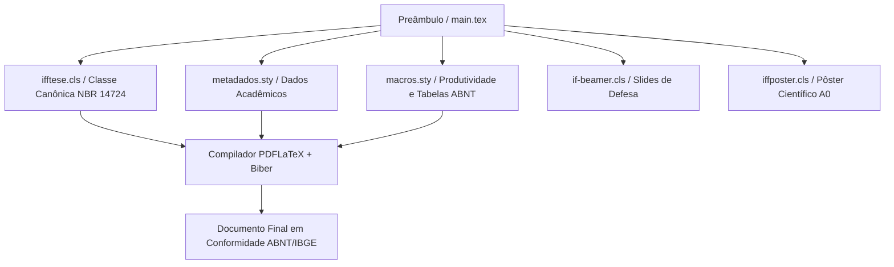

# LaTeX & Escrita Acadêmica

Bem-vindo ao repositório oficial da formação em **LaTeX & Escrita Acadêmica** do **Instituto Federal Fluminense (IFF) — Campus Bom Jesus do Itabapoana**, ministrada pelo **Prof. Dr. Pedro Henrique Rocha de Andrade**.

Esta plataforma centraliza o referencial teórico-metodológico e a arquitetura de automação documental **ReLaTeX**, promovendo o alinhamento integral entre rigor científico (**ABNT NBR 14724, NBR 10520, NBR 6023, NBR 6027, NBR 6028 e IBGE 1993**) e excelência tipográfica.

---

## 📚 Material Suplementar e Documentos Oficiais

Os documentos institucionais abaixo contêm a programação integral de 80 horas (20 Aulas de 4 tempos de 50 minutos), critérios de avaliação, código de ética científica e diretrizes de uso transparente de Inteligência Artificial:

- **[📅 Planejamento Letivo e Cronograma de Atividades](/pt-br/resource/latex/planejamento-e-cronograma)**  
  *Planejamento analítico das 20 aulas, divisão em 5 módulos didáticos, matriz de competências e referencial normativo ABNT.*
- **[📜 Código de Conduta, Ética na Pesquisa e Diretrizes Acadêmicas](/pt-br/resource/latex/codigo-de-conduta-e-diretrizes)**  
  *Código de ética científica, política institucional de integridade contra plágio/autoplágio, regimento de uso de IA (LLMs) e boas práticas de laboratório.*
- **[🏛️ Guia Oficial de Modelos, Classes e Pacotes ReLaTeX](/pt-br/resource/latex/modelos-de-documento)**  
  *Referência técnica unificada com documentação canônica das classes `ifftese.cls`, `iffposter.cls`, `relatoriocorp.cls` e pacotes `metadados.sty` e `macros.sty`.*

---

## 🎨 Carrossel de Aulas (Acesso Rápido)

Acesse diretamente as notas de aula ilustradas pelas capas autênticas dos slides institucionais de cada encontro:

<!-- COURSE_CAROUSEL_START -->

  <a href="/pt-br/resource/latex/aula-01-epistemologia-problematizacao-e-hipoteses" class="course-carousel-card">
    

      AULA 01
      
    

    

      
Epistemologia, Problematização e Hipóteses

      
Normas em Foco: —

    

  </a>
  <a href="/pt-br/resource/latex/aula-02-objetivos-taxonomia-de-bloom-e-justificativa" class="course-carousel-card">
    

      AULA 02
      
    

    

      
Objetivos, Taxonomia de Bloom e Justificativa

      
Normas em Foco: ABNT NBR 14724

    

  </a>
  <a href="/pt-br/resource/latex/aula-03-resumo-abstract-e-palavras-chave-nbr-6028" class="course-carousel-card">
    

      AULA 03
      
    

    

      
Resumo, Abstract e Palavras-Chave (NBR 6028:2021)

      
Normas em Foco: ABNT NBR 6028 / ABNT NBR 6028:2021

    

  </a>
  <a href="/pt-br/resource/latex/aula-04-elementos-pre-textuais-nbr-14724" class="course-carousel-card">
    

      AULA 04
      
    

    

      
Elementos Pré-Textuais NBR 14724

      
Normas em Foco: ABNT NBR 14724 / ABNT NBR 14724:

    

  </a>
  <a href="/pt-br/resource/latex/aula-05-introducao-contextualizacao-e-lacuna-de-pesquisa" class="course-carousel-card">
    

      AULA 05
      
    

    

      
Introdução e Lacuna de Pesquisa (*Research Gap*)

      
Normas em Foco: ABNT NBR 14724

    

  </a>
  <a href="/pt-br/resource/latex/aula-06-revisao-sistematica-da-literatura-e-protocolo-prisma" class="course-carousel-card">
    

      AULA 06
      
    

    

      
Revisão Sistemática da Literatura e Protocolo PRISMA 2020

      
Normas em Foco: ABNT NBR 14724 / ABNT NBR 6023:2018

    

  </a>
  <a href="/pt-br/resource/latex/aula-07-metodologia-materiais-e-reprodutibilidade" class="course-carousel-card">
    

      AULA 07
      
    

    

      
Metodologia, Materiais e Reprodutibilidade na ABNT

      
Normas em Foco: ABNT NBR 14724 / ABNT NBR 14724:2011

    

  </a>
  <a href="/pt-br/resource/latex/aula-08-etica-plataforma-brasil-e-uso-de-ia" class="course-carousel-card">
    

      AULA 08
      
    

    

      
Ética na Pesquisa (Plataforma Brasil) e IA

      
Normas em Foco: ABNT NBR 6023:2018 / CEP/CONEP

    

  </a>
  <a href="/pt-br/resource/latex/aula-09-resultados-tabelas-ibge-vs-quadros-abnt" class="course-carousel-card">
    

      AULA 09
      
    

    

      
Resultados: Tabelas IBGE vs. Quadros ABNT

      
Normas em Foco: ABNT NBR 14724 / IBGE 1993

    

  </a>
  <a href="/pt-br/resource/latex/aula-10-discussao-citacoes-nbr-10520-e-referencias-nbr-6023" class="course-carousel-card">
    

      AULA 10
      
    

    

      
Discussão, Citações (10520) e Referências (6023)

      
Normas em Foco: ABNT NBR 10520:2023 / ABNT NBR 6023

    

  </a>
  <a href="/pt-br/resource/latex/aula-11-arquitetura-latex-motores-tex-e-preambulo-tex" class="course-carousel-card">
    

      AULA 11
      
    

    

      
Arquitetura do Kernel LaTeX2e, Motores PDFLaTeX/LuaLaTeX/XeLaTeX e Estrutura do Preâmbulo .tex

      
Normas em Foco: —

    

  </a>
  <a href="/pt-br/resource/latex/aula-12-sintaxe-matematica-amsmath-e-tabelas-booktabs" class="course-carousel-card">
    

      AULA 12
      
    

    

      
Sintaxe Canônica, Ambientes Matemáticos Avançados (amsmath) e Tabelas (booktabs)

      
Normas em Foco: —

    

  </a>
  <a href="/pt-br/resource/latex/aula-13-modularizacao-multi-arquivo-e-biblatex-biber" class="course-carousel-card">
    

      AULA 13
      
    

    

      
Modularização Multi-arquivo e Gestão Bibliográfica com biblatex-biber

      
Normas em Foco: —

    

  </a>
  <a href="/pt-br/resource/latex/aula-14-graficos-vetoriais-tikz-e-pgfplots" class="course-carousel-card">
    

      AULA 14
      
    

    

      
Computação Gráfica Vetorial Programável com TikZ e Gráficos PGFPlots

      
Normas em Foco: —

    

  </a>
  <a href="/pt-br/resource/latex/aula-15-engenharia-do-arquivo-de-metadados-sty" class="course-carousel-card">
    

      AULA 15
      
    

    

      
Engenharia de Metadados: Estrutura de metadados.sty, Escopo e Flexão de Gênero

      
Normas em Foco: —

    

  </a>
  <a href="/pt-br/resource/latex/aula-16-desenvolvimento-de-pacotes-e-macros-sty" class="course-carousel-card">
    

      AULA 16
      
    

    

      
Desenvolvimento de Pacotes .sty - Programação TeX e Macros

      
Normas em Foco: —

    

  </a>
  <a href="/pt-br/resource/latex/aula-17-engenharia-da-classe-ifftese-cls" class="course-carousel-card">
    

      AULA 17
      
    

    

      
Engenharia de Classes .cls - Anatomia da ifftese e abntex2

      
Normas em Foco: ABNT NBR 14724

    

  </a>
  <a href="/pt-br/resource/latex/aula-18-customizacao-de-floats-fancyhdr-e-nbr-6027" class="course-carousel-card">
    

      AULA 18
      
    

    

      
Controle Avançado de Floats e NBR 6027

      
Normas em Foco: —

    

  </a>
  <a href="/pt-br/resource/latex/aula-19-classes-especializadas-if-beamer-iffposter-relatoriocorp" class="course-carousel-card">
    

      AULA 19
      
    

    

      
Classes Especializadas (Beamer, Poster e Relatório)

      
Normas em Foco: —

    

  </a>
  <a href="/pt-br/resource/latex/aula-20-automacao-latexmkrc-git-e-integracao-continua" class="course-carousel-card">
    

      AULA 20
      
    

    

      
Automação LaTeX, Git e Integração Contínua CI/CD

      
Normas em Foco: —

    

  </a>

<!-- COURSE_CAROUSEL_END -->

---

## 📅 Ementa Analítica por Módulos

A programação do curso está estruturada em **5 Módulos Didáticos**, cada um composto por 4 encontros intensivos (4 tempos de 50 minutos / 3h20). Para cada aula, o estudante dispõe de **Notas de Aula** completas em português e dos **Slides de Apresentação** nos formatos LaTeX Institucional (`if-beamer.cls`) e PowerPoint Widescreen (`.pptx` / 16:9).

<!-- COURSE_TABLE_START -->
### 📘 Módulo I — Epistemologia, Metodologia Científica e Elementos Pré-Textuais (Aulas 01 a 04)

| Aula | Título da Lição & Conteúdo | Normas (ABNT / IBGE) | Material Didático |
| :---: | :--- | :---: | :--- |
| **01** | **Epistemologia, Problematização e Hipóteses** Fundamentação teórica, normas técnicas e prática ReLaTeX. | **—** | [Notas de Aula](/pt-br/resource/latex/aula-01-epistemologia-problematizacao-e-hipoteses) [Slides LaTeX (.pdf)](/assets/biblioteca/latex-escrita/slides-latex/aula-01.pdf) [Slides PPTX (.pdf)](/assets/biblioteca/latex-escrita/slides-pptx/aula-01.pdf) |
| **02** | **Objetivos, Taxonomia de Bloom e Justificativa** Fundamentação teórica, normas técnicas e prática ReLaTeX. | **ABNT NBR 14724** | [Notas de Aula](/pt-br/resource/latex/aula-02-objetivos-taxonomia-de-bloom-e-justificativa) [Slides LaTeX (.pdf)](/assets/biblioteca/latex-escrita/slides-latex/aula-02.pdf) [Slides PPTX (.pdf)](/assets/biblioteca/latex-escrita/slides-pptx/aula-02.pdf) |
| **03** | **Resumo, Abstract e Palavras-Chave (NBR 6028:2021)** Fundamentação teórica, normas técnicas e prática ReLaTeX. | **ABNT NBR 6028 / ABNT NBR 6028:2021** | [Notas de Aula](/pt-br/resource/latex/aula-03-resumo-abstract-e-palavras-chave-nbr-6028) [Slides LaTeX (.pdf)](/assets/biblioteca/latex-escrita/slides-latex/aula-03.pdf) [Slides PPTX (.pdf)](/assets/biblioteca/latex-escrita/slides-pptx/aula-03.pdf) |
| **04** | **Elementos Pré-Textuais NBR 14724** Fundamentação teórica, normas técnicas e prática ReLaTeX. | **ABNT NBR 14724 / ABNT NBR 14724:** | [Notas de Aula](/pt-br/resource/latex/aula-04-elementos-pre-textuais-nbr-14724) [Slides LaTeX (.pdf)](/assets/biblioteca/latex-escrita/slides-latex/aula-04.pdf) [Slides PPTX (.pdf)](/assets/biblioteca/latex-escrita/slides-pptx/aula-04.pdf) |

---

### 📘 Módulo II — Estrutura Textual, Introdução, PRISMA e Metodologia (Aulas 05 a 08)

| Aula | Título da Lição & Conteúdo | Normas (ABNT / IBGE) | Material Didático |
| :---: | :--- | :---: | :--- |
| **05** | **Introdução e Lacuna de Pesquisa (*Research Gap*)** Fundamentação teórica, normas técnicas e prática ReLaTeX. | **ABNT NBR 14724** | [Notas de Aula](/pt-br/resource/latex/aula-05-introducao-contextualizacao-e-lacuna-de-pesquisa) [Slides LaTeX (.pdf)](/assets/biblioteca/latex-escrita/slides-latex/aula-05.pdf) [Slides PPTX (.pdf)](/assets/biblioteca/latex-escrita/slides-pptx/aula-05.pdf) |
| **06** | **Revisão Sistemática da Literatura e Protocolo PRISMA 2020** Fundamentação teórica, normas técnicas e prática ReLaTeX. | **ABNT NBR 14724 / ABNT NBR 6023:2018** | [Notas de Aula](/pt-br/resource/latex/aula-06-revisao-sistematica-da-literatura-e-protocolo-prisma) [Slides LaTeX (.pdf)](/assets/biblioteca/latex-escrita/slides-latex/aula-06.pdf) [Slides PPTX (.pdf)](/assets/biblioteca/latex-escrita/slides-pptx/aula-06.pdf) |
| **07** | **Metodologia, Materiais e Reprodutibilidade na ABNT** Fundamentação teórica, normas técnicas e prática ReLaTeX. | **ABNT NBR 14724 / ABNT NBR 14724:2011** | [Notas de Aula](/pt-br/resource/latex/aula-07-metodologia-materiais-e-reprodutibilidade) [Slides LaTeX (.pdf)](/assets/biblioteca/latex-escrita/slides-latex/aula-07.pdf) [Slides PPTX (.pdf)](/assets/biblioteca/latex-escrita/slides-pptx/aula-07.pdf) |
| **08** | **Ética na Pesquisa (Plataforma Brasil) e IA** Fundamentação teórica, normas técnicas e prática ReLaTeX. | **ABNT NBR 6023:2018 / CEP/CONEP** | [Notas de Aula](/pt-br/resource/latex/aula-08-etica-plataforma-brasil-e-uso-de-ia) [Slides LaTeX (.pdf)](/assets/biblioteca/latex-escrita/slides-latex/aula-08.pdf) [Slides PPTX (.pdf)](/assets/biblioteca/latex-escrita/slides-pptx/aula-08.pdf) |

---

### 📘 Módulo III — Resultados, Discussão, Citações NBR 10520 e Referências NBR 6023 (Aulas 09 a 12)

| Aula | Título da Lição & Conteúdo | Normas (ABNT / IBGE) | Material Didático |
| :---: | :--- | :---: | :--- |
| **09** | **Resultados: Tabelas IBGE vs. Quadros ABNT** Fundamentação teórica, normas técnicas e prática ReLaTeX. | **ABNT NBR 14724 / IBGE 1993** | [Notas de Aula](/pt-br/resource/latex/aula-09-resultados-tabelas-ibge-vs-quadros-abnt) [Slides LaTeX (.pdf)](/assets/biblioteca/latex-escrita/slides-latex/aula-09.pdf) [Slides PPTX (.pdf)](/assets/biblioteca/latex-escrita/slides-pptx/aula-09.pdf) |
| **10** | **Discussão, Citações (10520) e Referências (6023)** Fundamentação teórica, normas técnicas e prática ReLaTeX. | **ABNT NBR 10520:2023 / ABNT NBR 6023** | [Notas de Aula](/pt-br/resource/latex/aula-10-discussao-citacoes-nbr-10520-e-referencias-nbr-6023) [Slides LaTeX (.pdf)](/assets/biblioteca/latex-escrita/slides-latex/aula-10.pdf) [Slides PPTX (.pdf)](/assets/biblioteca/latex-escrita/slides-pptx/aula-10.pdf) |
| **11** | **Arquitetura do Kernel LaTeX2e, Motores PDFLaTeX/LuaLaTeX/XeLaTeX e Estrutura do Preâmbulo .tex** Fundamentação teórica, normas técnicas e prática ReLaTeX. | **—** | [Notas de Aula](/pt-br/resource/latex/aula-11-arquitetura-latex-motores-tex-e-preambulo-tex) [Slides LaTeX (.pdf)](/assets/biblioteca/latex-escrita/slides-latex/aula-11.pdf) [Slides PPTX (.pdf)](/assets/biblioteca/latex-escrita/slides-pptx/aula-11.pdf) |
| **12** | **Sintaxe Canônica, Ambientes Matemáticos Avançados (amsmath) e Tabelas (booktabs)** Fundamentação teórica, normas técnicas e prática ReLaTeX. | **—** | [Notas de Aula](/pt-br/resource/latex/aula-12-sintaxe-matematica-amsmath-e-tabelas-booktabs) [Slides LaTeX (.pdf)](/assets/biblioteca/latex-escrita/slides-latex/aula-12.pdf) [Slides PPTX (.pdf)](/assets/biblioteca/latex-escrita/slides-pptx/aula-12.pdf) |

---

### 📗 Módulo IV — Arquitetura LaTeX (.tex), Motores, Sintaxe, Tabelas e Gráficos (Aulas 13 a 16)

| Aula | Título da Lição & Conteúdo | Normas (ABNT / IBGE) | Material Didático |
| :---: | :--- | :---: | :--- |
| **13** | **Modularização Multi-arquivo e Gestão Bibliográfica com biblatex-biber** Fundamentação teórica, normas técnicas e prática ReLaTeX. | **—** | [Notas de Aula](/pt-br/resource/latex/aula-13-modularizacao-multi-arquivo-e-biblatex-biber) [Slides LaTeX (.pdf)](/assets/biblioteca/latex-escrita/slides-latex/aula-13.pdf) [Slides PPTX (.pdf)](/assets/biblioteca/latex-escrita/slides-pptx/aula-13.pdf) |
| **14** | **Computação Gráfica Vetorial Programável com TikZ e Gráficos PGFPlots** Fundamentação teórica, normas técnicas e prática ReLaTeX. | **—** | [Notas de Aula](/pt-br/resource/latex/aula-14-graficos-vetoriais-tikz-e-pgfplots) [Slides LaTeX (.pdf)](/assets/biblioteca/latex-escrita/slides-latex/aula-14.pdf) [Slides PPTX (.pdf)](/assets/biblioteca/latex-escrita/slides-pptx/aula-14.pdf) |
| **15** | **Engenharia de Metadados: Estrutura de metadados.sty, Escopo e Flexão de Gênero** Fundamentação teórica, normas técnicas e prática ReLaTeX. | **—** | [Notas de Aula](/pt-br/resource/latex/aula-15-engenharia-do-arquivo-de-metadados-sty) [Slides LaTeX (.pdf)](/assets/biblioteca/latex-escrita/slides-latex/aula-15.pdf) [Slides PPTX (.pdf)](/assets/biblioteca/latex-escrita/slides-pptx/aula-15.pdf) |
| **16** | **Desenvolvimento de Pacotes .sty - Programação TeX e Macros** Fundamentação teórica, normas técnicas e prática ReLaTeX. | **—** | [Notas de Aula](/pt-br/resource/latex/aula-16-desenvolvimento-de-pacotes-e-macros-sty) [Slides LaTeX (.pdf)](/assets/biblioteca/latex-escrita/slides-latex/aula-16.pdf) [Slides PPTX (.pdf)](/assets/biblioteca/latex-escrita/slides-pptx/aula-16.pdf) |

---

### 📗 Módulo V — Engenharia ReLaTeX (.cls e .sty), Metadados, Macros e Automação (Aulas 17 a 20)

| Aula | Título da Lição & Conteúdo | Normas (ABNT / IBGE) | Material Didático |
| :---: | :--- | :---: | :--- |
| **17** | **Engenharia de Classes .cls - Anatomia da ifftese e abntex2** Fundamentação teórica, normas técnicas e prática ReLaTeX. | **ABNT NBR 14724** | [Notas de Aula](/pt-br/resource/latex/aula-17-engenharia-da-classe-ifftese-cls) [Slides LaTeX (.pdf)](/assets/biblioteca/latex-escrita/slides-latex/aula-17.pdf) [Slides PPTX (.pdf)](/assets/biblioteca/latex-escrita/slides-pptx/aula-17.pdf) |
| **18** | **Controle Avançado de Floats e NBR 6027** Fundamentação teórica, normas técnicas e prática ReLaTeX. | **—** | [Notas de Aula](/pt-br/resource/latex/aula-18-customizacao-de-floats-fancyhdr-e-nbr-6027) [Slides LaTeX (.pdf)](/assets/biblioteca/latex-escrita/slides-latex/aula-18.pdf) [Slides PPTX (.pdf)](/assets/biblioteca/latex-escrita/slides-pptx/aula-18.pdf) |
| **19** | **Classes Especializadas (Beamer, Poster e Relatório)** Fundamentação teórica, normas técnicas e prática ReLaTeX. | **—** | [Notas de Aula](/pt-br/resource/latex/aula-19-classes-especializadas-if-beamer-iffposter-relatoriocorp) [Slides LaTeX (.pdf)](/assets/biblioteca/latex-escrita/slides-latex/aula-19.pdf) [Slides PPTX (.pdf)](/assets/biblioteca/latex-escrita/slides-pptx/aula-19.pdf) |
| **20** | **Automação LaTeX, Git e Integração Contínua CI/CD** Fundamentação teórica, normas técnicas e prática ReLaTeX. | **—** | [Notas de Aula](/pt-br/resource/latex/aula-20-automacao-latexmkrc-git-e-integracao-continua) [Slides LaTeX (.pdf)](/assets/biblioteca/latex-escrita/slides-latex/aula-20.pdf) [Slides PPTX (.pdf)](/assets/biblioteca/latex-escrita/slides-pptx/aula-20.pdf) |

---

<!-- COURSE_TABLE_END -->

## 🏛️ Pacotes e Classes do Ecossistema ReLaTeX

O desenvolvimento de monografias, TCCs, relatórios de estágio e dissertações no Instituto Federal Fluminense apoia-se na centralização documental do **ReLaTeX**. Consulte a [página oficial de modelos](pt-br/resource/latex/modelos-de-documento) para exemplos completos de código.

---

## 📚 Material de Referência, Interdisciplinaridade e Conteúdo Suplementar

Abaixo, disponibilizamos referências canônicas internas (integração com disciplinas e laboratórios do IFF) e externas (portais de normalização científica, bases de dados e repositórios mundiais TeX) para complementar os estudos letivos:

### 🏛️ Interdisciplinaridade e Disciplinas do IFF — Campus Bom Jesus do Itabapoana
- **[📐 Álgebra Linear e Geometria Analítica I](/pt-br/resource/Engenharia-de-Computacao/1-periodo/algebra-linear-e-geometria-analitica-i/)** — *Aplicação prática de ambientes matemáticos (`amsmath`, `mathtools`), matrizes e equações diferenciais em LaTeX.*
- **[🏛️ Guia Oficial de Modelos, Classes e Pacotes ReLaTeX](/pt-br/resource/latex/modelos-de-documento)** — *Repositório institucional de modelos para trabalhos de conclusão de curso (`ifftese.cls`), pôsteres A0 (`iffposter.cls`) e relatórios técnicos.*
- **[📅 Planejamento Letivo e Cronograma de Atividades](/pt-br/resource/latex/planejamento-e-cronograma)** — *Estruturação analítica das 80 horas de formação em 20 encontros temáticos.*
- **[📜 Código de Conduta, Ética na Pesquisa e Diretrizes Acadêmicas](/pt-br/resource/latex/codigo-de-conduta-e-diretrizes)** — *Normativo disciplinar e boas práticas em laboratório de computação.*

### 🌐 Referências Externas, Manuais TeX e Normalização Mundial
- **[ABNT — Associação Brasileira de Normas Técnicas](https://www.abnt.org.br/)** — *Portal oficial de consulta às normas ABNT NBR 14724 (Trabalhos Acadêmicos), NBR 10520 (Citações) e NBR 6023 (Referências).*
- **[CTAN (Comprehensive TeX Archive Network)](https://ctan.org/)** — *O repositório mundial canônico de pacotes, documentações e classes LaTeX2e e LaTeX3.*
- **[Overleaf Documentation & TeX Live Guide](https://www.overleaf.com/learn)** — *Guias interativos, documentação de pacotes e tutoriais da linguagem LaTeX para pesquisadores.*
- **[Plataforma Brasil & CEP/CONEP](https://plataformabrasil.saude.gov.br/)** — *Base nacional e unificada dos registros de pesquisas envolvendo seres humanos para submissão aos Comitês de Ética.*
- **[PRISMA Statement 2020](http://www.prisma-statement.org/)** — *Diretrizes internacionais e fluxogramas recomendados para revisões sistemáticas da literatura e meta-análises.*
- **[IBGE — Normas de Apresentação Tabular (1993)](https://biblioteca.ibge.gov.br/)** — *Manual técnico oficial para elaboração, padronização e estruturação de tabelas estatísticas brasileiras.*
