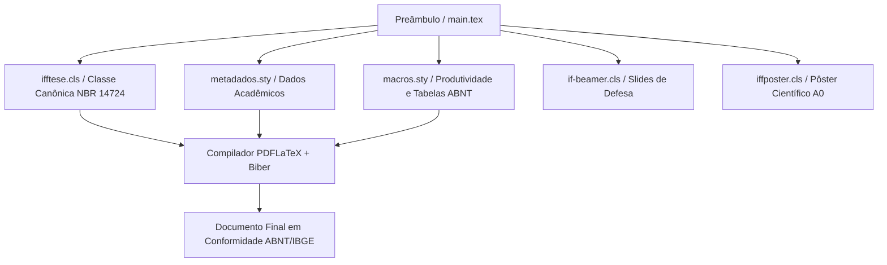

# LaTeX & Escrita Acadêmica

Bem-vindo ao repositório oficial da formação em **LaTeX & Escrita Acadêmica** do **Instituto Federal Fluminense (IFF) — Campus Bom Jesus do Itabapoana**, ministrada pelo **Prof. Dr. Pedro Henrique Rocha de Andrade**.

Esta plataforma centraliza o referencial teórico-metodológico e a arquitetura de automação documental **ReLaTeX**, promovendo o alinhamento integral entre rigor científico (**ABNT NBR 14724, NBR 10520, NBR 6023, NBR 6027, NBR 6028 e IBGE 1993**) e excelência tipográfica.

---

## 🔒 Material Suplementar e Documentos Oficiais

Os documentos institucionais abaixo contêm a programação integral, critérios de avaliação, código de ética científica e diretrizes de uso transparente de Inteligência Artificial.  
*(Acesso Restrito Institucional — Protegido por senha interna no arquivo PDF)*

- **[📅 Cronograma Geral e Ementa Analítica (PDF Protegido)](/assets/biblioteca/latex-escrita/documentos/cronograma-e-ementa.pdf)**  
  *Planejamento letivo detalhado das 80 horas (24 aulas de 2h/dia ao longo de 6 meses), matriz de competências e normas técnicas abordadas.*
- **[📖 Guia do Estudante e Diretrizes Acadêmicas (PDF Protegido)](/assets/biblioteca/latex-escrita/documentos/guia-e-diretrizes.pdf)**  
  *Código de conduta científica, política de tolerância zero contra plágio/autoplágio, regimento para declaração de uso de IA (LLMs) e 4 mandamentos do ecossistema ReLaTeX.*
- **[🏛️ Guia Oficial de Modelos, Classes e Pacotes ReLaTeX](pt-br/resource/latex/modelos-de-documento)**  
  *Referência técnica unificada com documentação e código canônico das classes `ifftese.cls`, `iffposter.cls`, `relatoriocorp.cls` e pacotes `metadados.sty` e `macros.sty`.*

---

## 🎨 Carrossel de Aulas (Acesso Rápido)

Acesse diretamente as notas de aula ilustradas pelas capas autênticas dos slides institucionais de cada encontro:

<!-- COURSE_CAROUSEL_START -->

-  **[Aula 01: Epistemologia, Problematização e Hipóteses](/pt-br/resource/latex/aula-01-epistemologia-problematizacao-e-hipoteses)**  
  *Conteúdo programático da aula 01, fundamentação técnica e automação.*
-  **[Aula 02: Objetivos, Taxonomia de Bloom e Justificativa](/pt-br/resource/latex/aula-02-objetivos-taxonomia-de-bloom-e-justificativa)**  
  *Conteúdo programático da aula 02, fundamentação técnica e automação.*
-  **[Aula 03: Resumo, Abstract e Palavras-Chave (NBR 6028:2021)](/pt-br/resource/latex/aula-03-resumo-abstract-e-palavras-chave-nbr-6028)**  
  *Conteúdo programático da aula 03, fundamentação técnica e automação.*
-  **[Aula 04: Elementos Pré-Textuais NBR 14724](/pt-br/resource/latex/aula-04-elementos-pre-textuais-nbr-14724)**  
  *Conteúdo programático da aula 04, fundamentação técnica e automação.*
-  **[Aula 05: Introdução e Lacuna de Pesquisa (*Research Gap*)](/pt-br/resource/latex/aula-05-introducao-contextualizacao-e-lacuna-de-pesquisa)**  
  *Conteúdo programático da aula 05, fundamentação técnica e automação.*
-  **[Aula 06: Revisão Sistemática da Literatura e Protocolo PRISMA 2020](/pt-br/resource/latex/aula-06-revisao-sistematica-da-literatura-e-protocolo-prisma)**  
  *Conteúdo programático da aula 06, fundamentação técnica e automação.*
-  **[Aula 07: Metodologia, Materiais e Reprodutibilidade na ABNT](/pt-br/resource/latex/aula-07-metodologia-materiais-e-reprodutibilidade)**  
  *Conteúdo programático da aula 07, fundamentação técnica e automação.*
-  **[Aula 08: Ética na Pesquisa (Plataforma Brasil) e IA](/pt-br/resource/latex/aula-08-etica-plataforma-brasil-e-uso-de-ia)**  
  *Conteúdo programático da aula 08, fundamentação técnica e automação.*
-  **[Aula 09: Resultados: Tabelas IBGE vs. Quadros ABNT](/pt-br/resource/latex/aula-09-resultados-tabelas-ibge-vs-quadros-abnt)**  
  *Conteúdo programático da aula 09, fundamentação técnica e automação.*
-  **[Aula 10: Discussão, Citações (10520) e Referências (6023)](/pt-br/resource/latex/aula-10-discussao-citacoes-nbr-10520-e-referencias-nbr-6023)**  
  *Conteúdo programático da aula 10, fundamentação técnica e automação.*
-  **[Aula 11: Arquitetura do Kernel LaTeX2e, Motores PDFLaTeX/LuaLaTeX/XeLaTeX e Estrutura do Preâmbulo .tex](/pt-br/resource/latex/aula-11-arquitetura-latex-motores-tex-e-preambulo-tex)**  
  *Conteúdo programático da aula 11, fundamentação técnica e automação.*
-  **[Aula 12: Sintaxe Canônica, Ambientes Matemáticos Avançados (amsmath) e Tabelas (booktabs)](/pt-br/resource/latex/aula-12-sintaxe-matematica-amsmath-e-tabelas-booktabs)**  
  *Conteúdo programático da aula 12, fundamentação técnica e automação.*
-  **[Aula 13: Modularização Multi-arquivo e Gestão Bibliográfica com biblatex-biber](/pt-br/resource/latex/aula-13-modularizacao-multi-arquivo-e-biblatex-biber)**  
  *Conteúdo programático da aula 13, fundamentação técnica e automação.*
-  **[Aula 14: Computação Gráfica Vetorial Programável com TikZ e Gráficos PGFPlots](/pt-br/resource/latex/aula-14-graficos-vetoriais-tikz-e-pgfplots)**  
  *Conteúdo programático da aula 14, fundamentação técnica e automação.*
-  **[Aula 15: Engenharia de Metadados: Estrutura de metadados.sty, Escopo e Flexão de Gênero](/pt-br/resource/latex/aula-15-engenharia-do-arquivo-de-metadados-sty)**  
  *Conteúdo programático da aula 15, fundamentação técnica e automação.*
-  **[Aula 16: Desenvolvimento de Pacotes .sty - Programação TeX e Macros](/pt-br/resource/latex/aula-16-desenvolvimento-de-pacotes-e-macros-sty)**  
  *Conteúdo programático da aula 16, fundamentação técnica e automação.*
-  **[Aula 17: Engenharia de Classes .cls - Anatomia da ifftese e abntex2](/pt-br/resource/latex/aula-17-engenharia-da-classe-ifftese-cls)**  
  *Conteúdo programático da aula 17, fundamentação técnica e automação.*
-  **[Aula 18: Controle Avançado de Floats e NBR 6027](/pt-br/resource/latex/aula-18-customizacao-de-floats-fancyhdr-e-nbr-6027)**  
  *Conteúdo programático da aula 18, fundamentação técnica e automação.*
-  **[Aula 19: Classes Especializadas (Beamer, Poster e Relatório)](/pt-br/resource/latex/aula-19-classes-especializadas-if-beamer-iffposter-relatoriocorp)**  
  *Conteúdo programático da aula 19, fundamentação técnica e automação.*
-  **[Aula 20: Automação LaTeX, Git e Integração Contínua CI/CD](/pt-br/resource/latex/aula-20-automacao-latexmkrc-git-e-integracao-continua)**  
  *Conteúdo programático da aula 20, fundamentação técnica e automação.*

<!-- COURSE_CAROUSEL_END -->

---

## 📅 Ementa Analítica por Módulos

A programação do curso está estruturada em **6 Módulos Mensais**, cada um composto por 4 encontros intensivos (2h/dia). Para cada aula, o estudante dispõe de **Notas de Aula** completas em português e dos **Slides de Apresentação** nos formatos LaTeX Institucional (`if-beamer.cls`) e PowerPoint Widescreen (`.pptx` / 16:9).

*(Acesso Restrito Institucional — Arquivos PDF Protegidos por Senha)*

<!-- COURSE_TABLE_START -->
### 📘 Módulo I — Epistemologia, Metodologia Científica e Elementos Pré-Textuais (Aulas 01 a 04)

| Aula | Título da Lição & Conteúdo | Normas (ABNT / IBGE) | Material Didático |
| :---: | :--- | :---: | :--- |
| **01** | **Epistemologia, Problematização e Hipóteses** Fundamentação teórica, normas técnicas e prática ReLaTeX. | **—** | [Notas de Aula](/pt-br/resource/latex/aula-01-epistemologia-problematizacao-e-hipoteses) [Slides LaTeX (.pdf)](/assets/biblioteca/latex-escrita/slides-latex/aula-01.pdf) [Slides PPTX (.pdf)](/assets/biblioteca/latex-escrita/slides-pptx/aula-01.pdf) |
| **02** | **Objetivos, Taxonomia de Bloom e Justificativa** Fundamentação teórica, normas técnicas e prática ReLaTeX. | **ABNT NBR 14724** | [Notas de Aula](/pt-br/resource/latex/aula-02-objetivos-taxonomia-de-bloom-e-justificativa) [Slides LaTeX (.pdf)](/assets/biblioteca/latex-escrita/slides-latex/aula-02.pdf) [Slides PPTX (.pdf)](/assets/biblioteca/latex-escrita/slides-pptx/aula-02.pdf) |
| **03** | **Resumo, Abstract e Palavras-Chave (NBR 6028:2021)** Fundamentação teórica, normas técnicas e prática ReLaTeX. | **ABNT NBR 6028 / ABNT NBR 6028:2021** | [Notas de Aula](/pt-br/resource/latex/aula-03-resumo-abstract-e-palavras-chave-nbr-6028) [Slides LaTeX (.pdf)](/assets/biblioteca/latex-escrita/slides-latex/aula-03.pdf) [Slides PPTX (.pdf)](/assets/biblioteca/latex-escrita/slides-pptx/aula-03.pdf) |
| **04** | **Elementos Pré-Textuais NBR 14724** Fundamentação teórica, normas técnicas e prática ReLaTeX. | **ABNT NBR 14724 / ABNT NBR 14724:** | [Notas de Aula](/pt-br/resource/latex/aula-04-elementos-pre-textuais-nbr-14724) [Slides LaTeX (.pdf)](/assets/biblioteca/latex-escrita/slides-latex/aula-04.pdf) [Slides PPTX (.pdf)](/assets/biblioteca/latex-escrita/slides-pptx/aula-04.pdf) |

---

### 📘 Módulo II — Estrutura Textual, Introdução, PRISMA e Metodologia (Aulas 05 a 08)

| Aula | Título da Lição & Conteúdo | Normas (ABNT / IBGE) | Material Didático |
| :---: | :--- | :---: | :--- |
| **05** | **Introdução e Lacuna de Pesquisa (*Research Gap*)** Fundamentação teórica, normas técnicas e prática ReLaTeX. | **ABNT NBR 14724** | [Notas de Aula](/pt-br/resource/latex/aula-05-introducao-contextualizacao-e-lacuna-de-pesquisa) [Slides LaTeX (.pdf)](/assets/biblioteca/latex-escrita/slides-latex/aula-05.pdf) [Slides PPTX (.pdf)](/assets/biblioteca/latex-escrita/slides-pptx/aula-05.pdf) |
| **06** | **Revisão Sistemática da Literatura e Protocolo PRISMA 2020** Fundamentação teórica, normas técnicas e prática ReLaTeX. | **ABNT NBR 14724 / ABNT NBR 6023:2018** | [Notas de Aula](/pt-br/resource/latex/aula-06-revisao-sistematica-da-literatura-e-protocolo-prisma) [Slides LaTeX (.pdf)](/assets/biblioteca/latex-escrita/slides-latex/aula-06.pdf) [Slides PPTX (.pdf)](/assets/biblioteca/latex-escrita/slides-pptx/aula-06.pdf) |
| **07** | **Metodologia, Materiais e Reprodutibilidade na ABNT** Fundamentação teórica, normas técnicas e prática ReLaTeX. | **ABNT NBR 14724 / ABNT NBR 14724:2011** | [Notas de Aula](/pt-br/resource/latex/aula-07-metodologia-materiais-e-reprodutibilidade) [Slides LaTeX (.pdf)](/assets/biblioteca/latex-escrita/slides-latex/aula-07.pdf) [Slides PPTX (.pdf)](/assets/biblioteca/latex-escrita/slides-pptx/aula-07.pdf) |
| **08** | **Ética na Pesquisa (Plataforma Brasil) e IA** Fundamentação teórica, normas técnicas e prática ReLaTeX. | **ABNT NBR 6023:2018 / CEP/CONEP** | [Notas de Aula](/pt-br/resource/latex/aula-08-etica-plataforma-brasil-e-uso-de-ia) [Slides LaTeX (.pdf)](/assets/biblioteca/latex-escrita/slides-latex/aula-08.pdf) [Slides PPTX (.pdf)](/assets/biblioteca/latex-escrita/slides-pptx/aula-08.pdf) |

---

### 📘 Módulo III — Resultados, Discussão, Citações NBR 10520 e Referências NBR 6023 (Aulas 09 a 12)

| Aula | Título da Lição & Conteúdo | Normas (ABNT / IBGE) | Material Didático |
| :---: | :--- | :---: | :--- |
| **09** | **Resultados: Tabelas IBGE vs. Quadros ABNT** Fundamentação teórica, normas técnicas e prática ReLaTeX. | **ABNT NBR 14724 / IBGE 1993** | [Notas de Aula](/pt-br/resource/latex/aula-09-resultados-tabelas-ibge-vs-quadros-abnt) [Slides LaTeX (.pdf)](/assets/biblioteca/latex-escrita/slides-latex/aula-09.pdf) [Slides PPTX (.pdf)](/assets/biblioteca/latex-escrita/slides-pptx/aula-09.pdf) |
| **10** | **Discussão, Citações (10520) e Referências (6023)** Fundamentação teórica, normas técnicas e prática ReLaTeX. | **ABNT NBR 10520:2023 / ABNT NBR 6023** | [Notas de Aula](/pt-br/resource/latex/aula-10-discussao-citacoes-nbr-10520-e-referencias-nbr-6023) [Slides LaTeX (.pdf)](/assets/biblioteca/latex-escrita/slides-latex/aula-10.pdf) [Slides PPTX (.pdf)](/assets/biblioteca/latex-escrita/slides-pptx/aula-10.pdf) |
| **11** | **Arquitetura do Kernel LaTeX2e, Motores PDFLaTeX/LuaLaTeX/XeLaTeX e Estrutura do Preâmbulo .tex** Fundamentação teórica, normas técnicas e prática ReLaTeX. | **—** | [Notas de Aula](/pt-br/resource/latex/aula-11-arquitetura-latex-motores-tex-e-preambulo-tex) [Slides LaTeX (.pdf)](/assets/biblioteca/latex-escrita/slides-latex/aula-11.pdf) [Slides PPTX (.pdf)](/assets/biblioteca/latex-escrita/slides-pptx/aula-11.pdf) |
| **12** | **Sintaxe Canônica, Ambientes Matemáticos Avançados (amsmath) e Tabelas (booktabs)** Fundamentação teórica, normas técnicas e prática ReLaTeX. | **—** | [Notas de Aula](/pt-br/resource/latex/aula-12-sintaxe-matematica-amsmath-e-tabelas-booktabs) [Slides LaTeX (.pdf)](/assets/biblioteca/latex-escrita/slides-latex/aula-12.pdf) [Slides PPTX (.pdf)](/assets/biblioteca/latex-escrita/slides-pptx/aula-12.pdf) |

---

### 📗 Módulo IV — Arquitetura LaTeX (.tex), Motores, Sintaxe, Tabelas e Gráficos (Aulas 13 a 16)

| Aula | Título da Lição & Conteúdo | Normas (ABNT / IBGE) | Material Didático |
| :---: | :--- | :---: | :--- |
| **13** | **Modularização Multi-arquivo e Gestão Bibliográfica com biblatex-biber** Fundamentação teórica, normas técnicas e prática ReLaTeX. | **—** | [Notas de Aula](/pt-br/resource/latex/aula-13-modularizacao-multi-arquivo-e-biblatex-biber) [Slides LaTeX (.pdf)](/assets/biblioteca/latex-escrita/slides-latex/aula-13.pdf) [Slides PPTX (.pdf)](/assets/biblioteca/latex-escrita/slides-pptx/aula-13.pdf) |
| **14** | **Computação Gráfica Vetorial Programável com TikZ e Gráficos PGFPlots** Fundamentação teórica, normas técnicas e prática ReLaTeX. | **—** | [Notas de Aula](/pt-br/resource/latex/aula-14-graficos-vetoriais-tikz-e-pgfplots) [Slides LaTeX (.pdf)](/assets/biblioteca/latex-escrita/slides-latex/aula-14.pdf) [Slides PPTX (.pdf)](/assets/biblioteca/latex-escrita/slides-pptx/aula-14.pdf) |
| **15** | **Engenharia de Metadados: Estrutura de metadados.sty, Escopo e Flexão de Gênero** Fundamentação teórica, normas técnicas e prática ReLaTeX. | **—** | [Notas de Aula](/pt-br/resource/latex/aula-15-engenharia-do-arquivo-de-metadados-sty) [Slides LaTeX (.pdf)](/assets/biblioteca/latex-escrita/slides-latex/aula-15.pdf) [Slides PPTX (.pdf)](/assets/biblioteca/latex-escrita/slides-pptx/aula-15.pdf) |
| **16** | **Desenvolvimento de Pacotes .sty - Programação TeX e Macros** Fundamentação teórica, normas técnicas e prática ReLaTeX. | **—** | [Notas de Aula](/pt-br/resource/latex/aula-16-desenvolvimento-de-pacotes-e-macros-sty) [Slides LaTeX (.pdf)](/assets/biblioteca/latex-escrita/slides-latex/aula-16.pdf) [Slides PPTX (.pdf)](/assets/biblioteca/latex-escrita/slides-pptx/aula-16.pdf) |

---

### 📗 Módulo V — Engenharia ReLaTeX (.cls e .sty), Metadados, Macros e Automação (Aulas 17 a 20)

| Aula | Título da Lição & Conteúdo | Normas (ABNT / IBGE) | Material Didático |
| :---: | :--- | :---: | :--- |
| **17** | **Engenharia de Classes .cls - Anatomia da ifftese e abntex2** Fundamentação teórica, normas técnicas e prática ReLaTeX. | **ABNT NBR 14724** | [Notas de Aula](/pt-br/resource/latex/aula-17-engenharia-da-classe-ifftese-cls) [Slides LaTeX (.pdf)](/assets/biblioteca/latex-escrita/slides-latex/aula-17.pdf) [Slides PPTX (.pdf)](/assets/biblioteca/latex-escrita/slides-pptx/aula-17.pdf) |
| **18** | **Controle Avançado de Floats e NBR 6027** Fundamentação teórica, normas técnicas e prática ReLaTeX. | **—** | [Notas de Aula](/pt-br/resource/latex/aula-18-customizacao-de-floats-fancyhdr-e-nbr-6027) [Slides LaTeX (.pdf)](/assets/biblioteca/latex-escrita/slides-latex/aula-18.pdf) [Slides PPTX (.pdf)](/assets/biblioteca/latex-escrita/slides-pptx/aula-18.pdf) |
| **19** | **Classes Especializadas (Beamer, Poster e Relatório)** Fundamentação teórica, normas técnicas e prática ReLaTeX. | **—** | [Notas de Aula](/pt-br/resource/latex/aula-19-classes-especializadas-if-beamer-iffposter-relatoriocorp) [Slides LaTeX (.pdf)](/assets/biblioteca/latex-escrita/slides-latex/aula-19.pdf) [Slides PPTX (.pdf)](/assets/biblioteca/latex-escrita/slides-pptx/aula-19.pdf) |
| **20** | **Automação LaTeX, Git e Integração Contínua CI/CD** Fundamentação teórica, normas técnicas e prática ReLaTeX. | **—** | [Notas de Aula](/pt-br/resource/latex/aula-20-automacao-latexmkrc-git-e-integracao-continua) [Slides LaTeX (.pdf)](/assets/biblioteca/latex-escrita/slides-latex/aula-20.pdf) [Slides PPTX (.pdf)](/assets/biblioteca/latex-escrita/slides-pptx/aula-20.pdf) |

---

<!-- COURSE_TABLE_END -->

## 🏛️ Pacotes e Classes do Ecossistema ReLaTeX

O desenvolvimento de monografias, TCCs, relatórios de estágio e dissertações no Instituto Federal Fluminense apoia-se na centralização documental do **ReLaTeX**. Consulte a [página oficial de modelos](pt-br/resource/latex/modelos-de-documento) para exemplos completos de código.

