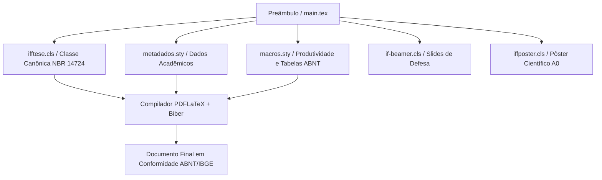

# LaTeX & Escrita Acadêmica

Bem-vindo ao repositório oficial da formação em **LaTeX & Escrita Acadêmica** do **Instituto Federal Fluminense (IFF) — Campus Bom Jesus do Itabapoana**, ministrada pelo **Prof. Dr. Pedro Henrique Rocha de Andrade**.

Esta plataforma centraliza o referencial teórico-metodológico e a arquitetura de automação documental **ReLaTeX**, promovendo o alinhamento integral entre rigor científico (**ABNT NBR 14724, NBR 10520, NBR 6023, NBR 6027, NBR 6028 e IBGE 1993**) e excelência tipográfica.

---

## 🔒 Material Suplementar e Documentos Oficiais

Os documentos institucionais abaixo contêm a programação integral, critérios de avaliação, código de ética científica e diretrizes de uso transparente de Inteligência Artificial.  
*(Acesso Restrito Institucional — Protegido por senha interna no arquivo PDF)*

- **[📅 Cronograma Geral e Ementa Analítica (PDF Protegido)](/assets/biblioteca/latex-escrita/documentos/cronograma-e-ementa.pdf)**  
  *Planejamento letivo detalhado das 80 horas (24 aulas de 2h/dia ao longo de 6 meses), matriz de competências e normas técnicas abordadas.*
- **[📖 Guia do Estudante e Diretrizes Acadêmicas (PDF Protegido)](/assets/biblioteca/latex-escrita/documentos/guia-e-diretrizes.pdf)**  
  *Código de conduta científica, política de tolerância zero contra plágio/autoplágio, regimento para declaração de uso de IA (LLMs) e 4 mandamentos do ecossistema ReLaTeX.*
- **[🏛️ Guia Oficial de Modelos, Classes e Pacotes ReLaTeX](pt-br/resource/latex/modelos-de-documento)**  
  *Referência técnica unificada com documentação e código canônico das classes `ifftese.cls`, `iffposter.cls`, `relatoriocorp.cls` e pacotes `metadados.sty` e `macros.sty`.*

---

## 🎨 Carrossel de Aulas (Acesso Rápido)

Acesse diretamente as notas de aula ilustradas pelas capas autênticas dos slides institucionais de cada encontro:

<!-- COURSE_CAROUSEL_START -->

-  **[Aula 01: Epistemologia, Problematização e Hipóteses](pt-br/resource/latex/aula-01-epistemologia-problematizacao)**  
  *Conteúdo programático da aula 01, fundamentação técnica e automação.*
-  **[Aula 02: Objetivos Geral e Específicos e Justificativa](pt-br/resource/latex/aula-02-objetivos-e-justificativa)**  
  *Conteúdo programático da aula 02, fundamentação técnica e automação.*
-  **[Aula 03: Resumo, Abstract e Palavras-Chave](pt-br/resource/latex/aula-03-resumo-abstract-palavras-chave)**  
  *Conteúdo programático da aula 03, fundamentação técnica e automação.*
-  **[Aula 04: Dedicatória, Agradecimentos e Epígrafe](pt-br/resource/latex/aula-04-dedicatoria-agradecimentos-epigrafe)**  
  *Conteúdo programático da aula 04, fundamentação técnica e automação.*
-  **[Aula 05: Introdução e Contextualização do Problema](pt-br/resource/latex/aula-05-introducao-e-contextualizacao)**  
  *Conteúdo programático da aula 05, fundamentação técnica e automação.*
-  **[Aula 06: Revisão Sistemática da Literatura e Estado da Arte](pt-br/resource/latex/aula-06-revisao-sistematica-literatura)**  
  *Conteúdo programático da aula 06, fundamentação técnica e automação.*
-  **[Aula 07 - Metodologia, Materiais e Reprodutibilidade Científica](pt-br/resource/latex/aula-07-metodologia-e-materiais)**  
  *Conteúdo programático da aula 07, fundamentação técnica e automação.*
-  **[Aula 08 - Ética na Pesquisa e Uso de IA](pt-br/resource/latex/aula-08-etica-na-pesquisa-e-ia)**  
  *Conteúdo programático da aula 08, fundamentação técnica e automação.*
-  **[Aula 09 - Resultados e Apresentação Visual de Dados](pt-br/resource/latex/aula-09-resultados-e-apresentacao-de-dados)**  
  *Conteúdo programático da aula 09, fundamentação técnica e automação.*
-  **[Aula 10 - Discussão dos Resultados e Conclusão](pt-br/resource/latex/aula-10-discussao-e-conclusao)**  
  *Conteúdo programático da aula 10, fundamentação técnica e automação.*
-  **[Aula 11 - Citações e Paráfrases](pt-br/resource/latex/aula-11-citacoes-e-parafrases)**  
  *Conteúdo programático da aula 11, fundamentação técnica e automação.*
-  **[Aula 12 - Referências, Apêndices e Anexos](pt-br/resource/latex/aula-12-referencias-apendices-anexos)**  
  *Conteúdo programático da aula 12, fundamentação técnica e automação.*
-  **[Aula 13 - Instalação e Ambiente LaTeX](pt-br/resource/latex/aula-13-instalacao-ambiente-latex)**  
  *Conteúdo programático da aula 13, fundamentação técnica e automação.*
-  **[Aula 14 - Sintaxe LaTeX e Matemática](pt-br/resource/latex/aula-14-sintaxe-latex-e-matematica)**  
  *Conteúdo programático da aula 14, fundamentação técnica e automação.*
-  **[Aula 15 - Modularização e BibLaTeX](pt-br/resource/latex/aula-15-modularizacao-e-biblatex)**  
  *Conteúdo programático da aula 15, fundamentação técnica e automação.*
-  **[Aula 16 - Gráficos com TikZ e PGFPlots](pt-br/resource/latex/aula-16-graphics-tikz-pgfplots)**  
  *Conteúdo programático da aula 16, fundamentação técnica e automação.*
-  **[Aula 17 - Arquivo de Metadados (.sty)](pt-br/resource/latex/aula-17-arquivo-metadados-sty)**  
  *Conteúdo programático da aula 17, fundamentação técnica e automação.*
-  **[Aula 18 - Pacotes e Macros Personalizadas](pt-br/resource/latex/aula-18-pacote-macros-sty)**  
  *Conteúdo programático da aula 18, fundamentação técnica e automação.*
-  **[Aula 19 - Engenharia de Macros e Estrutura Interna da Classe ifftese.cls](pt-br/resource/latex/aula-19-classe-ifftese-engenharia)**  
  *Conteúdo programático da aula 19, fundamentação técnica e automação.*
-  **[Aula 20 - Customização Avançada de Floats, Listas e Sumário Dinâmico](pt-br/resource/latex/aula-20-floats-e-sumario-dinamico)**  
  *Conteúdo programático da aula 20, fundamentação técnica e automação.*
-  **[Aula 21 - Slides de Defesa Institucionais em Beamer](pt-br/resource/latex/aula-21-beamer-slides-defesa)**  
  *Conteúdo programático da aula 21, fundamentação técnica e automação.*
-  **[Aula 22 - Pôster Científico em LaTeX com a Classe iffposter.cls](pt-br/resource/latex/aula-22-poster-cientifico-iffposter)**  
  *Conteúdo programático da aula 22, fundamentação técnica e automação.*
-  **[Aula 23 - Relatórios Corporativos e Documentação Técnica](pt-br/resource/latex/aula-23-relatorios-corporativos)**  
  *Conteúdo programático da aula 23, fundamentação técnica e automação.*
-  **[Aula 24 - Automação com latexmk, Versionamento Git e Checklist](pt-br/resource/latex/aula-24-latexmk-git-e-submissao)**  
  *Conteúdo programático da aula 24, fundamentação técnica e automação.*

<!-- COURSE_CAROUSEL_END -->

---

## 📅 Ementa Analítica por Módulos

A programação do curso está estruturada em **6 Módulos Mensais**, cada um composto por 4 encontros intensivos (2h/dia). Para cada aula, o estudante dispõe de **Notas de Aula** completas em português e dos **Slides de Apresentação** nos formatos LaTeX Institucional (`if-beamer.cls`) e PowerPoint Widescreen (`.pptx` / 16:9).

*(Acesso Restrito Institucional — Arquivos PDF Protegidos por Senha)*

<!-- COURSE_TABLE_START -->
### 📘 Módulo I — Epistemologia, Metodologia e Elementos Pré-Textuais

| Aula | Título da Lição & Conteúdo | Normas (ABNT / IBGE) | Material Didático |
| :---: | :--- | :---: | :--- |
| **01** | **Epistemologia, Problematização e Hipóteses** Fundamentação teórica, normas técnicas e prática ReLaTeX. | **—** | [Notas de Aula](pt-br/resource/latex/aula-01-epistemologia-problematizacao) [Slides LaTeX (.pdf)](/assets/biblioteca/latex-escrita/slides-latex/aula-01.pdf) [Slides PPTX (.pdf)](/assets/biblioteca/latex-escrita/slides-pptx/aula-01.pdf) |
| **02** | **Objetivos Geral e Específicos e Justificativa** Fundamentação teórica, normas técnicas e prática ReLaTeX. | **—** | [Notas de Aula](pt-br/resource/latex/aula-02-objetivos-e-justificativa) [Slides LaTeX (.pdf)](/assets/biblioteca/latex-escrita/slides-latex/aula-02.pdf) [Slides PPTX (.pdf)](/assets/biblioteca/latex-escrita/slides-pptx/aula-02.pdf) |
| **03** | **Resumo, Abstract e Palavras-Chave** Fundamentação teórica, normas técnicas e prática ReLaTeX. | **IBGE 1993** | [Notas de Aula](pt-br/resource/latex/aula-03-resumo-abstract-palavras-chave) [Slides LaTeX (.pdf)](/assets/biblioteca/latex-escrita/slides-latex/aula-03.pdf) [Slides PPTX (.pdf)](/assets/biblioteca/latex-escrita/slides-pptx/aula-03.pdf) |
| **04** | **Dedicatória, Agradecimentos e Epígrafe** Fundamentação teórica, normas técnicas e prática ReLaTeX. | **—** | [Notas de Aula](pt-br/resource/latex/aula-04-dedicatoria-agradecimentos-epigrafe) [Slides LaTeX (.pdf)](/assets/biblioteca/latex-escrita/slides-latex/aula-04.pdf) [Slides PPTX (.pdf)](/assets/biblioteca/latex-escrita/slides-pptx/aula-04.pdf) |

---

### 📘 Módulo II — Estrutura Textual e Construção Argumentativa

| Aula | Título da Lição & Conteúdo | Normas (ABNT / IBGE) | Material Didático |
| :---: | :--- | :---: | :--- |
| **05** | **Introdução e Contextualização do Problema** Fundamentação teórica, normas técnicas e prática ReLaTeX. | **—** | [Notas de Aula](pt-br/resource/latex/aula-05-introducao-e-contextualizacao) [Slides LaTeX (.pdf)](/assets/biblioteca/latex-escrita/slides-latex/aula-05.pdf) [Slides PPTX (.pdf)](/assets/biblioteca/latex-escrita/slides-pptx/aula-05.pdf) |
| **06** | **Revisão Sistemática da Literatura e Estado da Arte** Fundamentação teórica, normas técnicas e prática ReLaTeX. | **PRISMA** | [Notas de Aula](pt-br/resource/latex/aula-06-revisao-sistematica-literatura) [Slides LaTeX (.pdf)](/assets/biblioteca/latex-escrita/slides-latex/aula-06.pdf) [Slides PPTX (.pdf)](/assets/biblioteca/latex-escrita/slides-pptx/aula-06.pdf) |
| **07** | **Aula 07 - Metodologia, Materiais e Reprodutibilidade Científica** Fundamentação teórica, normas técnicas e prática ReLaTeX. | **ABNT NBR 14724** | [Notas de Aula](pt-br/resource/latex/aula-07-metodologia-e-materiais) [Slides LaTeX (.pdf)](/assets/biblioteca/latex-escrita/slides-latex/aula-07.pdf) [Slides PPTX (.pdf)](/assets/biblioteca/latex-escrita/slides-pptx/aula-07.pdf) |
| **08** | **Aula 08 - Ética na Pesquisa e Uso de IA** Fundamentação teórica, normas técnicas e prática ReLaTeX. | **ABNT NBR 14724 / CEP/CONEP** | [Notas de Aula](pt-br/resource/latex/aula-08-etica-na-pesquisa-e-ia) [Slides LaTeX (.pdf)](/assets/biblioteca/latex-escrita/slides-latex/aula-08.pdf) [Slides PPTX (.pdf)](/assets/biblioteca/latex-escrita/slides-pptx/aula-08.pdf) |

---

### 📘 Módulo III — Resultados, Discussão e Elementos Pós-Textuais

| Aula | Título da Lição & Conteúdo | Normas (ABNT / IBGE) | Material Didático |
| :---: | :--- | :---: | :--- |
| **09** | **Aula 09 - Resultados e Apresentação Visual de Dados** Fundamentação teórica, normas técnicas e prática ReLaTeX. | **ABNT NBR 14724 / IBGE 1993** | [Notas de Aula](pt-br/resource/latex/aula-09-resultados-e-apresentacao-de-dados) [Slides LaTeX (.pdf)](/assets/biblioteca/latex-escrita/slides-latex/aula-09.pdf) [Slides PPTX (.pdf)](/assets/biblioteca/latex-escrita/slides-pptx/aula-09.pdf) |
| **10** | **Aula 10 - Discussão dos Resultados e Conclusão** Fundamentação teórica, normas técnicas e prática ReLaTeX. | **ABNT NBR 14724** | [Notas de Aula](pt-br/resource/latex/aula-10-discussao-e-conclusao) [Slides LaTeX (.pdf)](/assets/biblioteca/latex-escrita/slides-latex/aula-10.pdf) [Slides PPTX (.pdf)](/assets/biblioteca/latex-escrita/slides-pptx/aula-10.pdf) |
| **11** | **Aula 11 - Citações e Paráfrases** Fundamentação teórica, normas técnicas e prática ReLaTeX. | **ABNT NBR 10520:2023** | [Notas de Aula](pt-br/resource/latex/aula-11-citacoes-e-parafrases) [Slides LaTeX (.pdf)](/assets/biblioteca/latex-escrita/slides-latex/aula-11.pdf) [Slides PPTX (.pdf)](/assets/biblioteca/latex-escrita/slides-pptx/aula-11.pdf) |
| **12** | **Aula 12 - Referências, Apêndices e Anexos** Fundamentação teórica, normas técnicas e prática ReLaTeX. | **—** | [Notas de Aula](pt-br/resource/latex/aula-12-referencias-apendices-anexos) [Slides LaTeX (.pdf)](/assets/biblioteca/latex-escrita/slides-latex/aula-12.pdf) [Slides PPTX (.pdf)](/assets/biblioteca/latex-escrita/slides-pptx/aula-12.pdf) |

---

### 📗 Módulo IV — Fundamentos de LaTeX e Arquitetura de Documentos

| Aula | Título da Lição & Conteúdo | Normas (ABNT / IBGE) | Material Didático |
| :---: | :--- | :---: | :--- |
| **13** | **Aula 13 - Instalação e Ambiente LaTeX** Fundamentação teórica, normas técnicas e prática ReLaTeX. | **—** | [Notas de Aula](pt-br/resource/latex/aula-13-instalacao-ambiente-latex) [Slides LaTeX (.pdf)](/assets/biblioteca/latex-escrita/slides-latex/aula-13.pdf) [Slides PPTX (.pdf)](/assets/biblioteca/latex-escrita/slides-pptx/aula-13.pdf) |
| **14** | **Aula 14 - Sintaxe LaTeX e Matemática** Fundamentação teórica, normas técnicas e prática ReLaTeX. | **—** | [Notas de Aula](pt-br/resource/latex/aula-14-sintaxe-latex-e-matematica) [Slides LaTeX (.pdf)](/assets/biblioteca/latex-escrita/slides-latex/aula-14.pdf) [Slides PPTX (.pdf)](/assets/biblioteca/latex-escrita/slides-pptx/aula-14.pdf) |
| **15** | **Aula 15 - Modularização e BibLaTeX** Fundamentação teórica, normas técnicas e prática ReLaTeX. | **—** | [Notas de Aula](pt-br/resource/latex/aula-15-modularizacao-e-biblatex) [Slides LaTeX (.pdf)](/assets/biblioteca/latex-escrita/slides-latex/aula-15.pdf) [Slides PPTX (.pdf)](/assets/biblioteca/latex-escrita/slides-pptx/aula-15.pdf) |
| **16** | **Aula 16 - Gráficos com TikZ e PGFPlots** Fundamentação teórica, normas técnicas e prática ReLaTeX. | **—** | [Notas de Aula](pt-br/resource/latex/aula-16-graphics-tikz-pgfplots) [Slides LaTeX (.pdf)](/assets/biblioteca/latex-escrita/slides-latex/aula-16.pdf) [Slides PPTX (.pdf)](/assets/biblioteca/latex-escrita/slides-pptx/aula-16.pdf) |

---

### 📗 Módulo V — Domínio da Classe ifftese.cls e Ecossistema ReLaTeX

| Aula | Título da Lição & Conteúdo | Normas (ABNT / IBGE) | Material Didático |
| :---: | :--- | :---: | :--- |
| **17** | **Aula 17 - Arquivo de Metadados (.sty)** Fundamentação teórica, normas técnicas e prática ReLaTeX. | **—** | [Notas de Aula](pt-br/resource/latex/aula-17-arquivo-metadados-sty) [Slides LaTeX (.pdf)](/assets/biblioteca/latex-escrita/slides-latex/aula-17.pdf) [Slides PPTX (.pdf)](/assets/biblioteca/latex-escrita/slides-pptx/aula-17.pdf) |
| **18** | **Aula 18 - Pacotes e Macros Personalizadas** Fundamentação teórica, normas técnicas e prática ReLaTeX. | **—** | [Notas de Aula](pt-br/resource/latex/aula-18-pacote-macros-sty) [Slides LaTeX (.pdf)](/assets/biblioteca/latex-escrita/slides-latex/aula-18.pdf) [Slides PPTX (.pdf)](/assets/biblioteca/latex-escrita/slides-pptx/aula-18.pdf) |
| **19** | **Aula 19 - Engenharia de Macros e Estrutura Interna da Classe ifftese.cls** Fundamentação teórica, normas técnicas e prática ReLaTeX. | **ABNT NBR 14724** | [Notas de Aula](pt-br/resource/latex/aula-19-classe-ifftese-engenharia) [Slides LaTeX (.pdf)](/assets/biblioteca/latex-escrita/slides-latex/aula-19.pdf) [Slides PPTX (.pdf)](/assets/biblioteca/latex-escrita/slides-pptx/aula-19.pdf) |
| **20** | **Aula 20 - Customização Avançada de Floats, Listas e Sumário Dinâmico** Fundamentação teórica, normas técnicas e prática ReLaTeX. | **ABNT NBR 6027 / ABNT NBR 6027:2012** | [Notas de Aula](pt-br/resource/latex/aula-20-floats-e-sumario-dinamico) [Slides LaTeX (.pdf)](/assets/biblioteca/latex-escrita/slides-latex/aula-20.pdf) [Slides PPTX (.pdf)](/assets/biblioteca/latex-escrita/slides-pptx/aula-20.pdf) |

---

### 📗 Módulo VI — Defesa, Apresentação Científica, Pôsteres e Relatórios

| Aula | Título da Lição & Conteúdo | Normas (ABNT / IBGE) | Material Didático |
| :---: | :--- | :---: | :--- |
| **21** | **Aula 21 - Slides de Defesa Institucionais em Beamer** Fundamentação teórica, normas técnicas e prática ReLaTeX. | **—** | [Notas de Aula](pt-br/resource/latex/aula-21-beamer-slides-defesa) [Slides LaTeX (.pdf)](/assets/biblioteca/latex-escrita/slides-latex/aula-21.pdf) [Slides PPTX (.pdf)](/assets/biblioteca/latex-escrita/slides-pptx/aula-21.pdf) |
| **22** | **Aula 22 - Pôster Científico em LaTeX com a Classe iffposter.cls** Fundamentação teórica, normas técnicas e prática ReLaTeX. | **—** | [Notas de Aula](pt-br/resource/latex/aula-22-poster-cientifico-iffposter) [Slides LaTeX (.pdf)](/assets/biblioteca/latex-escrita/slides-latex/aula-22.pdf) [Slides PPTX (.pdf)](/assets/biblioteca/latex-escrita/slides-pptx/aula-22.pdf) |
| **23** | **Aula 23 - Relatórios Corporativos e Documentação Técnica** Fundamentação teórica, normas técnicas e prática ReLaTeX. | **ABNT NBR 10719** | [Notas de Aula](pt-br/resource/latex/aula-23-relatorios-corporativos) [Slides LaTeX (.pdf)](/assets/biblioteca/latex-escrita/slides-latex/aula-23.pdf) [Slides PPTX (.pdf)](/assets/biblioteca/latex-escrita/slides-pptx/aula-23.pdf) |
| **24** | **Aula 24 - Automação com latexmk, Versionamento Git e Checklist** Fundamentação teórica, normas técnicas e prática ReLaTeX. | **—** | [Notas de Aula](pt-br/resource/latex/aula-24-latexmk-git-e-submissao) [Slides LaTeX (.pdf)](/assets/biblioteca/latex-escrita/slides-latex/aula-24.pdf) [Slides PPTX (.pdf)](/assets/biblioteca/latex-escrita/slides-pptx/aula-24.pdf) |

---

<!-- COURSE_TABLE_END -->

## 🏛️ Pacotes e Classes do Ecossistema ReLaTeX

O desenvolvimento de monografias, TCCs, relatórios de estágio e dissertações no Instituto Federal Fluminense apoia-se na centralização documental do **ReLaTeX**. Consulte a [página oficial de modelos](pt-br/resource/latex/modelos-de-documento) para exemplos completos de código.

