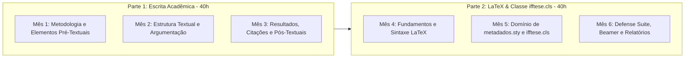

> [!note] Resumo Executivo
> Um curso de **nível avançado/universitário (80h, 6 meses | aulas diárias de 2h)** focado na integração entre a **Escrita Acadêmica de Alto Impacto** (normas ABNT e IBGE vigentes) e a **Tipografia Automatizada via LaTeX**. O curso percorre desde a epistemologia e todos os elementos pré-textuais, textuais e pós-textuais de um TCC/Dissertação até o domínio completo de classes customizadas como `ifftese.cls` (projeto ReLaTeX), `macros.sty`, `metadados.sty`, apresentações Beamer e pôsteres científicos.

> [!IMPORTANT]
> **Acesso Protegido às Aulas:** Todas as 24 aulas individuais e seus respectivos materiais complementares (slides em Beamer, códigos-fonte `.tex`, modelos `.zip` e bancos de dados) possuem acesso restrito. Utilize a senha **`escritaiff2026`** ao clicar em qualquer aula do carrossel ou da ementa abaixo.

---

## 🎠 Carrossel das 24 Aulas do Curso

Navegue pelo carrossel abaixo para acessar diretamente cada uma das aulas do curso (protegidas por senha):

  <a href="/pt-br/resource/latex/aula-01-epistemologia-problematizacao" class="carousel-slide">
    
    
Aula 01 — Epistemologia, Problematização e Hipóteses

  </a>
  <a href="/pt-br/resource/latex/aula-02-objetivos-e-justificativa" class="carousel-slide">
    
    
Aula 02 — Objetivos (Taxonomia de Bloom) e Justificativa

  </a>
  <a href="/pt-br/resource/latex/aula-03-resumo-abstract-palavras-chave" class="carousel-slide">
    
    
Aula 03 — Resumo, Abstract e Palavras-Chave (NBR 6028)

  </a>
  <a href="/pt-br/resource/latex/aula-04-dedicatoria-agradecimentos-epigrafe" class="carousel-slide">
    
    
Aula 04 — Dedicatória, Agradecimentos e Epígrafe

  </a>
  <a href="/pt-br/resource/latex/aula-05-introducao-e-contextualizacao" class="carousel-slide">
    
    
Aula 05 — Introdução e Contextualização do Problema

  </a>
  <a href="/pt-br/resource/latex/aula-06-revisao-sistematica-literatura" class="carousel-slide">
    
    
Aula 06 — Revisão Sistemática e Estado da Arte (PRISMA)

  </a>
  <a href="/pt-br/resource/latex/aula-07-metodologia-e-materiais" class="carousel-slide">
    
    
Aula 07 — Metodologia, Materiais e Reprodutibilidade

  </a>
  <a href="/pt-br/resource/latex/aula-08-etica-na-pesquisa-e-ia" class="carousel-slide">
    
    
Aula 08 — Ética (CEP/CONEP) e Uso Ético de IA

  </a>
  <a href="/pt-br/resource/latex/aula-09-resultados-e-apresentacao-de-dados" class="carousel-slide">
    
    
Aula 09 — Resultados e Apresentação de Dados (IBGE)

  </a>
  <a href="/pt-br/resource/latex/aula-10-discussao-e-conclusao" class="carousel-slide">
    
    
Aula 10 — Discussão dos Resultados e Conclusão

  </a>
  <a href="/pt-br/resource/latex/aula-11-citacoes-e-parafrases" class="carousel-slide">
    
    
Aula 11 — Citações e Paráfrases (NBR 10520:2023)

  </a>
  <a href="/pt-br/resource/latex/aula-12-referencias-apendices-anexos" class="carousel-slide">
    
    
Aula 12 — Referências (NBR 6023), Apêndices e Anexos

  </a>
  <a href="/pt-br/resource/latex/aula-13-instalacao-ambiente-latex" class="carousel-slide">
    
    
Aula 13 — Instalação, Compiladores e Ambientes LaTeX

  </a>
  <a href="/pt-br/resource/latex/aula-14-sintaxe-latex-e-matematica" class="carousel-slide">
    
    
Aula 14 — Sintaxe Fundamental, Matemática e booktabs

  </a>
  <a href="/pt-br/resource/latex/aula-15-modularizacao-e-biblatex" class="carousel-slide">
    
    
Aula 15 — Modularização do Projeto e BibLaTeX/Biber

  </a>
  <a href="/pt-br/resource/latex/aula-16-graphics-tikz-pgfplots" class="carousel-slide">
    
    
Aula 16 — Gráficos Vetoriais com TikZ e PGFPlots

  </a>
  <a href="/pt-br/resource/latex/aula-17-arquivo-metadados-sty" class="carousel-slide">
    
    
Aula 17 — Configuração de Metadados (metadados.sty)

  </a>
  <a href="/pt-br/resource/latex/aula-18-pacote-macros-sty" class="carousel-slide">
    
    
Aula 18 — Produtividade e Macros Personalizadas

  </a>
  <a href="/pt-br/resource/latex/aula-19-classe-ifftese-engenharia" class="carousel-slide">
    
    
Aula 19 — Engenharia de Macros e ifftese.cls

  </a>
  <a href="/pt-br/resource/latex/aula-20-floats-e-sumario-dinamico" class="carousel-slide">
    
    
Aula 20 — Floats Customizados e Sumário Dinâmico

  </a>
  <a href="/pt-br/resource/latex/aula-21-beamer-slides-defesa" class="carousel-slide">
    
    
Aula 21 — Slides de Defesa Institucionais (Beamer)

  </a>
  <a href="/pt-br/resource/latex/aula-22-poster-cientifico-iffposter" class="carousel-slide">
    
    
Aula 22 — Pôster Científico com iffposter.cls

  </a>
  <a href="/pt-br/resource/latex/aula-23-relatorios-corporativos" class="carousel-slide">
    
    
Aula 23 — Relatórios Corporativos (relatoriocorp.cls)

  </a>
  <a href="/pt-br/resource/latex/aula-24-latexmk-git-e-submissao" class="carousel-slide">
    
    
Aula 24 — Automação (latexmk), Git e Submissão

  </a>

---

## 🎯 Estrutura Curricular e Metodologia (80 Horas | 6 Meses)

O curso foi concebido com rigor de pós-graduação e é dividido em duas etapas de **40 horas cada** (3 meses para Escrita Acadêmica + 3 meses para Automação via LaTeX), totalizando **80 horas em 24 semanas**:

---

## 📖 Normativas ABNT e IBGE Detalhadas no Curso

A escrita acadêmica na **Parte 1** e a codificação tipográfica na **Parte 2** são estritamente alinhadas com as normas brasileiras vigentes para trabalhos acadêmicos e científicos:

- **ABNT NBR 14724:2011 (Trabalhos Acadêmicos — Apresentação):** Detalhamento exaustivo dos elementos pré-textuais (capa, folha de rosto, ficha catalográfica, errata, folha de aprovação, dedicatória, agradecimentos, epígrafe, resumos e listas), textuais (introdução, desenvolvimento e conclusão) e pós-textuais (referências, apêndices, anexos e índice).
- **ABNT NBR 10520:2023 (Citações em Documentos):** Explicação da atualização mais recente da norma de citações, abordando o sistema autor-data em caixa alta e baixa (ex: `(Silva, 2026)` ao invés de `(SILVA, 2026)`), citações diretas curtas (até 3 linhas) e longas (mais de 3 linhas, recuo de 4 cm, fonte menor e sem aspas), citações indiretas e citação de citação (*apud*).
- **ABNT NBR 6023:2018 / Emenda 1:2020 (Referências — Elaboração):** Regras de referenciação para monografias, livros, artigos em periódicos eletrônicos (com DOI obrigatório quando disponível), teses, normas técnicas, legislações, patentes e materiais não convencionais.
- **ABNT NBR 6027:2012 (Sumário — Apresentação):** Estrutura indicativa das seções e subseções com alinhamento e paginação.
- **ABNT NBR 6028:2021 (Resumo — Apresentação):** Composição do resumo informativo (entre 150 e 500 palavras para TCC e teses), ordem lógica (contexto, objetivo, método, resultados e conclusões) e seleção de palavras-chave.
- **ABNT NBR 12225:2023 (Lombada — Apresentação):** Requisitos de formatação para encadernação física de volumes de teses e dissertações.
- **Normas IBGE 1993 (Normas de Apresentação Tabulada):** Distinção clara e implementação em código entre **Tabelas** (dados numéricos e estatísticos, laterais abertas) e **Quadros** (informações textuais ou classificatórias, laterais fechadas).

---

## 🚀 A Pesquisa por Trás do Curso: O Projeto ReLaTeX

Este material não surgiu como um mero tutorial de edição de texto, mas como produto de investigação do projeto de pesquisa **[ReLaTeX](pt-br/research/relatex)** no Instituto Federal Fluminense (IFF), em coautoria com pesquisadores e docentes da instituição.

A barreira clássica do uso de LaTeX no Brasil sempre foi a complexidade de adaptação dos pacotes ABNT genéricos (`abntex2`) às exigências institucionais específicas de cada campus ou programa de pós-graduação. O **ReLaTeX** resolveu esse problema ao criar uma arquitetura em 3 camadas:
1. **O Motor de Regras (`ifftese.cls`):** Classe programada que herda e estende `abntex2`, controlando automaticamente margens, geometria recto/verso, sumário com pontilhados dinâmicos e floats customizados.
2. **O Banco de Macros (`macros.sty`):** Biblioteca de comandos de produtividade para inserção de figuras, gráficos, quadros e ambientes matemáticos interligados com `hyperref`.
3. **A Camada do Usuário (`metadados.sty`):** O único arquivo de configuração que o estudante edita, separando de forma limpa os dados biográficos/acadêmicos do corpo textual do trabalho.

---

## 📅 Ementa Completa, Notas de Aula (Notes) e Slides (Lectures)

> [!IMPORTANT] **Acesso Restrito e Senha Institucional**
> Todas as Notas de Aula (**Notes**) e páginas de Apresentação (**Lectures**) são protegidas por senha no Quartz.
> **Senha única para todos os materiais:** **`escritaiff2026`**
> 
> *Estrutura no estilo internacional (`Notes | Lecture | PPTX`): As **Notes** contêm o livro-texto detalhado com fundamentação teórica, normas ABNT/IBGE, diagramas e código; as **Lectures** contêm o código Beamer institucional e a especificação de slides.*

---

### 📘 PARTE 1: ESCRITA ACADÊMICA CIENTÍFICA (40 Horas / Meses 1 a 3)

#### 🗓️ MÊS 1: Epistemologia, Metodologia e Elementos Pré-Textuais
*Carga Horária Módulo: 8 horas (4 aulas de 2h/dia) | Foco: Construção do pensamento científico e elementos iniciais da NBR 14724.*

| Aula | Competência e Conteúdo Programático | Recursos e Materiais de Aula (Acesso Restrito 🔒) |
| :---: | :--- | :--- |
| **01** | **Epistemologia, Problematização e Hipóteses** *- Conhecimento científico vs. senso comum, método hipotético-dedutivo (Popper) e formulação de $H_0$ vs $H_1$.* | [📝 **Notes** (Notas de Aula)](pt-br/resource/latex/aula-01-epistemologia-problematizacao) • [📊 **Lecture** (Beamer/Slides)](pt-br/resource/latex/lectures/lecture-01-epistemologia-problematizacao) • [📥 **PPTX**](/assets/biblioteca/latex-escrita/slides-pptx/aula-01-iff-institucional.pptx) |
| **02** | **Objetivos Geral e Específicos e Justificativa de Relevância** *- Taxonomia de Bloom na escolha de verbos científicos e argumentação da relevância tecnológica.* | [📝 **Notes** (Notas de Aula)](pt-br/resource/latex/aula-02-objetivos-e-justificativa) • [📊 **Lecture** (Beamer/Slides)](pt-br/resource/latex/lectures/lecture-02-objetivos-e-justificativa) • [📥 **PPTX**](/assets/biblioteca/latex-escrita/slides-pptx/aula-02-iff-institucional.pptx) |
| **03** | **Resumo, Abstract e Palavras-Chave (ABNT NBR 6028)** *- Estrutura do resumo informativo (150 a 500 palavras) e vocabulários controlados (DeCS/IEEE).* | [📝 **Notes** (Notas de Aula)](pt-br/resource/latex/aula-03-resumo-abstract-palavras-chave) • [📊 **Lecture** (Beamer/Slides)](pt-br/resource/latex/lectures/lecture-03-resumo-abstract-palavras-chave) • [📥 **PPTX**](/assets/biblioteca/latex-escrita/slides-pptx/aula-03-iff-institucional.pptx) |
| **04** | **Dedicatória, Agradecimentos e Epígrafe (ABNT NBR 14724)** *- Normativa, ética de reconhecimento a agências de fomento e sobriedade institucional.* | [📝 **Notes** (Notas de Aula)](pt-br/resource/latex/aula-04-dedicatoria-agradecimentos-epigrafe) • [📊 **Lecture** (Beamer/Slides)](pt-br/resource/latex/lectures/lecture-04-dedicatoria-agradecimentos-epigrafe) • [📥 **PPTX**](/assets/biblioteca/latex-escrita/slides-pptx/aula-04-iff-institucional.pptx) |

#### 🗓️ MÊS 2: Estrutura Textual e Construção Argumentativa
*Carga Horária Módulo: 8 horas (4 aulas de 2h/dia) | Foco: Técnica de redação do corpo principal da monografia ou artigo.*

| Aula | Competência e Conteúdo Programático | Recursos e Materiais de Aula (Acesso Restrito 🔒) |
| :---: | :--- | :--- |
| **05** | **Introdução e Contextualização do Problema** *- A técnica do funil argumentativo (macro para micro) e evidenciação clara do Research Gap.* | [📝 **Notes** (Notas de Aula)](pt-br/resource/latex/aula-05-introducao-e-contextualizacao) • [📊 **Lecture** (Beamer/Slides)](pt-br/resource/latex/lectures/lecture-05-introducao-e-contextualizacao) • [📥 **PPTX**](/assets/biblioteca/latex-escrita/slides-pptx/aula-05-iff-institucional.pptx) |
| **06** | **Revisão Sistemática da Literatura e Estado da Arte** *- Protocolo PRISMA, buscas em bases indexadas (Scopus/WoS/IEEE) e matriz de síntese.* | [📝 **Notes** (Notas de Aula)](pt-br/resource/latex/aula-06-revisao-sistematica-literatura) • [📊 **Lecture** (Beamer/Slides)](pt-br/resource/latex/lectures/lecture-06-revisao-sistematica-literatura) • [📥 **PPTX**](/assets/biblioteca/latex-escrita/slides-pptx/aula-06-iff-institucional.pptx) |
| **07** | **Metodologia, Materiais e Reprodutibilidade Científica** *- Desenho experimental, universo/amostra, instrumentação e critérios de replicabilidade.* | [📝 **Notes** (Notas de Aula)](pt-br/resource/latex/aula-07-metodologia-e-materiais) • [📊 **Lecture** (Beamer/Slides)](pt-br/resource/latex/lectures/lecture-07-metodologia-e-materiais) • [📥 **PPTX**](/assets/biblioteca/latex-escrita/slides-pptx/aula-07-iff-institucional.pptx) |
| **08** | **Ética na Pesquisa (CEP/CONEP) e Uso Ético de IA** *- Plataforma Brasil, TCLE, prevenção a plágio e transparência no uso de LLMs na pesquisa.* | [📝 **Notes** (Notas de Aula)](pt-br/resource/latex/aula-08-etica-na-pesquisa-e-ia) • [📊 **Lecture** (Beamer/Slides)](pt-br/resource/latex/lectures/lecture-08-etica-na-pesquisa-e-ia) • [📥 **PPTX**](/assets/biblioteca/latex-escrita/slides-pptx/aula-08-iff-institucional.pptx) |

#### 🗓️ MÊS 3: Resultados, Discussão e Pós-Textuais
*Carga Horária Módulo: 8 horas (4 aulas de 2h/dia) | Foco: Análise visual de dados, debate e fecho bibliográfico.*

| Aula | Competência e Conteúdo Programático | Recursos e Materiais de Aula (Acesso Restrito 🔒) |
| :---: | :--- | :--- |
| **09** | **Resultados e Apresentação Visual de Dados** *- Normas IBGE 1993 (Tabelas estatísticas abertas) vs Quadros classificatórios ABNT.* | [📝 **Notes** (Notas de Aula)](pt-br/resource/latex/aula-09-resultados-e-apresentacao-de-dados) • [📊 **Lecture** (Beamer/Slides)](pt-br/resource/latex/lectures/lecture-09-resultados-e-apresentacao-de-dados) • [📥 **PPTX**](/assets/biblioteca/latex-escrita/slides-pptx/aula-09-iff-institucional.pptx) |
| **10** | **Discussão dos Resultados, Limitações e Conclusão** *- Triangulação de achados, modéstia acadêmica (limitações) e agenda de trabalhos futuros.* | [📝 **Notes** (Notas de Aula)](pt-br/resource/latex/aula-10-discussao-e-conclusao) • [📊 **Lecture** (Beamer/Slides)](pt-br/resource/latex/lectures/lecture-10-discussao-e-conclusao) • [📥 **PPTX**](/assets/biblioteca/latex-escrita/slides-pptx/aula-10-iff-institucional.pptx) |
| **11** | **Citações e Paráfrases (ABNT NBR 10520:2023)** *- Sistema autor-data em caixa baixa, citações diretas (>3 linhas), indiretas e apud.* | [📝 **Notes** (Notas de Aula)](pt-br/resource/latex/aula-11-citacoes-e-parafrases) • [📊 **Lecture** (Beamer/Slides)](pt-br/resource/latex/lectures/lecture-11-citacoes-e-parafrases) • [📥 **PPTX**](/assets/biblioteca/latex-escrita/slides-pptx/aula-11-iff-institucional.pptx) |
| **12** | **Referências Bibliográficas (NBR 6023), Apêndices e Anexos** *- Formatação canônica de monografias, artigos, leis, DOI obrigatório e produção extra.* | [📝 **Notes** (Notas de Aula)](pt-br/resource/latex/aula-12-referencias-apendices-anexos) • [📊 **Lecture** (Beamer/Slides)](pt-br/resource/latex/lectures/lecture-12-referencias-apendices-anexos) • [📥 **PPTX**](/assets/biblioteca/latex-escrita/slides-pptx/aula-12-iff-institucional.pptx) |

---

### 📗 PARTE 2: AUTOMAÇÃO COM LATEX E A CLASSE IFFTESE (40 Horas / Meses 4 a 6)

#### 🗓️ MÊS 4: Fundamentos de LaTeX e Arquitetura de Documentos
*Carga Horária Módulo: 8 horas (4 aulas de 2h/dia) | Foco: Instalação, motores TeX, matemática e tabelas profissionais.*

| Aula | Competência e Conteúdo Programático | Recursos e Materiais de Aula (Acesso Restrito 🔒) |
| :---: | :--- | :--- |
| **13** | **Instalação, Compiladores (PDFLaTeX/LuaLaTeX) e Ambientes** *- TeX Live/MacTeX, VS Code + LaTeX Workshop, Overleaf e suporte nativo a UTF-8.* | [📝 **Notes** (Notas de Aula)](pt-br/resource/latex/aula-13-instalacao-ambiente-latex) • [📊 **Lecture** (Beamer/Slides)](pt-br/resource/latex/lectures/lecture-13-instalacao-ambiente-latex) • [📥 **PPTX**](/assets/biblioteca/latex-escrita/slides-pptx/aula-13-iff-institucional.pptx) |
| **14** | **Sintaxe Fundamental, Matemática e Tabelas Profissionais** *- Ambientes matemáticos (`amsmath`) e tabelas formais sem linhas verticais (`booktabs`).* | [📝 **Notes** (Notas de Aula)](pt-br/resource/latex/aula-14-sintaxe-latex-e-matematica) • [📊 **Lecture** (Beamer/Slides)](pt-br/resource/latex/lectures/lecture-14-sintaxe-latex-e-matematica) • [📥 **PPTX**](/assets/biblioteca/latex-escrita/slides-pptx/aula-14-iff-institucional.pptx) |
| **15** | **Modularização do Projeto (`\input`/`\include`) e BibLaTeX com Biber** *- Arquitetura multi-arquivo para teses e gestão automatizada de citações no estilo ABNT.* | [📝 **Notes** (Notas de Aula)](pt-br/resource/latex/aula-15-modularizacao-e-biblatex) • [📊 **Lecture** (Beamer/Slides)](pt-br/resource/latex/lectures/lecture-15-modularizacao-e-biblatex) • [📥 **PPTX**](/assets/biblioteca/latex-escrita/slides-pptx/aula-15-iff-institucional.pptx) |
| **16** | **Computação Gráfica Vetorial com TikZ e PGFPlots** *- Criação de diagramas de blocos, fluxogramas, árvores e gráficos de dados em código .tex.* | [📝 **Notes** (Notas de Aula)](pt-br/resource/latex/aula-16-graphics-tikz-pgfplots) • [📊 **Lecture** (Beamer/Slides)](pt-br/resource/latex/lectures/lecture-16-graphics-tikz-pgfplots) • [📥 **PPTX**](/assets/biblioteca/latex-escrita/slides-pptx/aula-16-iff-institucional.pptx) |

#### 🗓️ MÊS 5: Domínio da Classe `ifftese.cls` e Ecossistema ReLaTeX
*Carga Horária Módulo: 8 horas (4 aulas de 2h/dia) | Foco: A filosofia ReLaTeX de isolamento de metadados e macros.*

| Aula | Competência e Conteúdo Programático | Recursos e Materiais de Aula (Acesso Restrito 🔒) |
| :---: | :--- | :--- |
| **17** | **Arquivo de Configuração de Metadados (`metadados.sty`)** *- Preenchimento de autor, título, banca e orientadores sem tocar na formatação da classe.* | [📝 **Notes** (Notas de Aula)](pt-br/resource/latex/aula-17-arquivo-metadados-sty) • [📊 **Lecture** (Beamer/Slides)](pt-br/resource/latex/lectures/lecture-17-arquivo-metadados-sty) • [📥 **PPTX**](/assets/biblioteca/latex-escrita/slides-pptx/aula-17-iff-institucional.pptx) |
| **18** | **Produtividade e Macros Personalizadas (`macros.sty`)** *- Atalhos unificados para inserir figuras, quadros e teoremas com referência cruzada.* | [📝 **Notes** (Notas de Aula)](pt-br/resource/latex/aula-18-pacote-macros-sty) • [📊 **Lecture** (Beamer/Slides)](pt-br/resource/latex/lectures/lecture-18-pacote-macros-sty) • [📥 **PPTX**](/assets/biblioteca/latex-escrita/slides-pptx/aula-18-iff-institucional.pptx) |
| **19** | **Engenharia de Macros e Estrutura Interna da Classe `ifftese.cls`** *- Herança do abntex2, redefinição de comandos com `makeatletter` e margens NBR 14724.* | [📝 **Notes** (Notas de Aula)](pt-br/resource/latex/aula-19-classe-ifftese-engenharia) • [📊 **Lecture** (Beamer/Slides)](pt-br/resource/latex/lectures/lecture-19-classe-ifftese-engenharia) • [📥 **PPTX**](/assets/biblioteca/latex-escrita/slides-pptx/aula-19-iff-institucional.pptx) |
| **20** | **Customização Avançada de Floats, Listas e Sumário Dinâmico** *- Lista de Quadros, Lista de Algoritmos, paginação NBR 6027 e cabeçalhos `fancyhdr`.* | [📝 **Notes** (Notas de Aula)](pt-br/resource/latex/aula-20-floats-e-sumario-dinamico) • [📊 **Lecture** (Beamer/Slides)](pt-br/resource/latex/lectures/lecture-20-floats-e-sumario-dinamico) • [📥 **PPTX**](/assets/biblioteca/latex-escrita/slides-pptx/aula-20-iff-institucional.pptx) |

#### 🗓️ MÊS 6: Ecossistema de Defesa, Apresentação e Publicação
*Carga Horária Módulo: 8 horas (4 aulas de 2h/dia) | Foco: Slides, pôsteres científicos, relatórios corporativos e CI/CD.*

| Aula | Competência e Conteúdo Programático | Recursos e Materiais de Aula (Acesso Restrito 🔒) |
| :---: | :--- | :--- |
| **21** | **Slides de Defesa Institucionais em Beamer com Integração aos Metadados** *- Classe `slidesiffmodelo.cls` em 16:9, régua IFF, cartões KPI e reuso de metadados.* | [📝 **Notes** (Notas de Aula)](pt-br/resource/latex/aula-21-beamer-slides-defesa) • [📊 **Lecture** (Beamer/Slides)](pt-br/resource/latex/lectures/lecture-21-beamer-slides-defesa) • [📥 **PPTX**](/assets/biblioteca/latex-escrita/slides-pptx/aula-21-iff-institucional.pptx) |
| **22** | **Pôster Científico em LaTeX com a Classe `iffposter.cls`** *- Formatação para congressos em A0/A1, colunas sem quebra e cabeçalho IFF.* | [📝 **Notes** (Notas de Aula)](pt-br/resource/latex/aula-22-poster-cientifico-iffposter) • [📊 **Lecture** (Beamer/Slides)](pt-br/resource/latex/lectures/lecture-22-poster-cientifico-iffposter) • [📥 **PPTX**](/assets/biblioteca/latex-escrita/slides-pptx/aula-22-iff-institucional.pptx) |
| **23** | **Relatórios Corporativos e Documentação Técnica (`relatoriocorp.cls`)** *- Documentos para o setor produtivo, sumário executivo e paleta corporativa `marca.sty`.* | [📝 **Notes** (Notas de Aula)](pt-br/resource/latex/aula-23-relatorios-corporativos) • [📊 **Lecture** (Beamer/Slides)](pt-br/resource/latex/lectures/lecture-23-relatorios-corporativos) • [📥 **PPTX**](/assets/biblioteca/latex-escrita/slides-pptx/aula-23-iff-institucional.pptx) |
| **24** | **Automação com `latexmk`, Versionamento Git e Checklist de Submissão** *- CI/CD para LaTeX, `.gitignore` profissional e verificação final antes do depósito.* | [📝 **Notes** (Notas de Aula)](pt-br/resource/latex/aula-24-latexmk-git-e-submissao) • [📊 **Lecture** (Beamer/Slides)](pt-br/resource/latex/lectures/lecture-24-latexmk-git-e-submissao) • [📥 **PPTX**](/assets/biblioteca/latex-escrita/slides-pptx/aula-24-iff-institucional.pptx) |

## 📚 Referências Bibliográficas Fundamentais

### Epistemologia e Metodologia Científica
1. **ECO, Umberto.** *Como se faz uma tese*. 27. ed. São Paulo: Perspectiva, 2018.
2. **SEVERINO, Antônio Joaquim.** *Metodologia do trabalho científico*. 24. ed. São Paulo: Cortez, 2017.
3. **GIL, Antonio Carlos.** *Como elaborar projetos de pesquisa*. 7. ed. São Paulo: Atlas, 2022.
4. **LAKATOS, Eva Maria; MARCONI, Marina de Andrade.** *Metodologia do trabalho científico*. 9. ed. São Paulo: Atlas, 2021.
5. **BOOTH, Wayne C.; COLOMB, Gregory G.; WILLIAMS, Joseph M.** *A arte da pesquisa*. 2. ed. São Paulo: Martins Fontes, 2008.

### Normas ABNT & IBGE
6. **ASSOCIAÇÃO BRASILEIRA DE NORMAS TÉCNICAS.** *NBR 14724: Informação e documentação — Trabalhos acadêmicos — Apresentação*. Rio de Janeiro: ABNT, 2011.
7. **ASSOCIAÇÃO BRASILEIRA DE NORMAS TÉCNICAS.** *NBR 6023: Informação e documentação — Referências — Elaboração*. Rio de Janeiro: ABNT, 2018 / Emenda 1:2020.
8. **ASSOCIAÇÃO BRASILEIRA DE NORMAS TÉCNICAS.** *NBR 10520: Informação e documentação — Citações em documentos — Apresentação*. Rio de Janeiro: ABNT, 2023.
9. **ASSOCIAÇÃO BRASILEIRA DE NORMAS TÉCNICAS.** *NBR 6027: Informação e documentação — Sumário — Apresentação*. Rio de Janeiro: ABNT, 2012.
10. **ASSOCIAÇÃO BRASILEIRA DE NORMAS TÉCNICAS.** *NBR 6028: Informação e documentação — Resumo — Apresentação*. Rio de Janeiro: ABNT, 2021.
11. **ASSOCIAÇÃO BRASILEIRA DE NORMAS TÉCNICAS.** *NBR 12225: Informação e documentação — Lombada — Apresentação*. Rio de Janeiro: ABNT, 2023.
12. **INSTITUTO BRASILEIRO DE GEOGRAFIA E ESTATÍSTICA (IBGE).** *Normas de apresentação tabulada*. 3. ed. Rio de Janeiro: IBGE, 1993.

### Tipografia, LaTeX e Engenharia de Documentos
13. **KNUTH, Donald E.** *The TeXbook*. Reading, MA: Addison-Wesley, 1984.
14. **LAMPORT, Leslie.** *LaTeX: A Document Preparation System*. 2. ed. Reading, MA: Addison-Wesley, 1994.
15. **MITTELBACH, Frank et al.** *The LaTeX Companion*. 3. ed. Boston: Addison-Wesley, 2023.
16. **TANTAU, Till.** *The TikZ and PGF Packages: Manual for version 3.1.10*. CTAN, 2023.
17. **ARAUJO, Lauro César.** *A classe abntex2: Modelo canônico de trabalho acadêmico*. Projeto abnTeX2, 2015.
