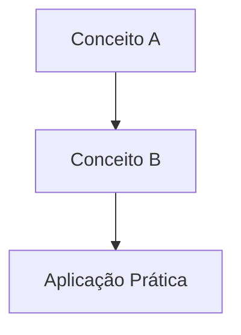

# Aula XX: Título da Aula

> [!IMPORTANT] Acesso Restrito Institucional
> Este material pedagógico, bem como seus slides em **LaTeX (.pdf)** e **PowerPoint (.pptx)**, são de uso exclusivo dos estudantes do Instituto Federal Fluminense (*Campus* Bom Jesus do Itabapoana) e estão protegidos com senha institucional.

**Carga Horária Equivalente:** 2 horas/aula diárias.  
**Professor Responsável:** Prof. Dr. Pedro Henrique Rocha de Andrade

---

## 1. Fundamentação Teórica e Metodológica

*(Desenvolva o referencial teórico da aula e conceitos fundamentais)*



---

## 2. Normas Técnicas e Padrões Aplicáveis

- **ABNT NBR 14724:2011**: Informação e documentação — Trabalhos acadêmicos — Apresentação.

---

## 3. Código LaTeX Canônico dos Slides (Beamer)

```latex
\documentclass{if-beamer}
\usepackage[utf8]{inputenc}

\title{Aula XX: Título da Aula}
\author{Prof. Dr. Pedro Henrique Rocha de Andrade}
\date{\today}

\begin{document}
\begin{frame}
  \titlepage
\end{frame}
\end{document}
```

---

## 4. Estudo de Caso e Prática

*(Insira exercícios, diagramas ou casos de uso para o estudante)*

---

## 5. Referências Bibliográficas

- ABNT. **NBR 14724**: Informação e documentação — Trabalhos acadêmicos — Apresentação. Rio de Janeiro: ABNT, 2011.
