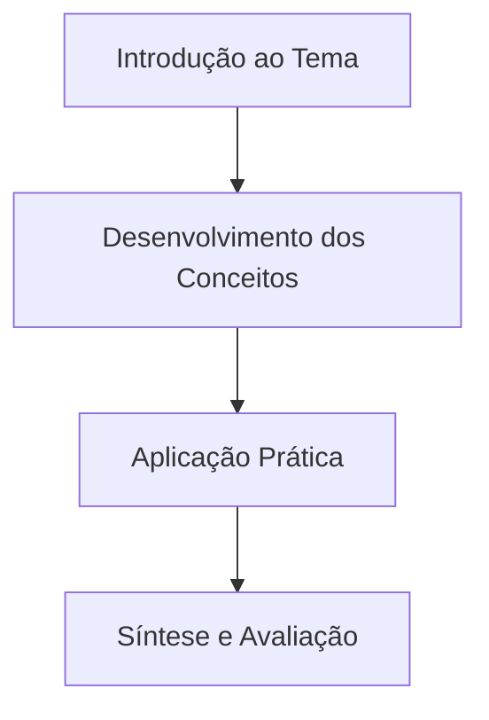

  

  
🏠 <b><a href="/pt-br/resource/seu-curso/">Índice do Curso</a></b>

  
➡️ <b><a href="/pt-br/resource/seu-curso/aula-02-exemplo">Próxima Aula: 02</a></b>

> [!note] 📦 Material Didático e Recursos da Aula
> - 📄 **[Slides da Aula — Modelo Branco (PDF)](/assets/biblioteca/seu-curso/slides/aula-01-branco.pdf)** — *Apresentação visual oficial.*
> - 📄 **[Slides da Aula — Modelo Preto (PDF)](/assets/biblioteca/seu-curso/slides/aula-01-preto.pdf)** — *Apresentação visual em tema escuro.*
> - 📝 **[Notas de Aula Institucionais (PDF)](/assets/biblioteca/seu-curso/notes/aula-01.pdf)** — *Apostila técnica completa.*
> - 🏛️ **[Guia Oficial da Disciplina](/assets/biblioteca/seu-curso/documentos/guia.pdf)** — *Documento em PDF.*
> - 🌐 **[Portal IFF](https://www.iff.edu.br/)** — *Instituto Federal Fluminense.*

## 📋 Sumário Interativo
- [📍 1. Introdução e Contextualização](#-1-introdução-e-contextualização)
- [📍 2. Desenvolvimento dos Conceitos](#-2-desenvolvimento-dos-conceitos)
- [📍 3. Aplicação Prática](#-3-aplicação-prática)
- [🔗 Aulas Correlatas & Conexões](#-aulas-correlatas--conexões)
- [📚 Referências Bibliográficas](#-referências-bibliográficas)

## 📖 Conteúdo da Aula

### 📍 1. Introdução e Contextualização
Apresentação conceitual do tema e contextualização na matriz curricular.

### 📍 2. Desenvolvimento dos Conceitos
Exposição teórica detalhada dos fundamentos e normas aplicáveis.

### 📍 3. Aplicação Prática
Exemplos práticos de implementação e resolução de problemas.

### 📊 Fluxograma do Conteúdo (Mermaid)

## 🔗 Aulas Correlatas & Conexões
- 🔗 **[Aula 02: Título da Aula 02](/pt-br/resource/seu-curso/aula-02-exemplo)**

## 📚 Referências Bibliográficas
- AUTOR. **Título da Obra**. Cidade: Editora, Ano.

  

  
🏠 <b><a href="/pt-br/resource/seu-curso/">Índice do Curso</a></b>

  
➡️ <b><a href="/pt-br/resource/seu-curso/aula-02-exemplo">Próxima Aula: 02</a></b>

