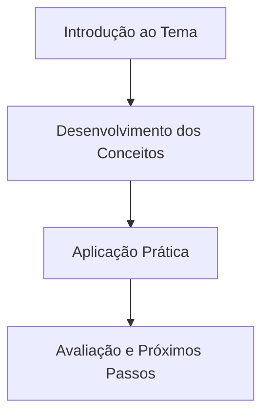

| Material Didático | Link Institucional (Acesso Aberto / PDF) |
| :--- | :--- |
| 📄 **Slides da Aula (.pdf)** | [Acessar Slide Institucional](/assets/biblioteca/seu-curso/slides/aula-01.pdf) |
| 📝 **Notas de Aula (.pdf)** | [Acessar Notas de Aula](/assets/biblioteca/seu-curso/notes/aula-01.pdf) |

## 📋 Sumário da Aula

- 1. Introdução e Contextualização
- 2. Conceitos Fundamentais
- 3. Aplicação Prática
- 4. Resumo e Atividades

### 📊 Fluxograma do Conteúdo (Mermaid)

## 🛠️ Recursos Adicionais e Material Suplementar

- **[🏛️ Documentação Oficial](https://www.iff.edu.br/)** — Recursos e materiais de apoio.
