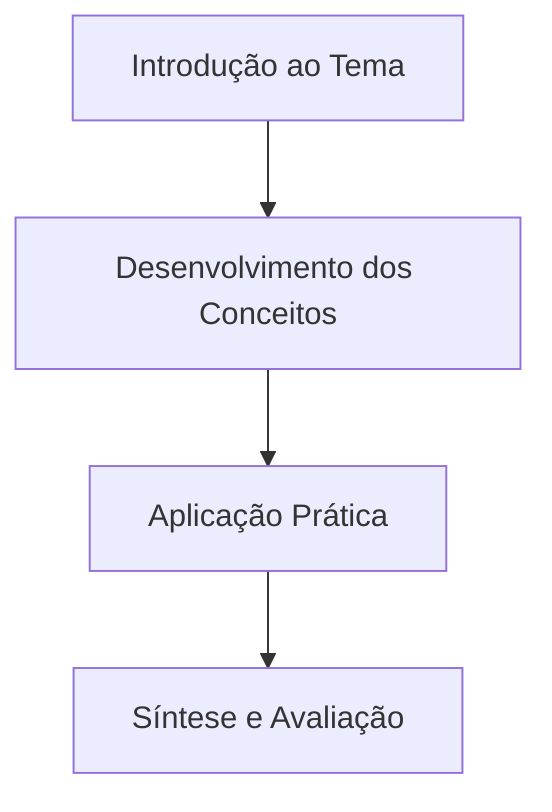

> [!note] 📦 Material Didático e Recursos da Aula
> - 📄 **[Slides da Aula — Modelo Branco (PDF)](/assets/biblioteca/seu-curso/slides/aula-01-branco.pdf)** — *Apresentação visual oficial.*
> - 📄 **[Slides da Aula — Modelo Preto (PDF)](/assets/biblioteca/seu-curso/slides/aula-01-preto.pdf)** — *Apresentação visual em tema escuro.*
> - 📝 **[Notas de Aula Institucionais (PDF)](/assets/biblioteca/seu-curso/notes/aula-01.pdf)** — *Apostila técnica completa.*
> 
> ### 🛠️ Recursos Adicionais e Links Externos
> - **[🏛️ Guia Oficial da Disciplina](/assets/biblioteca/seu-curso/documentos/guia.pdf)**
> - **[Portal IFF](https://www.iff.edu.br/)** — Instituto Federal Fluminense.

## 📋 Sumário da Aula
- 1. Introdução e Contextualização
- 2. Desenvolvimento dos Conceitos
- 3. Aplicação Prática
- 4. Síntese e Avaliação

### 📊 Fluxograma do Conteúdo (Mermaid)

## 📚 Referências Bibliográficas
- AUTOR. **Título da Obra**. Cidade: Editora, Ano.
